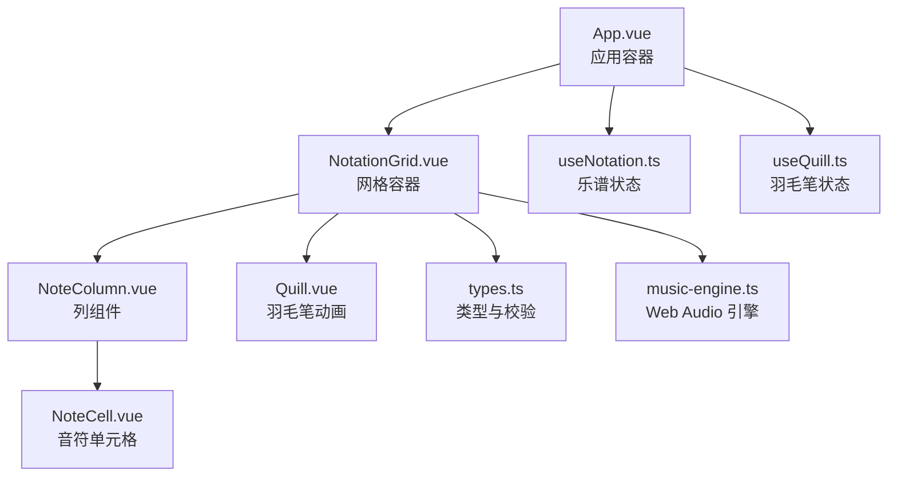
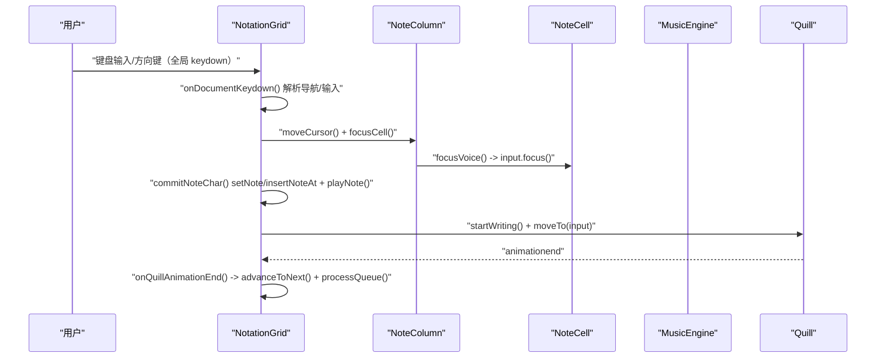
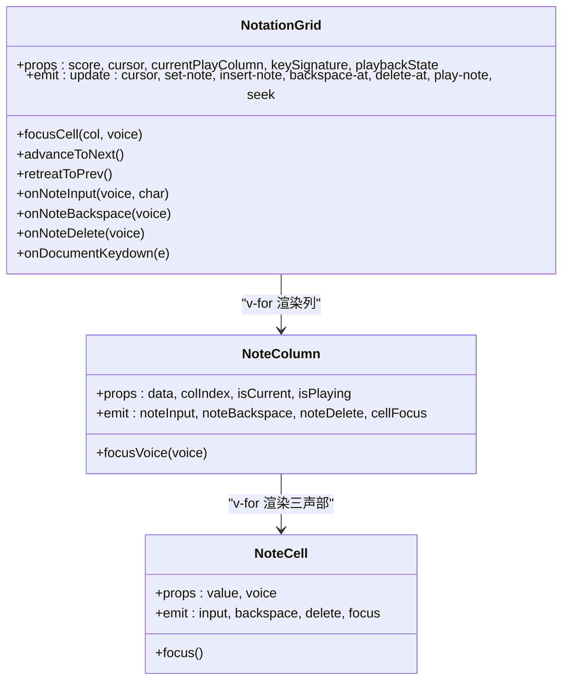
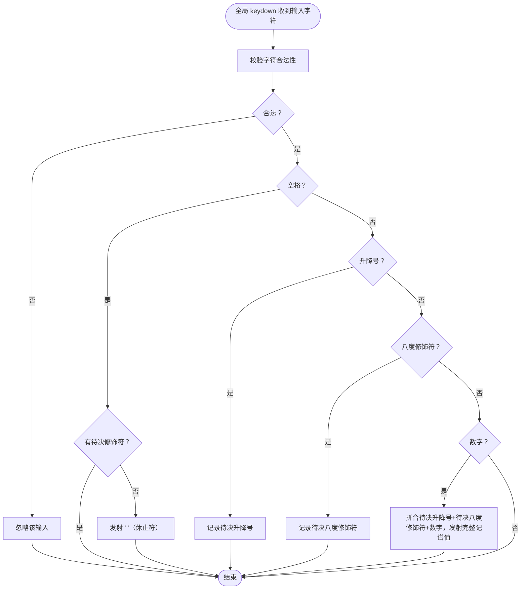
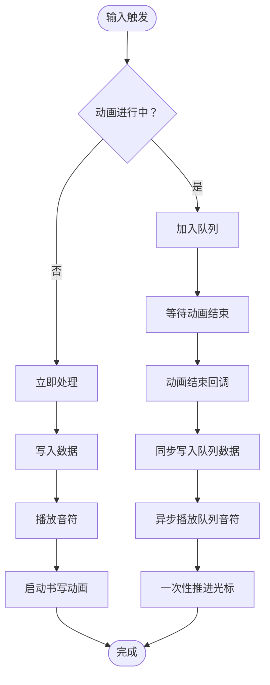
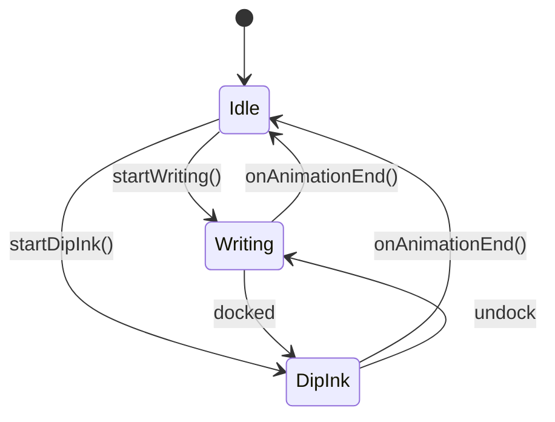
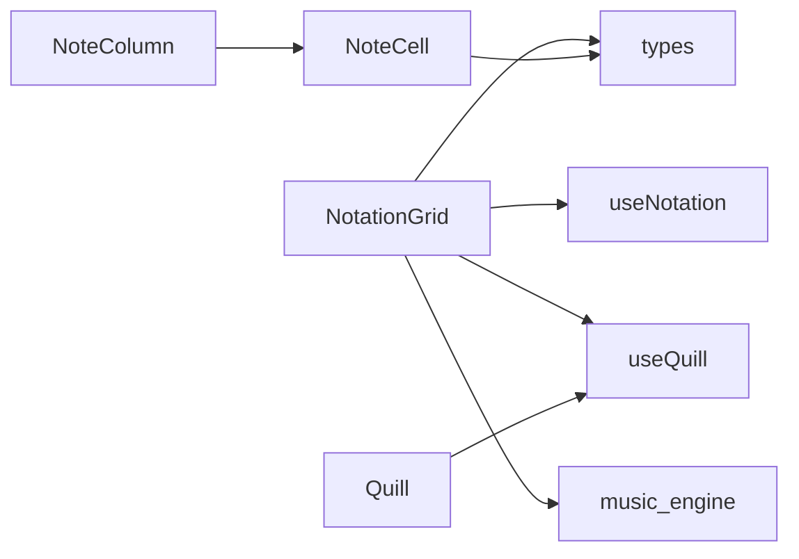

# 记谱网格组件

<cite>
**本文引用的文件**
- [NotationGrid.vue](file://src/components/NotationGrid.vue)
- [NoteColumn.vue](file://src/components/NoteColumn.vue)
- [NoteCell.vue](file://src/components/NoteCell.vue)
- [Quill.vue](file://src/components/Quill.vue)
- [useNotation.ts](file://src/composables/useNotation.ts)
- [useQuill.ts](file://src/composables/useQuill.ts)
- [types.ts](file://src/core/types.ts)
- [music-engine.ts](file://src/core/music-engine.ts)
- [App.vue](file://src/App.vue)
</cite>

## 更新摘要
**变更内容**
- 新增输入队列机制防止动画序列中的冲突
- 改进 NoteCell.vue 的输入事件处理，增加浏览器编辑操作过滤
- 增强 Quill.vue 的动画系统，支持 Docked 状态
- 改进光标移动检测机制，防止动画期间的意外导航

## 目录
1. [简介](#简介)
2. [项目结构](#项目结构)
3. [核心组件](#核心组件)
4. [架构总览](#架构总览)
5. [详细组件分析](#详细组件分析)
6. [依赖关系分析](#依赖关系分析)
7. [性能考虑](#性能考虑)
8. [故障排除指南](#故障排除指南)
9. [结论](#结论)
10. [附录](#附录)

## 简介
本文件系统化梳理记谱网格组件的实现，重点围绕 NotationGrid 网格布局、NoteColumn 列组件的三声部垂直排列与列宽计算、NoteCell 音符单元格的显示与焦点管理、组件间父子关系与数据流（props 传递与事件冒泡）、滚动机制（自动滚动到可视区域与滚动条稳定处理），以及交互最佳实践与性能优化建议。目标是帮助开发者快速理解并高效维护该组件体系。

## 项目结构
记谱网格组件位于 src/components 目录，配合 src/composables 提供的状态管理与 src/core 提供的类型与音乐引擎，形成清晰的分层：
- 视图层：NotationGrid、NoteColumn、NoteCell、Quill
- 状态层：useNotation（乐谱数据与光标）、useQuill（羽毛笔动画与定位）
- 核心层：types（类型与校验）、music-engine（Web Audio 音源）

**图表来源**
- [App.vue:104-117](file://src/App.vue#L104-L117)
- [NotationGrid.vue:255-267](file://src/components/NotationGrid.vue#L255-L267)
- [NoteColumn.vue:32-42](file://src/components/NoteColumn.vue#L32-L42)
- [NoteCell.vue:184-196](file://src/components/NoteCell.vue#L184-L196)
- [Quill.vue:15-24](file://src/components/Quill.vue#L15-L24)

**章节来源**
- [App.vue:102-138](file://src/App.vue#L102-L138)
- [NotationGrid.vue:252-276](file://src/components/NotationGrid.vue#L252-L276)

## 核心组件
- NotationGrid：网格容器，负责键盘导航、按输入字符类型写入/插入音符、光标移动、输入队列与书写动画协调、播放音符、与 Quill 的位置同步。
- NoteColumn：列容器，承载三个 NoteCell，并暴露 focusVoice 供父组件聚焦特定声部。
- NoteCell：音符单元格，负责展示记谱值（含待决修饰符的临时显示）、焦点状态与抖动反馈，input 事件作为安全网处理粘贴/IME 等边缘输入。
- Quill：羽毛笔动画组件，根据 useQuill 状态与位置渲染笔动画并驱动视觉反馈。
- useNotation：提供乐谱数据、光标、覆盖/插入的音符写入与位移逻辑。
- useQuill：提供羽毛笔位置追踪与动画状态管理。
- types：定义三声部索引、记谱值解析、合法字符校验、默认列数等。
- music-engine：封装 Web Audio API，按三声部音域调度音符播放。

**章节来源**
- [NotationGrid.vue:10-27](file://src/components/NotationGrid.vue#L10-L27)
- [NoteColumn.vue:6-18](file://src/components/NoteColumn.vue#L6-L18)
- [NoteCell.vue:7-17](file://src/components/NoteCell.vue#L7-L17)
- [useNotation.ts:15-116](file://src/composables/useNotation.ts#L15-L116)
- [useQuill.ts:5-39](file://src/composables/useQuill.ts#L5-L39)
- [types.ts:47-96](file://src/core/types.ts#L47-L96)
- [music-engine.ts:17-221](file://src/core/music-engine.ts#L17-L221)

## 架构总览
NotationGrid 作为顶层控制器，接收来自 useNotation 的 score/cursor，通过事件向上派发 set-note/insert-note/backspace-at/delete-at/play-note 等操作，同时以全局键盘监听（document keydown）负责键盘导航、输入校验与待决修饰符处理、播放音符与书写动画协调。NoteColumn 作为列容器，内部三个 NoteCell 对应三声部，负责焦点定位与待决修饰符的下发显示。NoteCell 负责显示与焦点管理（input 事件仅作为安全网），Quill 由 useQuill 驱动，实时跟随当前输入元素位置。

**图表来源**
- [NotationGrid.vue:186-244](file://src/components/NotationGrid.vue#L186-L244)
- [NotationGrid.vue:113-148](file://src/components/NotationGrid.vue#L113-L148)
- [NoteColumn.vue:23-25](file://src/components/NoteColumn.vue#L23-L25)
- [NoteCell.vue:68-115](file://src/components/NoteCell.vue#L68-L115)
- [music-engine.ts:69-75](file://src/core/music-engine.ts#L69-L75)
- [useQuill.ts:17-29](file://src/composables/useQuill.ts#L17-L29)

## 详细组件分析

### NotationGrid 网格布局与响应式适配
- 网格布局采用弹性布局与换行，通过 gap 控制行列间距，flex-wrap 实现多列自适应换行，适合在不同屏幕宽度下自动排列列项。
- 列宽计算策略：每个列项为固定尺寸的垂直堆叠容器，内部三个 NoteCell 高度与行距由 CSS 控制，整体列宽由列容器的内边距与边框决定，不依赖动态计算，保证渲染稳定性。
- 响应式适配：通过 flex-wrap 和 gap，在窄屏设备上自动换行；列项的最小宽度与最大宽度由内部 input 的 min/max-width 固定，避免布局抖动。

**章节来源**
- [NotationGrid.vue:278-292](file://src/components/NotationGrid.vue#L278-L292)
- [NoteColumn.vue:47-63](file://src/components/NoteColumn.vue#L47-L63)
- [NoteCell.vue:244-260](file://src/components/NoteCell.vue#L244-L260)

### NoteColumn 列组件：三声部垂直排列与列宽
- 三声部垂直排列：列容器使用纵向 flex，三个 NoteCell 依次渲染，形成从上到下的三声部布局。
- 列宽与样式：列容器设置固定底部边框与内边距，通过 nth-child 选择器为每四列交替颜色，便于识别小节；current playing 样式用于播放状态高亮。
- 子组件暴露方法：通过 ref 收集三个 NoteCell 的实例，暴露 focusVoice(voice) 供父组件聚焦指定声部。

**图表来源**
- [NotationGrid.vue:10-27](file://src/components/NotationGrid.vue#L10-L27)
- [NoteColumn.vue:6-18](file://src/components/NoteColumn.vue#L6-L18)
- [NoteColumn.vue:23-25](file://src/components/NoteColumn.vue#L23-L25)
- [NoteCell.vue:7-17](file://src/components/NoteCell.vue#L7-L17)

**章节来源**
- [NoteColumn.vue:30-44](file://src/components/NoteColumn.vue#L30-L44)
- [NoteColumn.vue:47-63](file://src/components/NoteColumn.vue#L47-L63)

### NoteCell 音符单元格：显示、光标与焦点
- 输入处理（安全网）：
  - 输入字符的正常路径由 NotationGrid 的全局键盘监听统一处理，NoteCell 的 input 事件仅作为安全网，处理粘贴、IME 等边缘情况。
  - 安全网校验：仅允许数字 1-7、升降号 #/b、八度修饰符 .,/、延音线 -、空格；全角"，"转半角"，"、"。"转"."。
  - 非法输入触发动画抖动并重置受控值，提示无效输入。
- 待决修饰符显示：
  - NotationGrid 暂存的待决升降号与八度修饰符通过 props（pendingAccidental/pendingOctave）下发，NoteCell 负责临时显示。
- 焦点与显示：
  - 聚焦时显示完整值（含升降号），失焦时隐藏升降号，仅显示数字。
  - 升降号在输入左侧以绝对定位显示，八度标记通过 CSS 类在音符上下方显示点。
- 键盘行为：
  - 首次按键自动全选，确保新输入覆盖旧值。
  - 长按字符键的原生 repeat 事件由 NoteCell 节流（preventDefault），实际的重复输入由 NotationGrid 的自定义计时器驱动（首延 350ms、间隔 110ms）。

**更新** 输入解析与待决修饰符处理已上移至 NotationGrid 的全局键盘监听，NoteCell 保留安全网校验与显示职责

**图表来源**
- [NoteCell.vue:68-115](file://src/components/NoteCell.vue#L68-L115)
- [types.ts:78-96](file://src/core/types.ts#L78-L96)

**章节来源**
- [NoteCell.vue:181-198](file://src/components/NoteCell.vue#L181-L198)
- [NoteCell.vue:200-278](file://src/components/NoteCell.vue#L200-L278)

### 组件间父子关系与数据流
- 父传子（props）：
  - NotationGrid 向 NoteColumn 传递 data、colIndex、isCurrent、isPlaying。
  - NoteColumn 向 NoteCell 传递 value、voice。
  - NotationGrid 向 Quill 传递 x/y 与动画状态。
- 子传父（事件冒泡）：
  - NoteCell 通过 noteInput/backspace/delete/focus 向 NoteColumn 冒泡。
  - NoteColumn 通过 noteInput/backspace/delete/cellFocus 向 NotationGrid 冒泡。
  - NotationGrid 通过 set-note/insert-note/backspace-at/delete-at/play-note/seek/update:cursor 向 App 上抛。
- 数据流向：
  - App 通过 useNotation 管理 score/cursor，NotationGrid 仅负责交互与播放，不直接修改数据。
  - 输入队列与书写动画状态在 NotationGrid 内部协调，避免并发写入导致的错位。

**章节来源**
- [NotationGrid.vue:255-267](file://src/components/NotationGrid.vue#L255-L267)
- [NoteColumn.vue:32-42](file://src/components/NoteColumn.vue#L32-L42)
- [App.vue:104-117](file://src/App.vue#L104-L117)

### 滚动机制：自动滚动到可视区域与滚动条稳定
- 自动滚动到可视区域：NotationGrid 在 onMounted 时聚焦首列首声部，并在 nextTick 中更新 Quill 位置；键盘导航时也通过 moveCursor + focusCell 确保目标单元格进入视口附近。
- 滚动条稳定处理：列容器使用固定列宽与行高，避免频繁布局抖动；Quill 通过 will-change 与过渡动画减少重绘；输入队列与动画状态机确保一次只处理一格，降低滚动与布局压力。

**章节来源**
- [NotationGrid.vue:246-249](file://src/components/NotationGrid.vue#L246-L249)
- [NotationGrid.vue:180-183](file://src/components/NotationGrid.vue#L180-L183)
- [useQuill.ts:37-39](file://src/composables/useQuill.ts#L37-L39)

### 输入队列机制与动画协调
**新增** NotationGrid 实现了完整的输入队列机制来防止动画序列中的冲突：

- **输入队列管理**：`inputQueue` 数组缓存动画进行期间的后续输入，保证每格依次处理。
- **动画状态跟踪**：`writingAnimationActive` 标志位防止并发输入绕过队列。
- **外部导航检测**：`cursorMovedDuringAnimation` 标记动画期间的外部导航，确保数据一致性。
- **队列处理流程**：
  1. 数据先行：同步写入所有队列数据到目标列
  2. 声音异步：播放所有队列音符的声音
  3. 光标推进：一次性推进光标到最终位置

**图表来源**
- [NotationGrid.vue:60-66](file://src/components/NotationGrid.vue#L60-L66)
- [NotationGrid.vue:120-128](file://src/components/NotationGrid.vue#L120-L128)
- [NotationGrid.vue:162-197](file://src/components/NotationGrid.vue#L162-L197)

**章节来源**
- [NotationGrid.vue:60-66](file://src/components/NotationGrid.vue#L60-L66)
- [NotationGrid.vue:120-128](file://src/components/NotationGrid.vue#L120-L128)
- [NotationGrid.vue:162-197](file://src/components/NotationGrid.vue#L162-L197)

### Quill 动画系统增强
**更新** Quill 组件增强了动画系统，支持 Docked 状态：

- **Docked 状态**：播放时羽毛笔自动停靠在墨水瓶位置，提供视觉反馈。
- **动画类型**：支持 'writing'（书写）、'dipInk'（蘸墨）、'idle'（空闲）三种状态。
- **坐标系统**：支持动态坐标和 Docked 固定位置两种模式。
- **性能优化**：使用 will-change 和 transition 属性减少重绘。

**图表来源**
- [Quill.vue:16-20](file://src/components/Quill.vue#L16-L20)
- [Quill.vue:41-48](file://src/components/Quill.vue#L41-L48)
- [Quill.vue:76-85](file://src/components/Quill.vue#L76-L85)

**章节来源**
- [Quill.vue:16-20](file://src/components/Quill.vue#L16-L20)
- [Quill.vue:41-48](file://src/components/Quill.vue#L41-L48)
- [Quill.vue:76-85](file://src/components/Quill.vue#L76-L85)

## 依赖关系分析
- NotationGrid 依赖：
  - useNotation：提供 setNote/clearNote/insertNoteAt/backspaceAt/deleteAt/moveCursor/loadScore 等数据操作。
  - useQuill：提供 quill.position 与动画状态，驱动 Quill 定位与动画。
  - music-engine：提供 playNote 与初始化检查，用于输入预览音效。
  - types：提供 isValidNoteChar/parseNoteValue/KeySignature 等类型与校验。
- NoteColumn 依赖：NoteCell（内部渲染）。
- NoteCell 依赖：types.isValidNoteChar/parseNoteValue（输入校验与显示解析）。
- Quill 依赖：useQuill（位置与动画状态）。

**图表来源**
- [NotationGrid.vue:53-54](file://src/components/NotationGrid.vue#L53-L54)
- [NoteColumn.vue:3](file://src/components/NoteColumn.vue#L3)
- [NoteCell.vue:3](file://src/components/NoteCell.vue#L3)
- [Quill.vue:2](file://src/components/Quill.vue#L2)

**章节来源**
- [NotationGrid.vue:1-16](file://src/components/NotationGrid.vue#L1-L16)
- [types.ts:1-164](file://src/core/types.ts#L1-L164)
- [music-engine.ts:17-221](file://src/core/music-engine.ts#L17-L221)

## 性能考虑
- **输入队列与动画节流**：在书写动画进行期间将后续输入缓存至队列，动画结束后逐条处理，避免并发写入导致的布局抖动与状态错乱。
- **DOM 操作最小化**：列容器使用固定尺寸与固定边框，减少布局计算；Quill 使用 will-change 与过渡动画，降低重绘成本。
- **事件处理去抖**：键盘导航长按重复由自定义计时器驱动（间隔 120ms），避免焦点切换过快导致的光标混乱与多余计算。
- **音频调度**：MusicEngine 使用精确的时间锚点与增益包络，避免不必要的节点创建与连接，降低音频开销。
- **列宽与渲染**：NoteCell 的 input 使用固定宽高与 field-sizing: content，减少回流；列容器使用 flex-wrap，避免复杂计算。
- **浏览器编辑操作过滤**：NoteCell 过滤浏览器编辑操作产生的非插入事件，提高输入准确性。

**更新** 新增了输入队列机制和浏览器编辑操作过滤的性能优化

**章节来源**
- [NotationGrid.vue:58-61](file://src/components/NotationGrid.vue#L58-L61)
- [NotationGrid.vue:113-148](file://src/components/NotationGrid.vue#L113-L148)
- [NotationGrid.vue:186-244](file://src/components/NotationGrid.vue#L186-L244)
- [NoteCell.vue:72-76](file://src/components/NoteCell.vue#L72-L76)
- [music-engine.ts:90-150](file://src/core/music-engine.ts#L90-L150)

## 故障排除指南
- **输入无效字符**：NoteCell 对非法字符进行抖动反馈并清空输入，确认输入字符符合合法范围。
- **Backspace/Delete 行为异常**：Backspace 删除前一格并左移填补、末位补空格；Delete 清空当前格且不移位。
- **光标跳转错乱**：检查键盘导航事件是否被重复触发（长按重复由自定义计时器控制），确保 moveCursor 与 focusCell 的调用顺序正确。
- **音符播放无声**：确认 MusicEngine 已初始化且用户交互后 AudioContext 已恢复；检查 noteToMidi 转换结果是否为 null。
- **羽毛笔位置偏移**：确认 onCellFocus 后 nextTick 再更新 Quill 位置，确保 input.getBoundingClientRect() 返回正确坐标。
- **输入队列冲突**：检查 writingAnimationActive 标志位，确保动画期间的输入被正确缓存和处理。
- **Docked 状态异常**：确认播放状态与 docked 属性的同步，检查 CSS 类的正确应用。

**更新** 新增了输入队列冲突和 Docked 状态异常的故障排除指南

**章节来源**
- [NoteCell.vue:68-115](file://src/components/NoteCell.vue#L68-L115)
- [NotationGrid.vue:163-177](file://src/components/NotationGrid.vue#L163-L177)
- [NotationGrid.vue:186-244](file://src/components/NotationGrid.vue#L186-L244)
- [music-engine.ts:41-64](file://src/core/music-engine.ts#L41-L64)
- [Quill.vue:76-85](file://src/components/Quill.vue#L76-L85)

## 结论
记谱网格组件通过清晰的分层设计与严格的事件冒泡机制，实现了三声部记谱输入、键盘导航、播放预览与书写动画的协同工作。NotationGrid 作为控制器，结合 useNotation 与 useQuill，既保证了交互的流畅性，又兼顾了性能与可维护性。NoteColumn 与 NoteCell 的职责明确，显示与焦点管理完善，适合在多种设备与场景下稳定运行。

**更新** 最新的改进包括输入队列机制、增强的动画系统和更完善的事件处理，进一步提升了组件的稳定性和用户体验。

## 附录
- 三声部索引与标签：0=主旋律（方波）、1=和弦律（方波）、2=低频（三角波）。
- 默认列数：125 列，支持长乐谱编辑。
- 调号枚举：C、D、F、G、♭B。
- BPM 档位：60、75、90、105、120、135（默认 90）。
- **新增**：播放状态：stopped、playing、paused。

**章节来源**
- [types.ts:47-54](file://src/core/types.ts#L47-L54)
- [types.ts:99](file://src/core/types.ts#L99)
- [types.ts:132-138](file://src/core/types.ts#L132-L138)
- [types.ts:113](file://src/core/types.ts#L113)
- [types.ts:68-72](file://src/core/types.ts#L68-L72)
- [types.ts:71-72](file://src/core/types.ts#L71-L72)