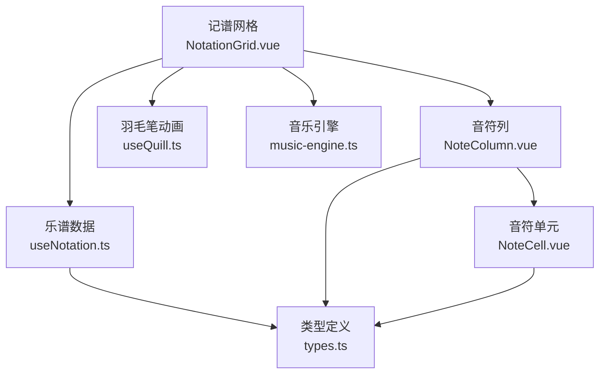
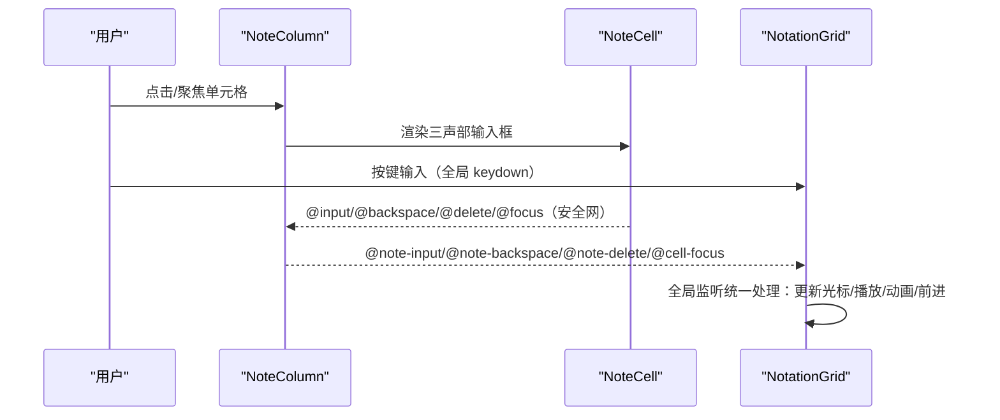
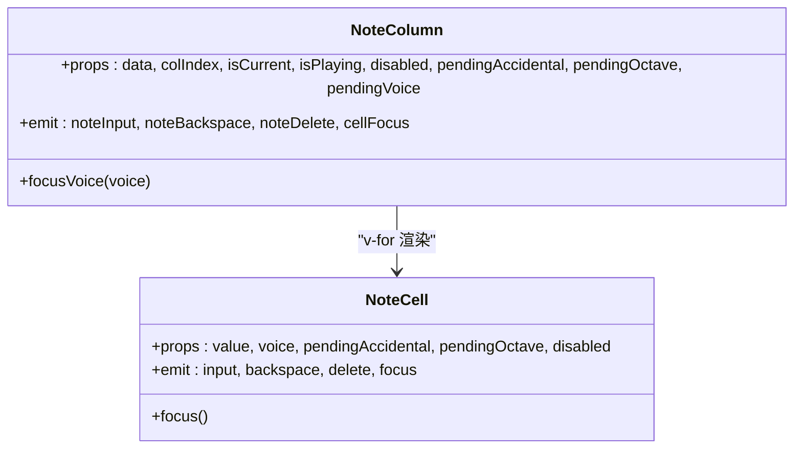
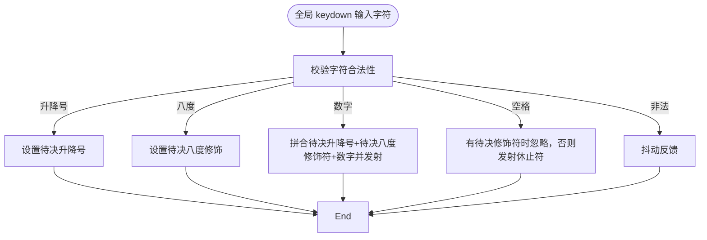
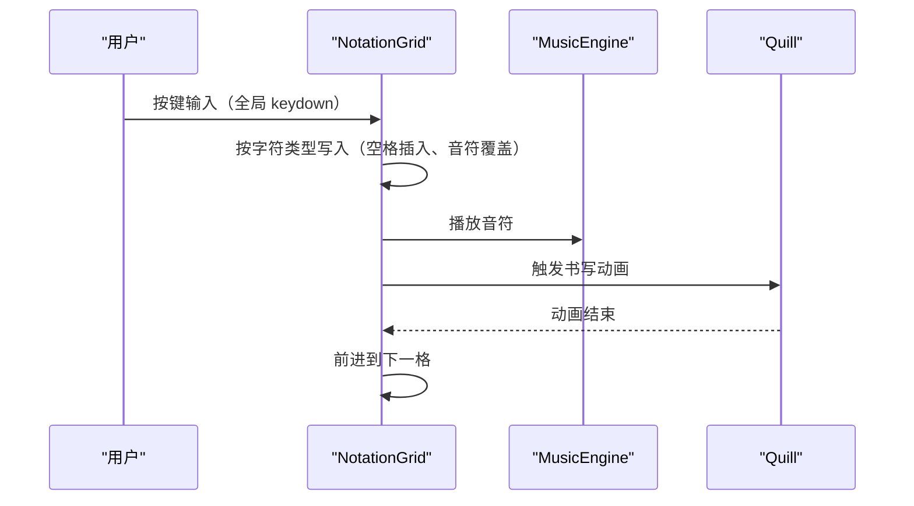
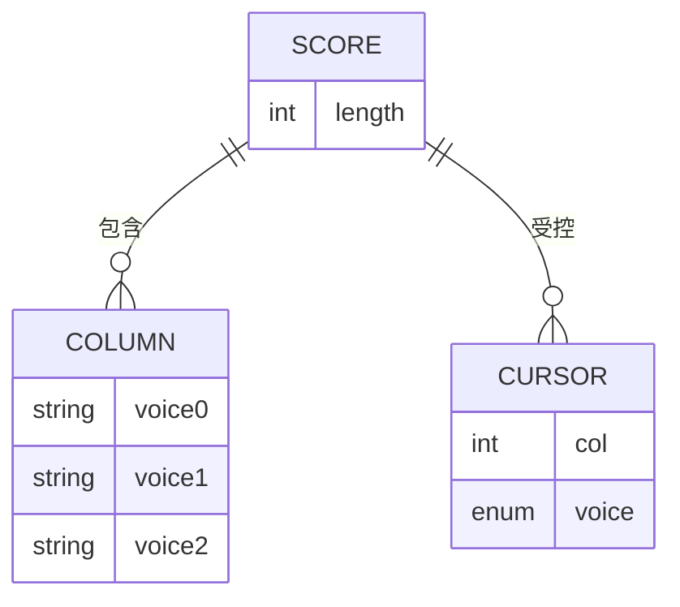
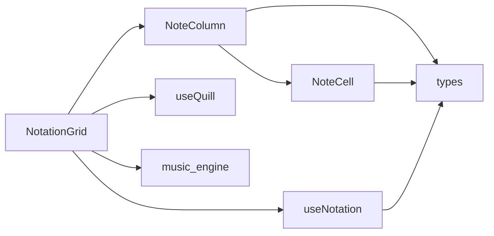

# 音符列组件

<cite>
**本文引用的文件**
- [NoteColumn.vue](file://src/components/NoteColumn.vue)
- [NoteCell.vue](file://src/components/NoteCell.vue)
- [NotationGrid.vue](file://src/components/NotationGrid.vue)
- [types.ts](file://src/core/types.ts)
- [useNotation.ts](file://src/composables/useNotation.ts)
- [useQuill.ts](file://src/composables/useQuill.ts)
- [music-engine.ts](file://src/core/music-engine.ts)
</cite>

## 目录
1. [简介](#简介)
2. [项目结构](#项目结构)
3. [核心组件](#核心组件)
4. [架构总览](#架构总览)
5. [详细组件分析](#详细组件分析)
6. [依赖关系分析](#依赖关系分析)
7. [性能考虑](#性能考虑)
8. [故障排除指南](#故障排除指南)
9. [结论](#结论)

## 简介
本文件系统化梳理“音符列组件”（NoteColumn）的实现架构与交互机制，重点覆盖：
- 三声部音符的垂直布局设计与列宽计算逻辑
- 数据结构设计：音符数组存储格式与声部索引管理
- 渲染机制：动态类名绑定与播放状态高亮
- 交互处理：点击聚焦、键盘导航与焦点管理
- 生命周期与性能优化：虚拟滚动与懒加载策略

NoteColumn 是记谱网格（NotationGrid）中的单列单元，承载三个声部的输入控件，并负责将用户输入事件向上冒泡给父组件进行统一处理。

## 项目结构
NoteColumn 所属的组件体系围绕“记谱网格”展开，整体采用分层设计：
- 视图层：NotationGrid（网格容器）、NoteColumn（列单元）、NoteCell（单元格）
- 业务层：useNotation（乐谱数据与光标管理）
- 媒体层：useQuill（羽毛笔动画）、music-engine（Web Audio 播放）

图表来源
- [NotationGrid.vue:1-292](file://src/components/NotationGrid.vue#L1-L292)
- [NoteColumn.vue:1-63](file://src/components/NoteColumn.vue#L1-L63)
- [NoteCell.vue:1-278](file://src/components/NoteCell.vue#L1-L278)
- [useNotation.ts:1-116](file://src/composables/useNotation.ts#L1-L116)
- [useQuill.ts:1-39](file://src/composables/useQuill.ts#L1-L39)
- [music-engine.ts:1-221](file://src/core/music-engine.ts#L1-L221)
- [types.ts:1-164](file://src/core/types.ts#L1-L164)

章节来源
- [NotationGrid.vue:1-292](file://src/components/NotationGrid.vue#L1-L292)
- [NoteColumn.vue:1-63](file://src/components/NoteColumn.vue#L1-L63)
- [NoteCell.vue:1-278](file://src/components/NoteCell.vue#L1-L278)
- [useNotation.ts:1-116](file://src/composables/useNotation.ts#L1-L116)
- [useQuill.ts:1-39](file://src/composables/useQuill.ts#L1-L39)
- [music-engine.ts:1-221](file://src/core/music-engine.ts#L1-L221)
- [types.ts:1-164](file://src/core/types.ts#L1-L164)

## 核心组件
- NoteColumn：单列三声部容器，负责将列数据映射为三个 NoteCell，并暴露聚焦方法给父组件调用。
- NoteCell：单个音符单元，负责显示解析（含待决修饰符的临时显示）、焦点管理与抖动反馈，input 事件作为安全网处理粘贴/IME 等边缘输入。
- NotationGrid：网格容器，负责键盘导航、输入队列、播放与动画协调、列宽计算与渲染。
- useNotation：提供乐谱数据结构、光标位置、覆盖/插入的音符写入与移动逻辑。
- useQuill：提供羽毛笔位置与动画状态，配合输入流程进行视觉反馈。
- music-engine：Web Audio 引擎，负责音符播放与音频资源管理。

章节来源
- [NoteColumn.vue:1-63](file://src/components/NoteColumn.vue#L1-L63)
- [NoteCell.vue:1-278](file://src/components/NoteCell.vue#L1-L278)
- [NotationGrid.vue:1-292](file://src/components/NotationGrid.vue#L1-L292)
- [useNotation.ts:1-116](file://src/composables/useNotation.ts#L1-L116)
- [useQuill.ts:1-39](file://src/composables/useQuill.ts#L1-L39)
- [music-engine.ts:1-221](file://src/core/music-engine.ts#L1-L221)
- [types.ts:1-164](file://src/core/types.ts#L1-L164)

## 架构总览
NoteColumn 作为视图层的最小渲染单元，其职责清晰：
- 接收列数据（三声部字符串数组）
- 通过 v-for 渲染三个 NoteCell
- 将子组件事件向上冒泡（输入、回退、删除、聚焦）
- 暴露 focusVoice 方法供父组件跨列聚焦

图表来源
- [NoteColumn.vue:30-44](file://src/components/NoteColumn.vue#L30-L44)
- [NoteCell.vue:68-178](file://src/components/NoteCell.vue#L68-L178)
- [NotationGrid.vue:112-183](file://src/components/NotationGrid.vue#L112-L183)

章节来源
- [NoteColumn.vue:1-63](file://src/components/NoteColumn.vue#L1-L63)
- [NoteCell.vue:1-278](file://src/components/NoteCell.vue#L1-L278)
- [NotationGrid.vue:1-292](file://src/components/NotationGrid.vue#L1-L292)

## 详细组件分析

### NoteColumn 组件
- 数据结构
  - 列数据为只读三元组：[主旋律, 和弦律, 低频]，每个元素为音符字符串。
  - 声部索引 VoiceIndex 为 0..2，分别对应主旋律（方波）、和弦律（方波）、低频（三角波）。
- 垂直布局
  - li 容器采用纵向 flex，内部三个 NoteCell 垂直排列，形成三声部的视觉堆叠。
- 动态类名绑定
  - current：当前列高亮（用于播放/编辑定位）
  - playing：播放状态高亮（与 current 同时生效）
- 播放状态高亮
  - current 类通过 :deep 作用域穿透，影响内部 input 的阴影样式，形成聚焦边框效果。
- 交互与事件
  - 将 NoteCell 的 input/backspace/delete/focus 事件原样转发给父组件，便于统一处理。
  - 暴露 focusVoice 方法，父组件可通过列索引与声部索引直接聚焦对应单元格。
- 性能与渲染
  - 使用 v-for 遍历列数据，key 为声部索引，确保每个 NoteCell 的稳定引用。
  - 通过 ref 数组 cellRefs 暴露子组件实例，便于父组件批量聚焦。

图表来源
- [NoteColumn.vue:6-27](file://src/components/NoteColumn.vue#L6-L27)
- [NoteCell.vue:7-17](file://src/components/NoteCell.vue#L7-L17)

章节来源
- [NoteColumn.vue:1-63](file://src/components/NoteColumn.vue#L1-L63)
- [types.ts:41-54](file://src/core/types.ts#L41-L54)

### NoteCell 组件
- 输入解析与显示
  - 支持合法字符集：1-7、升降号（#、b）、八度修饰符（.、,）、延音线（-）、空格（休止符）。
  - 解析规则：识别数字之前的升降号与八度修饰符（. 上点、, 下点），再提取音符数字。
  - 显示策略：聚焦时显示完整值（含升降号），非聚焦时隐藏升降号，仅显示数字。
- 待决修饰符
  - pendingAccidental/pendingOctave：由 NotationGrid 暂存的待决升降号与八度修饰符，经 props 下发给 NoteCell 临时显示。
  - maxlength 动态控制：存在待决修饰符时允许最大长度为 3，以便一次性输入“升降号+八度修饰符+音符”。
- 交互行为
  - 音符字符、空格、Backspace/Delete 均由 NotationGrid 的全局键盘监听统一处理：空格插入休止符（有待决修饰符时忽略）、音符/延音线覆盖、Backspace 删除前一格并左移填补、Delete 清空当前格不移位。
  - 抖动反馈：非法字符输入时触发动画抖动，提示错误。
- 焦点管理
  - onFocus/onBlur 控制 isFocused 状态，影响显示。
  - focus 方法暴露给父组件调用，实现跨列聚焦。

图表来源
- [NoteCell.vue:68-115](file://src/components/NoteCell.vue#L68-L115)
- [types.ts:77-96](file://src/core/types.ts#L77-L96)

章节来源
- [NoteCell.vue:1-278](file://src/components/NoteCell.vue#L1-L278)
- [types.ts:1-164](file://src/core/types.ts#L1-L164)

### NotationGrid 组件（父组件）
- 列宽计算与布局
  - 采用 flex-wrap 布局，gap 控制列间距与行间距，形成网格。
  - 列宽由单个 NoteCell 的固定尺寸决定（input 宽度为 1em，line-height 为 1.6），整体列宽近似为 1em。
  - 通过 gap 与 padding/margin 控制列间距，保证三声部垂直对齐。
- 键盘导航
  - ArrowUp/Down：在三声部间切换
  - ArrowLeft/Right：在列间移动
  - 长按重复：由自定义计时器驱动（间隔 120ms），确保光标定位准确
- 输入队列与动画
  - 写入动画期间将后续输入缓存至队列，保证每格依次处理，避免乱序。
  - 雕刻动画结束后推进到下一格并继续处理队列。
- 播放与声音
  - 将音符转换为 MIDI 并交由音乐引擎播放，不同声部使用不同波形与八度倍率。

图表来源
- [NotationGrid.vue:112-156](file://src/components/NotationGrid.vue#L112-L156)
- [music-engine.ts:69-150](file://src/core/music-engine.ts#L69-L150)
- [useQuill.ts:16-29](file://src/composables/useQuill.ts#L16-L29)

章节来源
- [NotationGrid.vue:1-292](file://src/components/NotationGrid.vue#L1-L292)
- [music-engine.ts:1-221](file://src/core/music-engine.ts#L1-L221)
- [useQuill.ts:1-39](file://src/composables/useQuill.ts#L1-L39)

### 数据结构与声部索引管理
- Column（列）：三元组 [主旋律, 和弦律, 低频]，顺序严格对应 VoiceIndex。
- Score（乐谱）：Column 的数组，表示 N 列。
- CursorPosition（光标）：包含列索引与声部索引，用于定位当前编辑位置。
- VoiceIndex：0..2，分别映射到不同的波形与八度倍率，形成层次分明的三声部效果。

图表来源
- [types.ts:56-66](file://src/core/types.ts#L56-L66)
- [useNotation.ts:15-17](file://src/composables/useNotation.ts#L15-L17)

章节来源
- [types.ts:1-164](file://src/core/types.ts#L1-L164)
- [useNotation.ts:1-116](file://src/composables/useNotation.ts#L1-L116)

## 依赖关系分析
- NoteColumn 依赖 NoteCell 与 types.ts（VoiceIndex、Column 类型）。
- NotationGrid 依赖 NoteColumn、useNotation、useQuill、music-engine。
- useNotation 提供 Score/Cursor/列操作（插入、覆盖、回退、清空）。
- useQuill 提供位置与动画状态，驱动输入过程的视觉反馈。
- music-engine 提供 Web Audio 播放能力，支持三声部不同波形与八度倍率。

图表来源
- [NotationGrid.vue:1-292](file://src/components/NotationGrid.vue#L1-L292)
- [NoteColumn.vue:1-63](file://src/components/NoteColumn.vue#L1-L63)
- [NoteCell.vue:1-278](file://src/components/NoteCell.vue#L1-L278)
- [useNotation.ts:1-116](file://src/composables/useNotation.ts#L1-L116)
- [useQuill.ts:1-39](file://src/composables/useQuill.ts#L1-L39)
- [music-engine.ts:1-221](file://src/core/music-engine.ts#L1-L221)
- [types.ts:1-164](file://src/core/types.ts#L1-L164)

章节来源
- [NotationGrid.vue:1-292](file://src/components/NotationGrid.vue#L1-L292)
- [NoteColumn.vue:1-63](file://src/components/NoteColumn.vue#L1-L63)
- [NoteCell.vue:1-278](file://src/components/NoteCell.vue#L1-L278)
- [useNotation.ts:1-116](file://src/composables/useNotation.ts#L1-L116)
- [useQuill.ts:1-39](file://src/composables/useQuill.ts#L1-L39)
- [music-engine.ts:1-221](file://src/core/music-engine.ts#L1-L221)
- [types.ts:1-164](file://src/core/types.ts#L1-L164)

## 性能考虑
- 渲染层面
  - 使用 v-for 渲染三声部，key 为声部索引，避免不必要的重排。
  - 通过 ref 数组缓存子组件实例，减少查找成本。
- 输入与动画
  - 输入队列（inputQueue）在动画进行期间缓存后续输入，保证每格依次处理，避免 UI 卡顿与状态错乱。
  - 动画结束后统一推进到下一格，减少频繁的 DOM 更新。
- 列宽与布局
  - 单个单元格采用固定尺寸（1em 宽高），列宽近似为 1em，结合 gap 实现稳定的网格布局。
  - flex-wrap 与 gap 控制列间距，避免复杂计算带来的重排。
- 虚拟滚动与懒加载
  - 当前实现为全量渲染列（默认 125 列）。若需进一步优化，可在 NotationGrid 中引入虚拟滚动：
    - 仅渲染可视窗口内的列，根据滚动位置动态更新可见范围。
    - 结合 IntersectionObserver 或自定义滚动监听，按需创建/销毁列实例。
  - 懒加载建议：
    - 对于远端列数据，可在进入可视区域时才请求或初始化。
    - 对于音频资源，可在首次播放时按需初始化音乐引擎，避免启动开销。

[本节为通用性能建议，不直接分析具体文件，故不附加章节来源]

## 故障排除指南
- 输入无效字符
  - 现象：输入非法字符时出现抖动反馈。
  - 原因：字符不在合法集合内。
  - 处理：检查输入字符是否符合合法集合，或等待抖动动画结束。
- 升降号与八度修饰冲突
  - 现象：同时输入 # 与 b，或混合使用 . 与 ,。
  - 原因：修饰符互斥或超出一级限制。
  - 处理：先清除待决修饰符，再重新输入。
- 回退/删除异常
  - 现象：Backspace/Delete 行为不符合预期。
  - 原因：光标位置不当或待决修饰符未按优先级清除。
  - 处理：确认光标位置与待决修饰符状态，必要时清空输入队列后再试。
- 焦点丢失
  - 现象：键盘导航后焦点未正确落在目标单元格。
  - 原因：长按重复计时器异常或聚焦逻辑异常。
  - 处理：确保未长按方向键，或手动点击目标单元格。

章节来源
- [NoteCell.vue:68-178](file://src/components/NoteCell.vue#L68-L178)
- [NotationGrid.vue:185-244](file://src/components/NotationGrid.vue#L185-L244)

## 结论
NoteColumn 组件通过简洁的三声部垂直布局与稳定的事件冒泡机制，实现了高效的记谱输入体验。配合 NotationGrid 的键盘导航、输入队列与动画协调，以及 useNotation 的数据模型与 useQuill 的视觉反馈，形成了完整的三声部记谱工作流。未来可在虚拟滚动与懒加载方面进一步优化，以支撑更长乐谱的流畅渲染与交互。