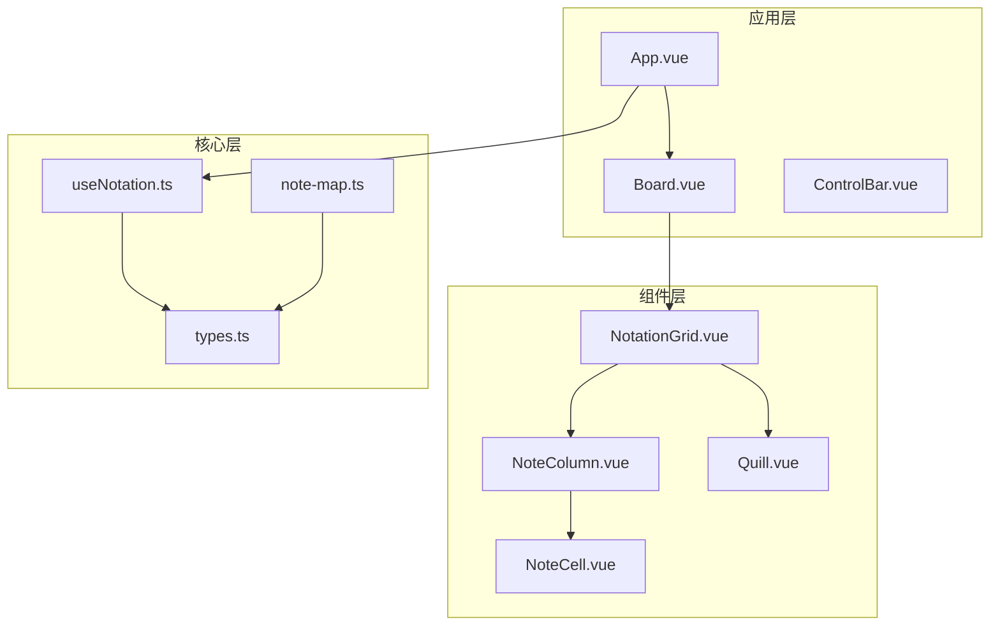
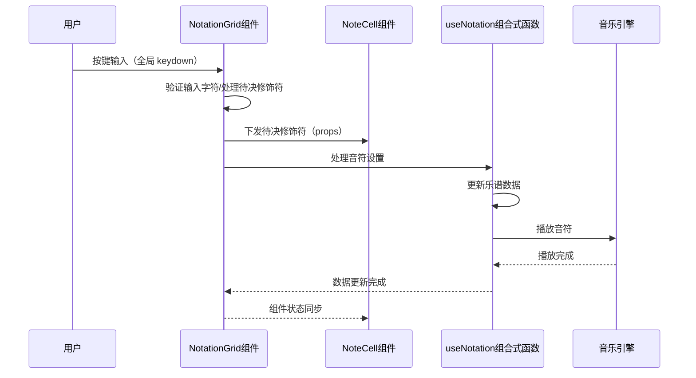
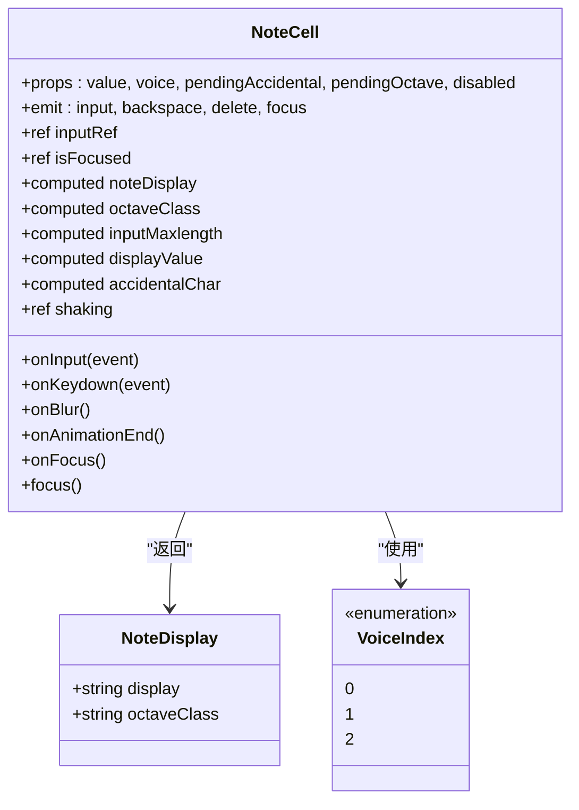
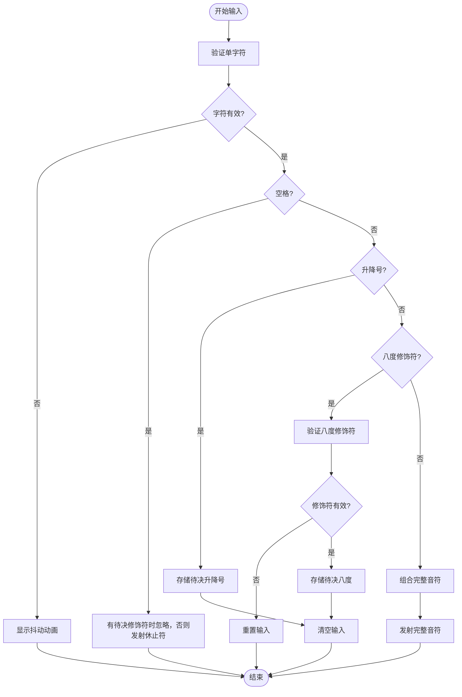
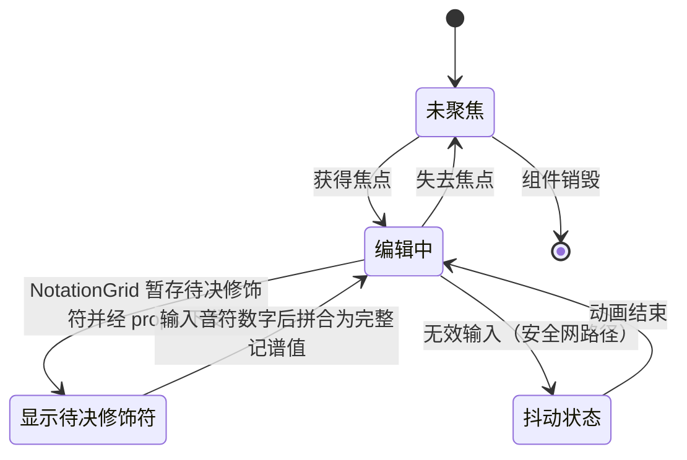
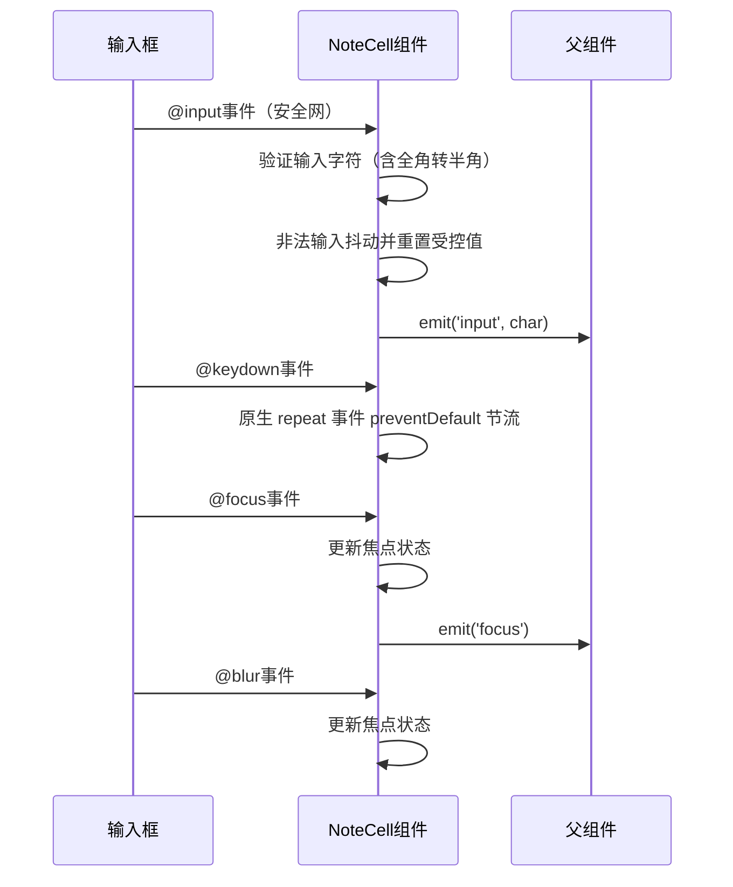
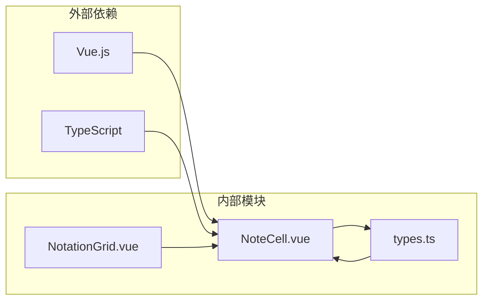

# 音符单元格组件

<cite>
**本文引用的文件**
- [NoteCell.vue](file://src/components/NoteCell.vue)
- [types.ts](file://src/core/types.ts)
- [note-map.ts](file://src/core/note-map.ts)
- [useNotation.ts](file://src/composables/useNotation.ts)
- [NotationGrid.vue](file://src/components/NotationGrid.vue)
- [App.vue](file://src/App.vue)
- [style.css](file://src/style.css)
</cite>

## 目录
1. [简介](#简介)
2. [项目结构](#项目结构)
3. [核心组件](#核心组件)
4. [架构概览](#架构概览)
5. [详细组件分析](#详细组件分析)
6. [依赖关系分析](#依赖关系分析)
7. [性能考虑](#性能考虑)
8. [故障排除指南](#故障排除指南)
9. [结论](#结论)
10. [附录](#附录)

## 简介

音符单元格组件（NoteCell）是音乐记谱板系统中的核心交互组件，负责简谱音符的显示解析、安全网输入验证和视觉反馈。音符字符的正常输入由 NotationGrid 的全局键盘监听统一处理，该组件实现动态尺寸调整、占位符管理、输入验证、状态管理和视觉反馈等功能。

组件支持简谱音符的所有基本元素：音符数字（1-7）、升降号（#、b）、八度修饰符（.、,，位于数字之前）、延音线（-）以及休止符（空格）。通过智能的状态管理，组件能够在不同输入状态下提供一致的用户体验。

## 项目结构

音符单元格组件位于Vue单文件组件中，采用Composition API模式实现。整个音乐记谱系统围绕NoteCell组件构建，形成了完整的输入、验证、显示和播放工作流。

**图表来源**
- [App.vue:1-138](file://src/App.vue#L1-L138)
- [NotationGrid.vue:1-292](file://src/components/NotationGrid.vue#L1-L292)
- [NoteCell.vue:1-278](file://src/components/NoteCell.vue#L1-L278)

**章节来源**
- [App.vue:1-138](file://src/App.vue#L1-L138)
- [NotationGrid.vue:1-292](file://src/components/NotationGrid.vue#L1-L292)

## 核心组件

NoteCell组件是音乐记谱系统中最基础的交互单元，承担着以下核心职责：

### 输入验证机制
组件实现了多层次的输入验证体系：
- 单字符验证：使用正则表达式验证每个按键的有效性
- 完整值验证：确保最终的音符字符串符合简谱规范
- 修饰符约束：限制八度修饰符的数量和类型

### 状态管理系统
组件维护了多种状态以确保正确的输入行为：
- 编辑状态：跟踪当前的输入焦点和编辑状态
- 待决修饰符：由 NotationGrid 暂存的升降号与八度修饰符，经 props 下发用于临时显示
- 错误状态：通过动画效果提供视觉反馈

### 视觉反馈系统
组件提供了丰富的视觉反馈机制：
- 动态尺寸调整：根据输入内容自动调整输入框大小
- 占位符管理：在不同状态下显示适当的占位符
- 动画效果：通过抖动动画提示无效输入

**章节来源**
- [NoteCell.vue:1-278](file://src/components/NoteCell.vue#L1-L278)
- [types.ts:77-96](file://src/core/types.ts#L77-L96)

## 架构概览

NoteCell组件在整个音乐记谱系统中扮演着关键角色，它与NotationGrid协同工作，形成完整的输入处理链路：正常输入走 NotationGrid 的全局键盘监听，NoteCell 负责显示与焦点反馈，其 input 事件作为安全网兜底。

**图表来源**
- [NoteCell.vue:68-115](file://src/components/NoteCell.vue#L68-L115)
- [NotationGrid.vue:29-47](file://src/components/NotationGrid.vue#L29-L47)
- [useNotation.ts:19-24](file://src/composables/useNotation.ts#L19-L24)

## 详细组件分析

### 组件结构设计

NoteCell组件采用了模块化的结构设计，将不同的功能职责分离到独立的方法和计算属性中。

**图表来源**
- [NoteCell.vue:1-178](file://src/components/NoteCell.vue#L1-L178)
- [types.ts:7-12](file://src/core/types.ts#L7-L12)
- [types.ts:47](file://src/core/types.ts#L47)

### 输入验证机制详解

组件的输入验证机制是其核心功能之一，确保用户只能输入有效的简谱字符。

#### 字符验证流程

**图表来源**
- [NoteCell.vue:68-115](file://src/components/NoteCell.vue#L68-L115)
- [types.ts:84-86](file://src/core/types.ts#L84-L86)

#### 八度修饰符处理逻辑

组件对八度修饰符的处理遵循严格的规则，确保音符记谱的准确性。

| 修饰符 | 含义 | 作用范围 | 限制条件 |
|--------|------|----------|----------|
| `.` | 高音 | 上方加点 | 最多1级，不可与低音修饰符混用 |
| `,` | 低音 | 下方加点 | 最多1级，不可与高音修饰符混用 |

**章节来源**
- [NoteCell.vue:98-106](file://src/components/NoteCell.vue#L98-L106)
- [types.ts:4-5](file://src/core/types.ts#L4-L5)

### 状态管理机制

NoteCell组件实现了复杂的状态管理，以支持流畅的输入体验。

#### 状态转换图

**图表来源**
- [NoteCell.vue:19-177](file://src/components/NoteCell.vue#L19-L177)

#### 状态变量说明

| 状态变量 | 类型 | 作用 | 生命周期 |
|----------|------|------|----------|
| `isFocused` | `ref<boolean>` | 跟踪输入框焦点状态 | 组件生命周期内持续存在 |
| `pendingAccidental` | prop（string） | NotationGrid 暂存的待决升降号（#或b），经 props 下发用于显示 | 仅在输入过程中有效 |
| `pendingOctave` | prop（string） | NotationGrid 暂存的待决八度修饰符（.或,），经 props 下发用于显示 | 仅在输入过程中有效 |
| `shaking` | `ref<boolean>` | 控制抖动动画状态 | 仅在错误反馈时有效 |

**章节来源**
- [NoteCell.vue:19-66](file://src/components/NoteCell.vue#L19-L66)

### 事件处理系统

组件实现了完整的事件处理系统，涵盖键盘输入、鼠标交互和焦点管理。

#### 事件处理流程

**图表来源**
- [NoteCell.vue:12-17](file://src/components/NoteCell.vue#L12-L17)
- [NoteCell.vue:137-172](file://src/components/NoteCell.vue#L137-L172)

#### 键盘快捷键支持

**注意：** NoteCell 的键盘处理现在主要负责视觉反馈和待决修饰符的特殊处理，大部分业务逻辑已移至 NotationGrid 的全局监听器。

| 键位 | 功能 | 行为描述 |
|------|------|----------|
| `Backspace` | 删除前一个音符 | 由 NotationGrid 全局监听处理：优先清除待决八度修饰符，再清待决升降号；无修饰符则删除前一格并左移填补 |
| `Delete` | 清空当前音符 | 由 NotationGrid 全局监听处理：清空当前格且不移位（有待决修饰符时清除全部待决修饰符） |
| 字符键 | 输入音符 | 触发 `select()` 选中内容，实现覆盖效果；正常输入由全局监听器统一处理 |
| 长按字符键 | 连续重复输入 | 由 NotationGrid 的自定义计时器驱动重复（首延 350ms、间隔 110ms），忽略原生 `e.repeat` 事件 |

**重要变化：**
- ❌ **不再依赖焦点**：即使 input 失焦，NotationGrid 的全局监听器仍能捕获按键
- ✅ **职责简化**：NoteCell 专注于视觉反馈，业务逻辑由 NotationGrid 统一处理
- ✅ **长按重复**：由自定义计时器统一驱动（首延 350ms、间隔 110ms），确保一致性

**章节来源**
- [NoteCell.vue:137-157](file://src/components/NoteCell.vue#L137-L157)

### 样式系统与视觉反馈

NoteCell组件采用了精心设计的样式系统，提供了丰富的视觉反馈机制。

#### CSS类名动态绑定

组件通过计算属性动态绑定CSS类名，实现响应式的视觉效果：

| 计算属性 | 条件 | 应用的CSS类 |
|----------|------|-------------|
| `octaveClass` | `pendingOctave`（props）存在 | `s1`或`s-1` |
| `octaveClass` | `pendingOctave`（props）不存在 | `noteDisplay.value.octaveClass` |
| `displayValue` | `isFocused.value`为true | 显示完整音符（含升降号） |
| `displayValue` | `isFocused.value`为false | 显示数字部分（去除升降号） |
| `accidentalChar` | `isFocused.value`为false且有待决升降号 | 显示升降号字符 |
| `accidentalChar` | `isFocused.value`为false且无待决升降号 | 显示存储音符的升降号 |

#### 视觉反馈机制

组件实现了多层次的视觉反馈：

1. **抖动动画**：当输入无效字符时，通过`shake`类触发动画
2. **尺寸调整**：根据输入内容动态调整输入框宽度
3. **八度标记**：通过伪元素在音符上方或下方添加点状标记
4. **焦点指示**：通过CSS伪类提供清晰的焦点状态

**章节来源**
- [NoteCell.vue:200-277](file://src/components/NoteCell.vue#L200-L277)

## 依赖关系分析

NoteCell组件与多个核心模块存在紧密的依赖关系，这些依赖关系构成了完整的音乐记谱系统。

**图表来源**
- [NoteCell.vue:2-3](file://src/components/NoteCell.vue#L2-L3)
- [types.ts:1-164](file://src/core/types.ts#L1-L164)

### 核心依赖关系

| 依赖模块 | 用途 | 关键功能 |
|----------|------|----------|
| `types.ts` | 类型定义和验证 | 提供音符字符验证（isValidNoteChar）、显示解析（parseNoteValue）等核心功能 |
| `NotationGrid.vue` | 组件协调 | 暂存待决修饰符并经 props 下发，通过全局键盘监听统一处理输入 |

**章节来源**
- [NoteCell.vue:2-3](file://src/components/NoteCell.vue#L2-L3)
- [types.ts:21-39](file://src/core/types.ts#L21-L39)

## 性能考虑

NoteCell组件在设计时充分考虑了性能优化，确保在大量音符输入时仍能保持流畅的用户体验。

### 性能优化策略

1. **计算属性缓存**：使用Vue的计算属性缓存昂贵的计算结果
2. **事件节流**：通过防抖和节流机制避免重复计算
3. **最小DOM操作**：尽量减少DOM操作次数，提高渲染效率
4. **内存管理**：及时清理事件监听器和定时器

### 内存使用分析

组件的内存使用主要集中在以下方面：
- 状态变量：约4个ref对象
- 事件处理器：约6个函数引用
- 计算属性：约6个计算结果缓存
- DOM引用：1个input元素引用

**章节来源**
- [NoteCell.vue:19-177](file://src/components/NoteCell.vue#L19-L177)

## 故障排除指南

### 常见问题及解决方案

#### 问题1：输入无效字符时没有反应
**症状**：用户输入#、b、.、,以外的字符时，组件没有任何反应  
**原因**：组件正确地阻止了无效字符的输入  
**解决方案**：检查输入法设置，确保使用正确的简谱字符

#### 问题2：八度修饰符无法正常工作
**症状**：输入.或,后没有出现预期的八度标记  
**原因**：八度修饰符需要与音符数字配合使用  
**解决方案**：先输入八度修饰符（.或,），再输入音符数字（1-7），八度修饰符位于数字之前

#### 问题3：升降号输入异常
**症状**：输入#或b后立即消失  
**原因**：升降号需要与音符数字组合才能生效  
**解决方案**：输入#或b后，立即输入音符数字（1-7）

#### 问题4：组件无法获得焦点
**症状**：点击音符单元格后无法输入  
**原因**：可能被其他元素遮挡或样式冲突  
**解决方案**：检查CSS样式，确保input元素可见且可交互

**章节来源**
- [NoteCell.vue:68-115](file://src/components/NoteCell.vue#L68-L115)

### 调试技巧

1. **开发者工具**：使用浏览器开发者工具检查组件状态
2. **控制台日志**：在关键事件处理函数中添加console.log语句
3. **Vue DevTools**：使用Vue官方调试工具检查组件状态
4. **网络监控**：检查是否有资源加载失败影响组件功能

## 结论

NoteCell组件作为音乐记谱板系统的核心组件，展现了优秀的软件工程实践。通过精心设计的状态管理、完善的输入验证机制和丰富的视觉反馈系统，组件为用户提供了直观、高效的音符输入体验。

组件的主要优势包括：
- **完整的功能覆盖**：支持简谱音符的所有基本元素
- **良好的用户体验**：通过动画和视觉反馈提供即时反馈
- **健壮的错误处理**：通过抖动动画提示无效输入
- **灵活的扩展性**：模块化设计便于功能扩展

未来可以考虑的改进方向：
- 添加更多音符类型的输入支持
- 实现更复杂的音符组合输入
- 增强键盘快捷键支持
- 优化移动端触摸体验

## 附录

### 使用示例

NoteCell组件通常在音符网格中使用，每个单元格代表一个音符位置。

### 最佳实践

1. **输入验证**：始终使用组件提供的验证机制
2. **状态管理**：合理使用待决状态变量处理复合输入
3. **事件处理**：正确处理各种键盘和鼠标事件
4. **样式定制**：通过CSS类名定制组件外观
5. **性能优化**：避免不必要的重新渲染和DOM操作

### 相关文件

- [NoteCell.vue](file://src/components/NoteCell.vue) - 主要组件实现
- [types.ts](file://src/core/types.ts) - 类型定义和验证逻辑
- [note-map.ts](file://src/core/note-map.ts) - 音符映射转换
- [useNotation.ts](file://src/composables/useNotation.ts) - 数据管理
- [NotationGrid.vue](file://src/components/NotationGrid.vue) - 组件协调
- [App.vue](file://src/App.vue) - 应用入口