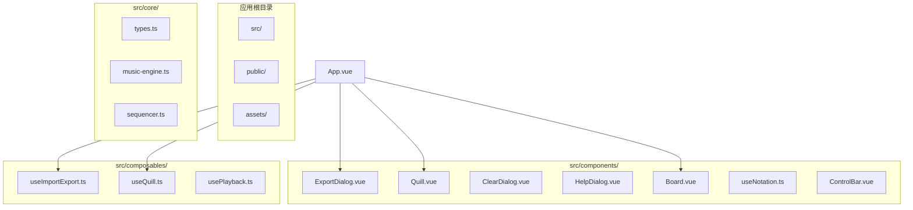
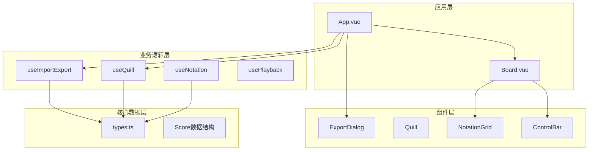
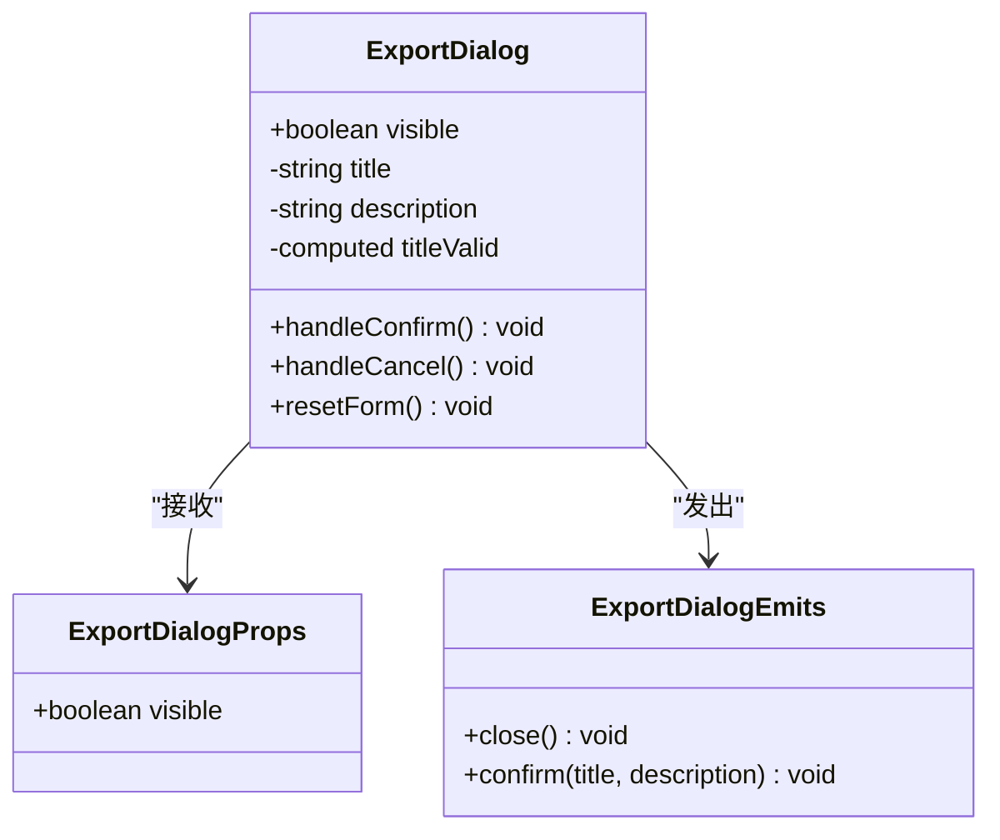
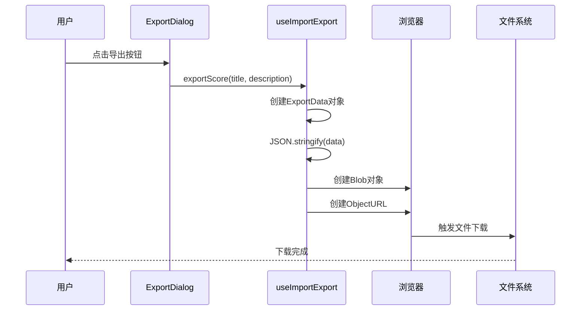
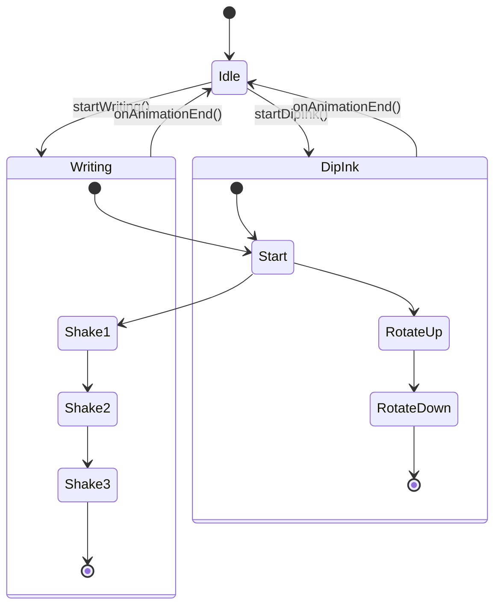
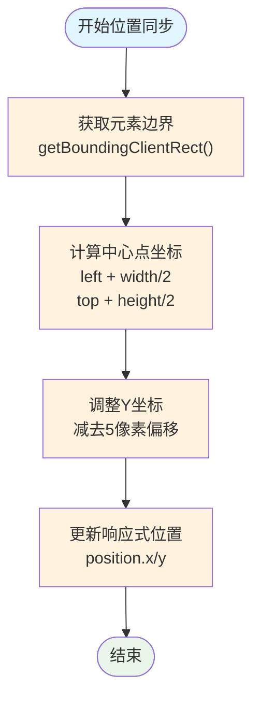
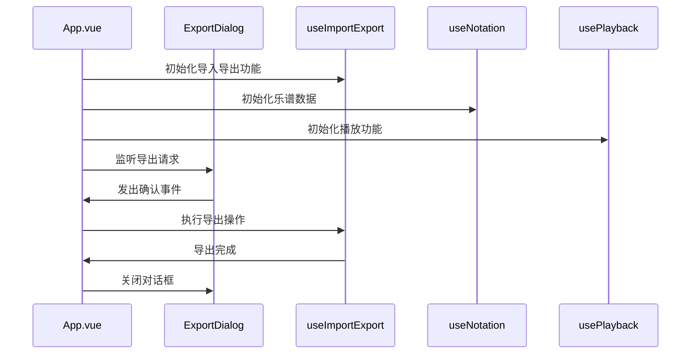
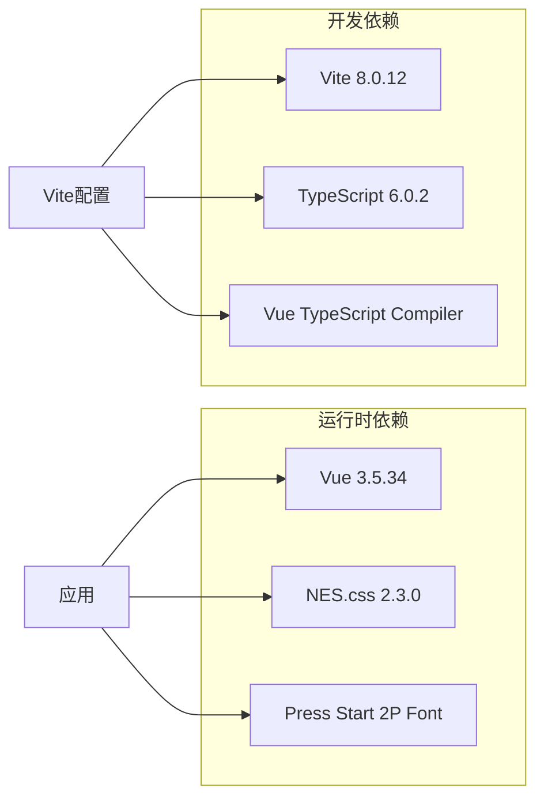
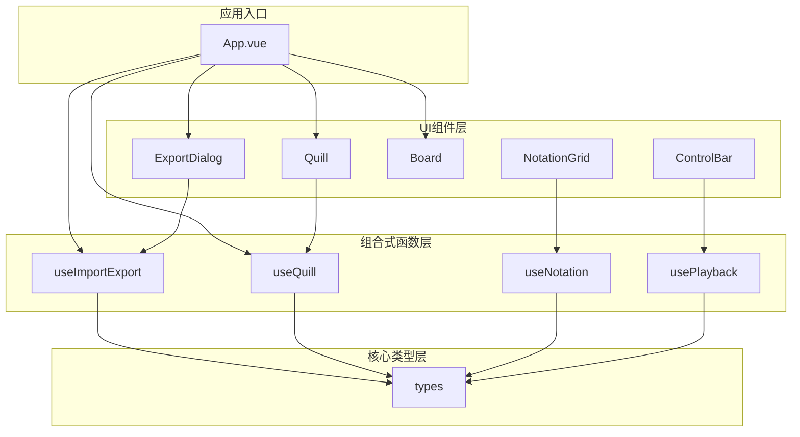

# 辅助功能组件

<cite>
**本文档引用的文件**
- [ExportDialog.vue](file://src/components/ExportDialog.vue)
- [Quill.vue](file://src/components/Quill.vue)
- [useImportExport.ts](file://src/composables/useImportExport.ts)
- [useQuill.ts](file://src/composables/useQuill.ts)
- [App.vue](file://src/App.vue)
- [types.ts](file://src/core/types.ts)
- [useNotation.ts](file://src/composables/useNotation.ts)
- [Board.vue](file://src/components/Board.vue)
- [main.ts](file://src/main.ts)
- [style.css](file://src/style.css)
- [package.json](file://package.json)
</cite>

## 目录
1. [简介](#简介)
2. [项目结构](#项目结构)
3. [核心组件](#核心组件)
4. [架构概览](#架构概览)
5. [详细组件分析](#详细组件分析)
6. [依赖关系分析](#依赖关系分析)
7. [性能考虑](#性能考虑)
8. [故障排除指南](#故障排除指南)
9. [结论](#结论)

## 简介

本文档详细介绍SUBOR音乐创作应用中的辅助功能组件，重点涵盖四个核心组件：ExportDialog导出对话框组件、Quill羽毛笔动画组件、ClearDialog清空确认对话框组件与HelpDialog帮助对话框组件。这些组件在音乐创作场景中发挥着重要作用，分别负责数据的导出管理、视觉效果增强、清空确认与使用帮助。

该应用采用Vue 3 Composition API构建，使用TypeScript进行类型安全开发，结合NES.css设计系统实现复古风格的用户界面。组件设计遵循单一职责原则，通过清晰的接口和事件通信机制实现松耦合的架构。

## 项目结构

项目采用模块化的组件架构，主要目录结构如下：

**图表来源**
- [App.vue:1-138](file://src/App.vue#L1-L138)
- [ExportDialog.vue:1-119](file://src/components/ExportDialog.vue#L1-L119)
- [Quill.vue:1-65](file://src/components/Quill.vue#L1-L65)

**章节来源**
- [main.ts:1-8](file://src/main.ts#L1-L8)
- [package.json:1-25](file://package.json#L1-L25)

## 核心组件

### ExportDialog导出对话框组件

ExportDialog是一个专门用于音乐作品导出的模态对话框组件，提供用户友好的界面来收集导出元数据。

#### 主要特性
- **表单验证**：实时验证标题输入的有效性
- **数据收集**：收集乐谱标题和可选描述信息
- **事件通信**：通过自定义事件与父组件通信
- **样式定制**：基于NES.css框架的复古风格设计

#### 数据流
组件内部维护标题和描述两个响应式状态，通过计算属性确保标题的有效性，并在确认时触发相应的事件。

**章节来源**
- [ExportDialog.vue:1-119](file://src/components/ExportDialog.vue#L1-L119)

### Quill羽毛笔动画组件

Quill组件实现了动态的羽毛笔视觉效果，为用户提供沉浸式的音乐创作体验。

#### 动画系统
组件支持三种动画模式：
- **Idle状态**：默认静止状态
- **Writing动画**：模拟书写时的笔尖抖动效果
- **DipInk动画**：模拟蘸墨时的笔身旋转动作

#### 位置管理
通过useQuill组合式函数管理羽毛笔的位置和动画状态，实现与输入元素的精确对齐。

**章节来源**
- [Quill.vue:1-65](file://src/components/Quill.vue#L1-L65)
- [useQuill.ts:1-39](file://src/composables/useQuill.ts#L1-L39)

### ClearDialog清空确认对话框组件

ClearDialog用于清空乐谱前的二次确认，接收visible属性控制显示，发出close与confirm事件；用户确认后由应用执行清空操作，取消则直接关闭对话框。

**章节来源**
- [ClearDialog.vue](file://src/components/ClearDialog.vue)

### HelpDialog帮助对话框组件

HelpDialog展示使用帮助内容，接收visible属性，发出close事件；可通过右上角×、遮罩点击或Esc键关闭，无底部确认按钮。内容包含主要功能说明、记谱语法与快捷键表，采用与帮助按钮统一的绿色#9fc主题。

**章节来源**
- [HelpDialog.vue](file://src/components/HelpDialog.vue)

## 架构概览

应用采用分层架构设计，各组件职责明确，通过清晰的接口进行通信。

**图表来源**
- [App.vue:1-138](file://src/App.vue#L1-L138)
- [useImportExport.ts:1-138](file://src/composables/useImportExport.ts#L1-L138)
- [useQuill.ts:1-39](file://src/composables/useQuill.ts#L1-L39)

## 详细组件分析

### ExportDialog组件深度分析

#### 组件结构
ExportDialog采用Vue 3的Composition API，定义了清晰的props、emits和响应式状态。

**图表来源**
- [ExportDialog.vue:4-35](file://src/components/ExportDialog.vue#L4-L35)

#### 数据序列化机制
组件通过useImportExport组合式函数实现数据的序列化和下载：

**图表来源**
- [useImportExport.ts:24-47](file://src/composables/useImportExport.ts#L24-L47)

#### 文件格式规范
导出的数据遵循统一的JSON格式，包含版本信息、元数据和乐谱数据：

| 字段名 | 类型 | 必需 | 描述 |
|--------|------|------|------|
| version | string | 是 | 数据格式版本号 |
| title | string | 是 | 乐谱标题 |
| description | string | 否 | 乐谱描述 |
| bpm | number | 是 | 拍号速度 |
| keySignature | string | 是 | 调号 |
| score | Array | 是 | 乐谱数据 |

**章节来源**
- [useImportExport.ts:145-158](file://src/composables/useImportExport.ts#L145-L158)
- [types.ts:140-164](file://src/core/types.ts#L140-L164)

### Quill组件深度分析

#### 动画系统架构
Quill组件实现了完整的动画状态管理，通过CSS动画和JavaScript控制实现流畅的视觉效果。

**图表来源**
- [Quill.vue:18-24](file://src/components/Quill.vue#L18-L24)
- [useQuill.ts:5-39](file://src/composables/useQuill.ts#L5-L39)

#### 位置同步机制
通过useQuill组合式函数实现羽毛笔与输入元素的精确位置同步：

**图表来源**
- [useQuill.ts:10-14](file://src/composables/useQuill.ts#L10-L14)

**章节来源**
- [Quill.vue:1-65](file://src/components/Quill.vue#L1-L65)
- [useQuill.ts:1-39](file://src/composables/useQuill.ts#L1-L39)

### 应用集成分析

#### 生命周期管理
App.vue作为应用入口，负责协调各个组件的生命周期和状态管理：

**图表来源**
- [App.vue:44-53](file://src/App.vue#L44-L53)
- [App.vue:86-94](file://src/App.vue#L86-L94)

#### 事件通信机制
组件间通过Vue的事件系统实现松耦合通信，确保良好的可维护性：

| 事件名称 | 触发方 | 接收方 | 参数 | 用途 |
|----------|--------|--------|------|------|
| close | ExportDialog | App.vue | 无 | 关闭导出对话框 |
| confirm | ExportDialog | App.vue | (title, description) | 处理导出确认 |
| animationEnd | Quill | useQuill | 无 | 动画结束回调 |
| update:cursor | NotationGrid | App.vue | (col, voice) | 光标位置更新 |
| set-note | NotationGrid | App.vue | (col, voice, char) | 设置音符 |

**章节来源**
- [App.vue:86-99](file://src/App.vue#L86-L99)
- [ExportDialog.vue:8-11](file://src/components/ExportDialog.vue#L8-L11)
- [Quill.vue:10-12](file://src/components/Quill.vue#L10-L12)

## 依赖关系分析

### 外部依赖
项目使用现代化的前端技术栈，主要依赖包括：

**图表来源**
- [package.json:11-23](file://package.json#L11-L23)

### 内部依赖关系
组件间的依赖关系体现了清晰的分层架构：

**图表来源**
- [App.vue:1-138](file://src/App.vue#L1-L138)
- [useImportExport.ts:1-138](file://src/composables/useImportExport.ts#L1-L138)
- [useQuill.ts:1-39](file://src/composables/useQuill.ts#L1-L39)

**章节来源**
- [package.json:1-25](file://package.json#L1-L25)

## 性能考虑

### 内存管理
- **对象URL清理**：导出完成后及时调用URL.revokeObjectURL()释放内存
- **响应式数据优化**：使用readonly()保护核心数据结构
- **动画资源管理**：动画结束后自动回到idle状态

### 渲染优化
- **CSS硬件加速**：使用transform属性触发动画，利用GPU加速
- **will-change属性**：预声明动画元素的变更类型
- **组件懒加载**：非关键路径组件按需加载

### 数据处理优化
- **增量更新**：仅更新发生变化的乐谱列
- **防抖处理**：输入事件的节流处理
- **内存池**：复用DOM元素避免频繁创建销毁

## 故障排除指南

### 导出功能问题
**问题症状**：点击导出按钮无响应
**可能原因**：
1. 标题输入为空或无效
2. 浏览器阻止了文件下载
3. 导出数据格式错误

**解决方案**：
1. 确保标题至少包含一个有效字符
2. 检查浏览器下载设置
3. 验证乐谱数据结构完整性

### 动画显示异常
**问题症状**：羽毛笔动画不显示或显示异常
**可能原因**：
1. CSS文件未正确加载
2. 图片资源路径错误
3. 动画事件监听失败

**解决方案**：
1. 检查CSS文件加载状态
2. 验证assets/pen.png文件存在
3. 确认animationend事件绑定正常

### 数据导入失败
**问题症状**：导入JSON文件时报错
**可能原因**：
1. 文件格式不符合规范
2. 版本不兼容
3. 数据结构损坏

**解决方案**：
1. 使用正确的.subor.json文件格式
2. 确保文件版本为1.0
3. 检查JSON语法正确性

**章节来源**
- [useImportExport.ts:72-76](file://src/composables/useImportExport.ts#L72-L76)
- [ExportDialog.vue:17-24](file://src/components/ExportDialog.vue#L17-L24)

## 结论

SUBOR音乐创作应用的辅助功能组件展现了现代前端开发的最佳实践。ExportDialog和Quill组件虽然功能相对简单，但通过精心设计的架构和完善的错误处理机制，为用户提供了可靠的音乐创作体验。

### 主要优势
1. **清晰的架构设计**：组件职责明确，接口简洁
2. **良好的用户体验**：直观的界面设计和流畅的动画效果
3. **强大的数据处理能力**：完整的导入导出机制和数据验证
4. **优秀的可维护性**：模块化设计便于扩展和修改

### 技术亮点
- Vue 3 Composition API的正确使用
- TypeScript类型系统的全面应用
- CSS动画与JavaScript的完美结合
- 现代化工具链的高效集成

这些组件为音乐创作场景提供了坚实的技术基础，通过合理的抽象和封装，使得复杂的音乐数据处理变得简单易用。未来可以考虑添加更多的动画效果和导出格式支持，进一步提升用户体验。