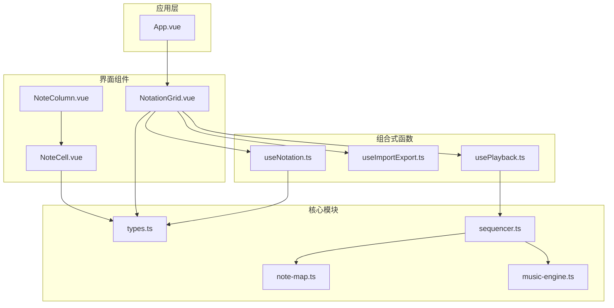
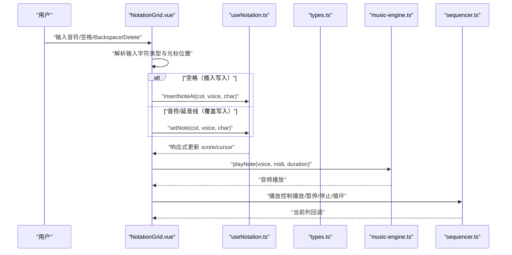
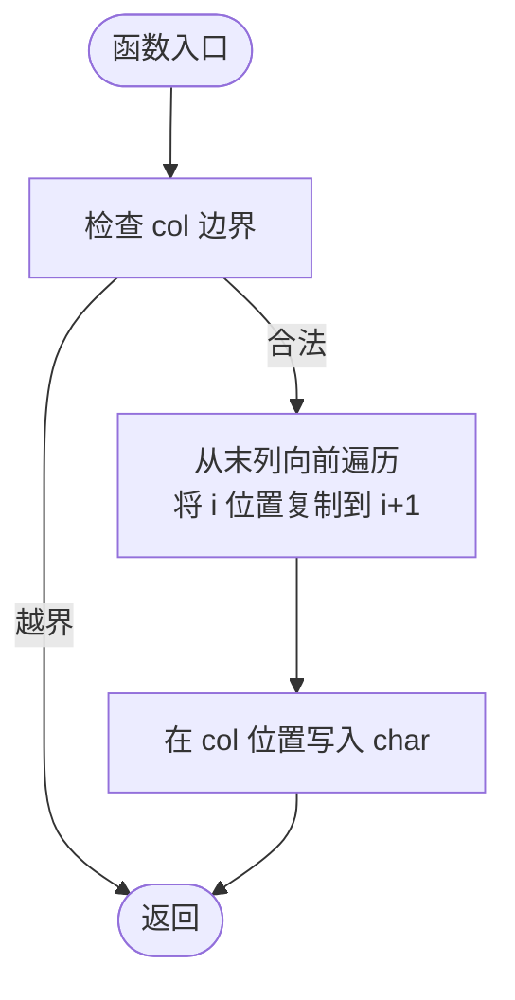
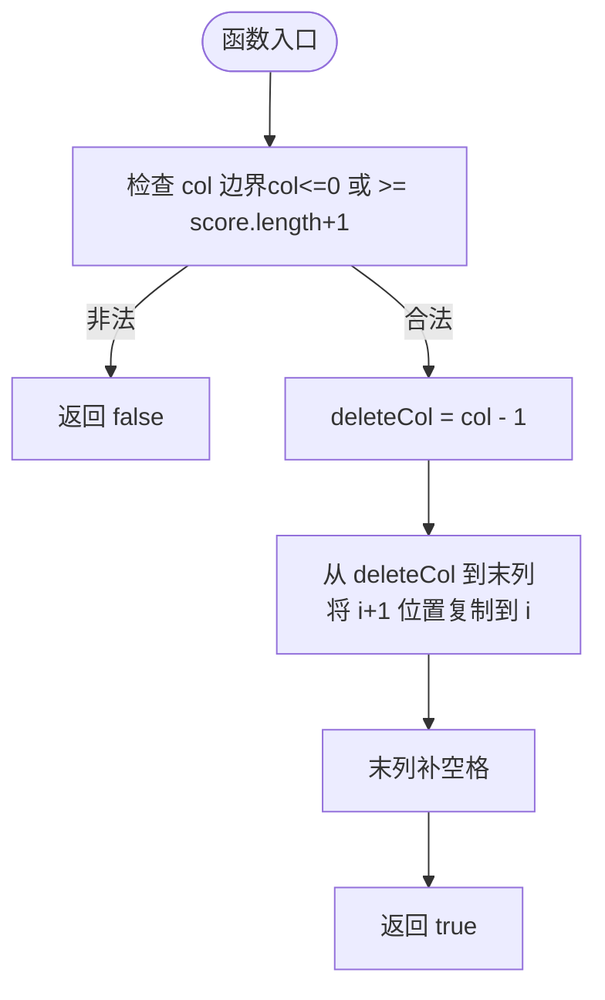
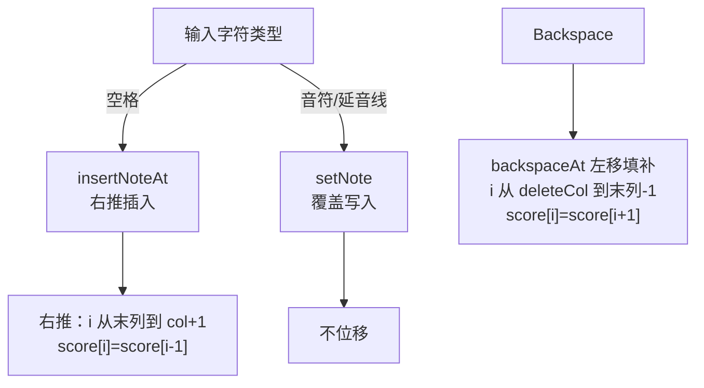
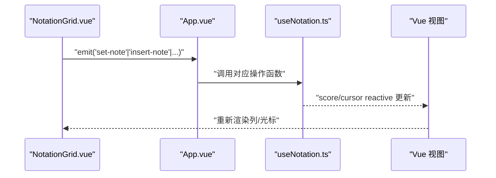
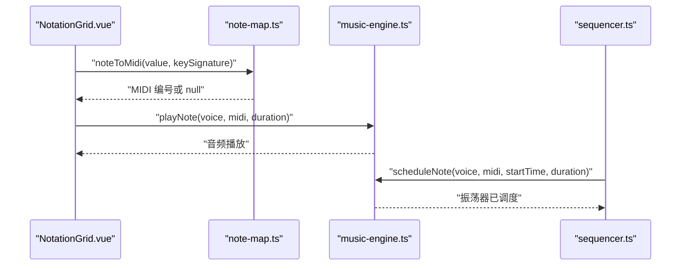
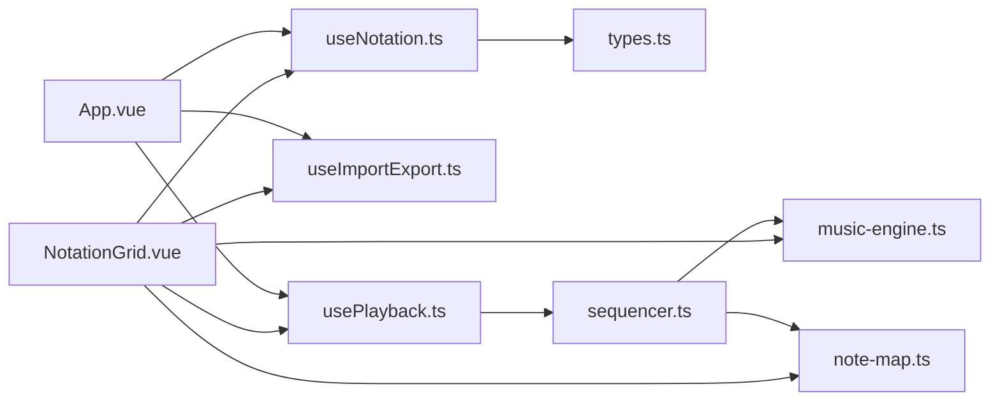

# 乐谱操作功能

<cite>
**本文引用的文件**
- [useNotation.ts](file://src/composables/useNotation.ts)
- [types.ts](file://src/core/types.ts)
- [NotationGrid.vue](file://src/components/NotationGrid.vue)
- [NoteCell.vue](file://src/components/NoteCell.vue)
- [NoteColumn.vue](file://src/components/NoteColumn.vue)
- [App.vue](file://src/App.vue)
- [music-engine.ts](file://src/core/music-engine.ts)
- [note-map.ts](file://src/core/note-map.ts)
- [sequencer.ts](file://src/core/sequencer.ts)
- [useImportExport.ts](file://src/composables/useImportExport.ts)
</cite>

## 目录
1. [简介](#简介)
2. [项目结构](#项目结构)
3. [核心组件](#核心组件)
4. [架构总览](#架构总览)
5. [详细组件分析](#详细组件分析)
6. [依赖关系分析](#依赖关系分析)
7. [性能考量](#性能考量)
8. [故障排查指南](#故障排查指南)
9. [结论](#结论)
10. [附录](#附录)

## 简介
本文件面向记谱系统的“乐谱操作功能”，围绕以下目标展开：
- 深入解释 setNote、clearNote、insertNoteAt、backspaceAt 等核心操作函数的实现原理
- 说明覆盖与插入两种写入行为的区别（由输入字符类型决定），包括音符位移算法与边界处理
- 阐述批量操作 resetScore 与 loadScore 的功能与使用场景
- 解释数据一致性保证机制（响应式更新与状态同步）
- 提供操作使用示例、最佳实践、性能优化建议与常见问题解决方案

## 项目结构
该系统采用 Vue 3 + TypeScript 架构，核心数据与业务逻辑集中在 composable 与 core 模块，UI 层由组件驱动事件流，最终通过序列器与音乐引擎实现播放。

图表来源
- [App.vue:13-100](file://src/App.vue#L13-L100)
- [useNotation.ts:15-116](file://src/composables/useNotation.ts#L15-L116)
- [useImportExport.ts:18-138](file://src/composables/useImportExport.ts#L18-L138)
- [usePlayback.ts:14-95](file://src/composables/usePlayback.ts#L14-L95)
- [types.ts:56-99](file://src/core/types.ts#L56-L99)
- [note-map.ts:83-119](file://src/core/note-map.ts#L83-L119)
- [music-engine.ts:17-221](file://src/core/music-engine.ts#L17-L221)
- [sequencer.ts:21-354](file://src/core/sequencer.ts#L21-L354)
- [NotationGrid.vue:10-292](file://src/components/NotationGrid.vue#L10-L292)
- [NoteColumn.vue:6-63](file://src/components/NoteColumn.vue#L6-L63)
- [NoteCell.vue:7-278](file://src/components/NoteCell.vue#L7-L278)

章节来源
- [App.vue:13-100](file://src/App.vue#L13-L100)
- [useNotation.ts:15-116](file://src/composables/useNotation.ts#L15-L116)
- [types.ts:56-99](file://src/core/types.ts#L56-L99)

## 核心组件
本节聚焦“乐谱操作”的核心数据结构与操作接口，以及它们如何在系统中被消费与传播。

- 数据模型
  - Score：N 列，每列包含 3 个声部（主旋律、和弦律、低频），类型为 Column[]
  - Column：三元组 [string, string, string]，分别对应三个声部的记谱字符串
  - CursorPosition：光标位置 { col, voice }，voice 限定在 0..2

- 关键操作（均由 useNotation.ts 提供）
  - setNote(col, voice, char)：覆盖写入
  - clearNote(col, voice)：清空单元格
  - insertNoteAt(col, voice, char)：插入写入，右推后续音符
  - backspaceAt(col, voice)：回删前格，左移填补并末位补空格
  - deleteAt(col, voice)：删除当前单元格（不位移）
  - moveCursor(col, voice)：移动光标
  - resetScore()：清空乐谱并重置光标
  - loadScore(newScore)：批量加载乐谱，补齐默认列数并重置光标

章节来源
- [useNotation.ts:15-116](file://src/composables/useNotation.ts#L15-L116)
- [types.ts:47-66](file://src/core/types.ts#L47-L66)
- [types.ts:68-79](file://src/core/types.ts#L68-L79)

## 架构总览
乐谱操作贯穿“输入层 -> 组合式函数 -> 核心类型 -> 播放链路”的路径。输入层负责键盘与 UI 事件，组合式函数负责数据变更与边界校验，核心类型定义数据结构与校验规则，播放链路负责将数据转换为音频。

图表来源
- [NotationGrid.vue:112-177](file://src/components/NotationGrid.vue#L112-L177)
- [useNotation.ts:19-63](file://src/composables/useNotation.ts#L19-L63)
- [music-engine.ts:69-150](file://src/core/music-engine.ts#L69-L150)
- [sequencer.ts:144-200](file://src/core/sequencer.ts#L144-L200)

## 详细组件分析

### 1) setNote 与 clearNote
- setNote：在给定列与声部写入字符，不做位移，用于音符/延音线输入的覆盖写入
- clearNote：将指定单元格置为空格，不改变其他列

实现要点
- 边界检查：仅当 col 在 [0, score.length) 时写入
- 响应式：score 为 reactive，写入后自动触发视图更新

复杂度
- 时间复杂度 O(1)
- 空间复杂度 O(1)

章节来源
- [useNotation.ts:19-31](file://src/composables/useNotation.ts#L19-L31)

### 2) insertNoteAt（插入写入）
- 行为：在 col 处插入音符，col 及之后同声部音符右移一位，末位丢弃
- 适用场景：空格（休止符）输入时插入，保持节奏对齐

算法流程

图表来源
- [useNotation.ts:36-42](file://src/composables/useNotation.ts#L36-L42)

边界与异常
- col 越界直接返回
- 末列会被挤出，不会扩展列数

复杂度
- 时间复杂度 O(N)，N 为列数
- 空间复杂度 O(1)

章节来源
- [useNotation.ts:36-42](file://src/composables/useNotation.ts#L36-L42)

### 3) backspaceAt（回删前格）
- 行为：删除 col 前一个位置的音符，之后同声部音符左移填补，末位补空格
- 返回值：是否成功执行（col=0 时无法回删）

算法流程

图表来源
- [useNotation.ts:48-56](file://src/composables/useNotation.ts#L48-L56)

边界与异常
- col=0 或超出范围时直接返回 false
- 末列始终补空格，确保列数不变

复杂度
- 时间复杂度 O(N)
- 空间复杂度 O(1)

章节来源
- [useNotation.ts:48-56](file://src/composables/useNotation.ts#L48-L56)

### 4) deleteAt（删除当前单元格，不位移）
- 行为：清空当前单元格，不触发位移
- 适用场景：Delete 键或需要“擦除”而不改变后续音符

复杂度
- 时间复杂度 O(1)
- 空间复杂度 O(1)

章节来源
- [useNotation.ts:61-63](file://src/composables/useNotation.ts#L61-L63)

### 5) resetScore 与 loadScore（批量操作）
- resetScore：清空所有列，每列重置为空白，光标归位
- loadScore(newScore)：
  - 清空现有数据
  - 最多加载 DEFAULT_COLUMNS 列
  - 不足部分用空白列补齐
  - 重置光标

使用场景
- 重置编辑器状态
- 从外部导入乐谱（配合 useImportExport）

复杂度
- resetScore：O(N)
- loadScore：O(min(M, DEFAULT_COLUMNS))，M 为新乐谱列数

章节来源
- [useNotation.ts:73-101](file://src/composables/useNotation.ts#L73-L101)
- [types.ts:98-99](file://src/core/types.ts#L98-L99)

### 6) 写入行为与位移算法对比
- 音符/延音线输入（覆盖写入）
  - setNote：覆盖写入，不位移
- 空格输入（插入写入）
  - insertNoteAt：右推后续音符，末位丢弃
- Backspace
  - backspaceAt：删除前一格并左移填补，末位补空格
- Delete
  - deleteAt：清空当前格，不移位

图表来源
- [NotationGrid.vue:124-128](file://src/components/NotationGrid.vue#L124-L128)
- [useNotation.ts:36-56](file://src/composables/useNotation.ts#L36-L56)

章节来源
- [NotationGrid.vue:124-177](file://src/components/NotationGrid.vue#L124-L177)
- [types.ts:68-79](file://src/core/types.ts#L68-L79)

### 7) 数据一致性与响应式更新
- useNotation.ts 使用 reactive 包裹 score 与 cursor，任何写入都会触发响应式更新
- NotationGrid.vue 接收只读的 score 与 cursor，并通过事件向上游传递操作请求
- App.vue 作为根组件，将 useNotation 的操作映射为事件处理器，实现双向绑定

图表来源
- [NotationGrid.vue:29-47](file://src/components/NotationGrid.vue#L29-L47)
- [App.vue:62-84](file://src/App.vue#L62-L84)
- [useNotation.ts:103-116](file://src/composables/useNotation.ts#L103-L116)

章节来源
- [useNotation.ts:16-17](file://src/composables/useNotation.ts#L16-L17)
- [NotationGrid.vue:10-27](file://src/components/NotationGrid.vue#L10-L27)
- [App.vue:13-23](file://src/App.vue#L13-L23)

### 8) 音符解析与播放链路
- NotationGrid.vue 在全局键盘监听中校验输入字符并合成记谱值（含升降号、八度修饰符）
- note-map.ts 将记谱字符串解析为 MIDI 编号
- music-engine.ts 使用 Web Audio API 播放音符
- sequencer.ts 将整首乐谱预调度到 AudioContext 时间轴，驱动 UI 指示

图表来源
- [NoteCell.vue:68-115](file://src/components/NoteCell.vue#L68-L115)
- [note-map.ts:83-100](file://src/core/note-map.ts#L83-L100)
- [music-engine.ts:69-150](file://src/core/music-engine.ts#L69-L150)
- [sequencer.ts:240-263](file://src/core/sequencer.ts#L240-L263)

章节来源
- [note-map.ts:83-119](file://src/core/note-map.ts#L83-L119)
- [music-engine.ts:17-221](file://src/core/music-engine.ts#L17-L221)
- [sequencer.ts:21-354](file://src/core/sequencer.ts#L21-L354)

## 依赖关系分析
- useNotation.ts 依赖 types.ts（Score/Column/CursorPosition 等类型）
- NotationGrid.vue 依赖 useNotation.ts、useImportExport.ts、usePlayback.ts、music-engine.ts、note-map.ts
- sequencer.ts 依赖 note-map.ts 与 music-engine.ts
- App.vue 依赖 useNotation.ts、usePlayback.ts、useImportExport.ts

图表来源
- [useNotation.ts:15-116](file://src/composables/useNotation.ts#L15-L116)
- [NotationGrid.vue:10-292](file://src/components/NotationGrid.vue#L10-L292)
- [useImportExport.ts:18-138](file://src/composables/useImportExport.ts#L18-L138)
- [usePlayback.ts:14-95](file://src/composables/usePlayback.ts#L14-L95)
- [sequencer.ts:21-354](file://src/core/sequencer.ts#L21-L354)
- [music-engine.ts:17-221](file://src/core/music-engine.ts#L17-L221)
- [note-map.ts:83-119](file://src/core/note-map.ts#L83-L119)
- [App.vue:13-100](file://src/App.vue#L13-L100)

章节来源
- [useNotation.ts:15-116](file://src/composables/useNotation.ts#L15-L116)
- [NotationGrid.vue:10-292](file://src/components/NotationGrid.vue#L10-L292)
- [sequencer.ts:21-354](file://src/core/sequencer.ts#L21-L354)

## 性能考量
- 插入/回删算法为 O(N)，其中 N 为列数（默认 125）。对于高频输入，建议：
  - 使用输入队列（NotationGrid.vue 中的 inputQueue）避免并发写入造成闪烁或错位
  - 在批量导入时优先使用 loadScore，减少多次写入开销
- 音频调度采用预调度模式（sequencer.ts），一次性计算所有音符的绝对时间，降低 UI 轮询压力
- 音符解析与播放链路尽量复用 MIDI 映射结果，避免重复计算

[本节为通用性能建议，不直接分析具体文件，故无章节来源]

## 故障排查指南
- 输入无效字符
  - 现象：NoteCell.vue 对非法字符进行抖动反馈
  - 处理：确认输入字符符合 isValidNoteChar（仅允许 1-7、#、b、.、,、-、空格）
  - 参考：[NoteCell.vue:72-79](file://src/components/NoteCell.vue#L72-L79)、[types.ts:84-86](file://src/core/types.ts#L84-L86)

- 回删无效
  - 现象：backspaceAt 返回 false
  - 原因：col 越界（col<=0 或 >= score.length+1）
  - 处理：确保光标位置合法后再回删
  - 参考：[useNotation.ts:48-56](file://src/composables/useNotation.ts#L48-L56)

- 插入溢出
  - 现象：末列音符被挤出
  - 原因：insertNoteAt 末位丢弃
  - 处理：在插入前检查列数或提前扩展
  - 参考：[useNotation.ts:36-42](file://src/composables/useNotation.ts#L36-L42)

- 导入数据不兼容
  - 现象：导入失败或被拒绝
  - 处理：useImportExport.ts 会对版本、BPM、调号、乐谱结构进行校验
  - 参考：[useImportExport.ts:84-131](file://src/composables/useImportExport.ts#L84-L131)

- 播放异常
  - 现象：音频无声或卡顿
  - 处理：确保初始化音频上下文（music-engine.ts），检查 BPM/调号变更时的重新调度
  - 参考：[music-engine.ts:41-60](file://src/core/music-engine.ts#L41-L60)、[sequencer.ts:84-115](file://src/core/sequencer.ts#L84-L115)

章节来源
- [NoteCell.vue:72-79](file://src/components/NoteCell.vue#L72-L79)
- [types.ts:84-86](file://src/core/types.ts#L84-L86)
- [useNotation.ts:48-56](file://src/composables/useNotation.ts#L48-L56)
- [useNotation.ts:36-42](file://src/composables/useNotation.ts#L36-L42)
- [useImportExport.ts:84-131](file://src/composables/useImportExport.ts#L84-L131)
- [music-engine.ts:41-60](file://src/core/music-engine.ts#L41-L60)
- [sequencer.ts:84-115](file://src/core/sequencer.ts#L84-L115)

## 结论
本系统通过按输入字符类型区分的写入行为与位移算法、严格的类型约束与响应式更新机制，实现了稳定可靠的乐谱编辑体验。覆盖与插入两种写入行为满足不同创作需求，批量操作支持高效的数据导入导出。播放链路采用预调度策略，兼顾音质与性能。遵循本文的最佳实践与故障排查建议，可进一步提升开发效率与用户体验。

[本节为总结性内容，不直接分析具体文件，故无章节来源]

## 附录

### A. 使用示例与最佳实践
- 基本写入
  - 音符/延音线（覆盖写入）：调用 setNote(col, voice, char)
  - 空格（插入写入）：调用 insertNoteAt(col, voice, char)
  - 参考：[useNotation.ts:19-42](file://src/composables/useNotation.ts#L19-L42)

- 删除与回删
  - 删除当前单元格：deleteAt(col, voice)
  - 回删前一格：backspaceAt(col, voice)
  - 参考：[useNotation.ts:61-56](file://src/composables/useNotation.ts#L61-L56)

- 批量操作
  - 重置：resetScore()
  - 导入：loadScore(newScore)，随后在 App.vue 中通过 useImportExport 完成 UI 流程
  - 参考：[useNotation.ts:73-101](file://src/composables/useNotation.ts#L73-L101)、[useImportExport.ts:52-79](file://src/composables/useImportExport.ts#L52-L79)

- 最佳实践
  - 使用输入队列（NotationGrid.vue）避免并发写入
  - 在批量导入前暂停播放，导入后再恢复
  - 合理设置 BPM 与调号，利用 sequencer 的选择性停止能力
  - 参考：[NotationGrid.vue:112-149](file://src/components/NotationGrid.vue#L112-L149)、[sequencer.ts:84-115](file://src/core/sequencer.ts#L84-L115)

章节来源
- [useNotation.ts:19-101](file://src/composables/useNotation.ts#L19-L101)
- [useImportExport.ts:52-79](file://src/composables/useImportExport.ts#L52-L79)
- [NotationGrid.vue:112-149](file://src/components/NotationGrid.vue#L112-L149)
- [sequencer.ts:84-115](file://src/core/sequencer.ts#L84-L115)