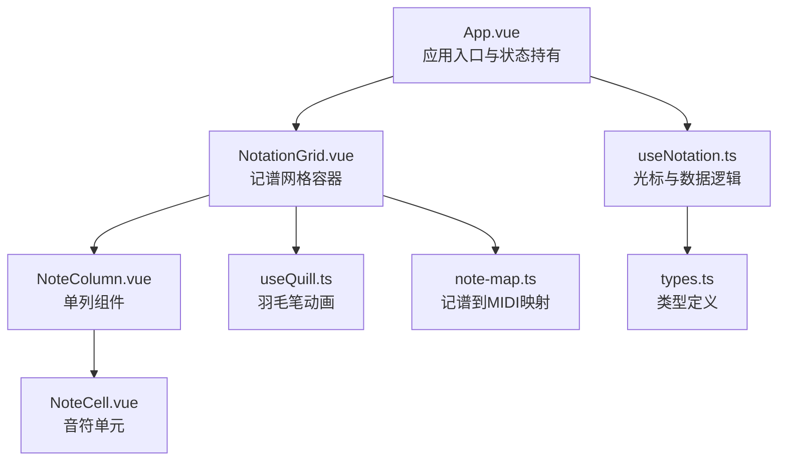
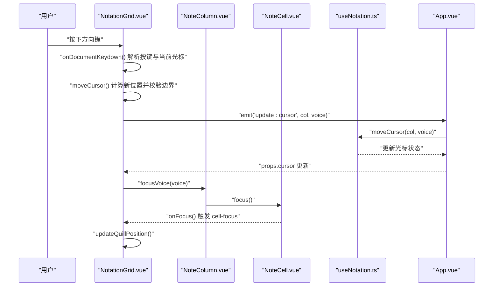
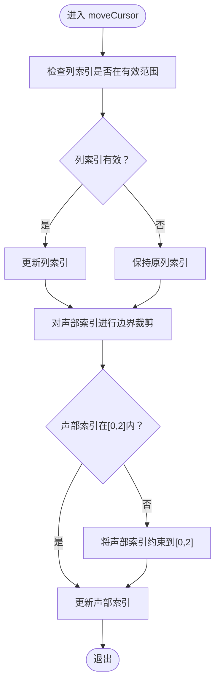
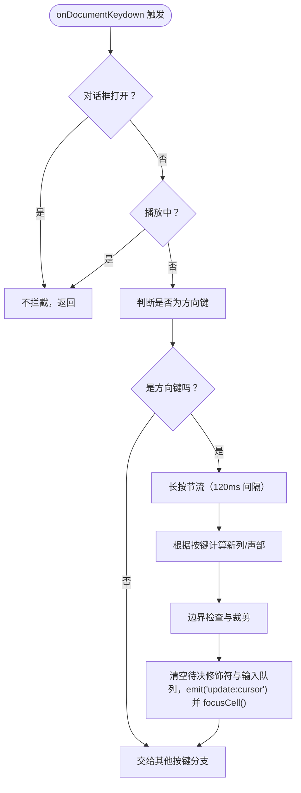
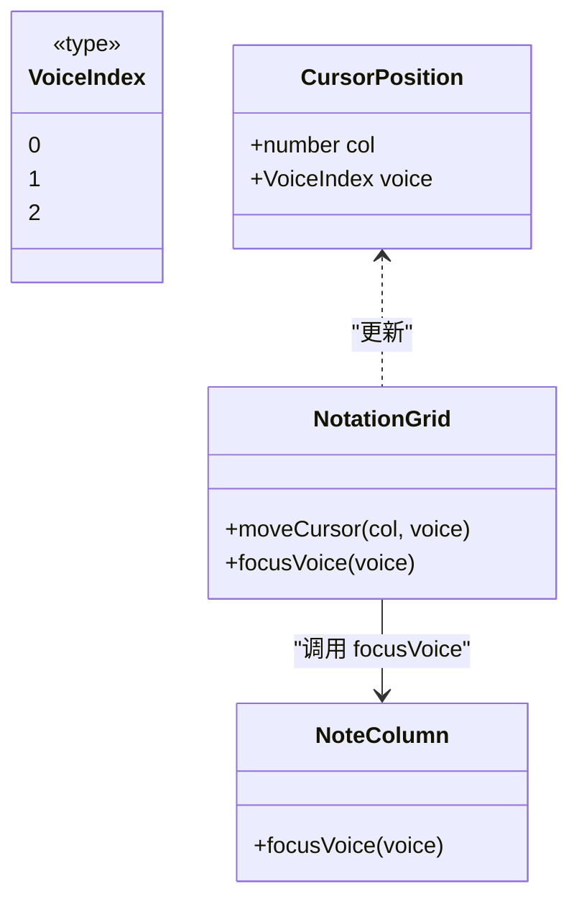
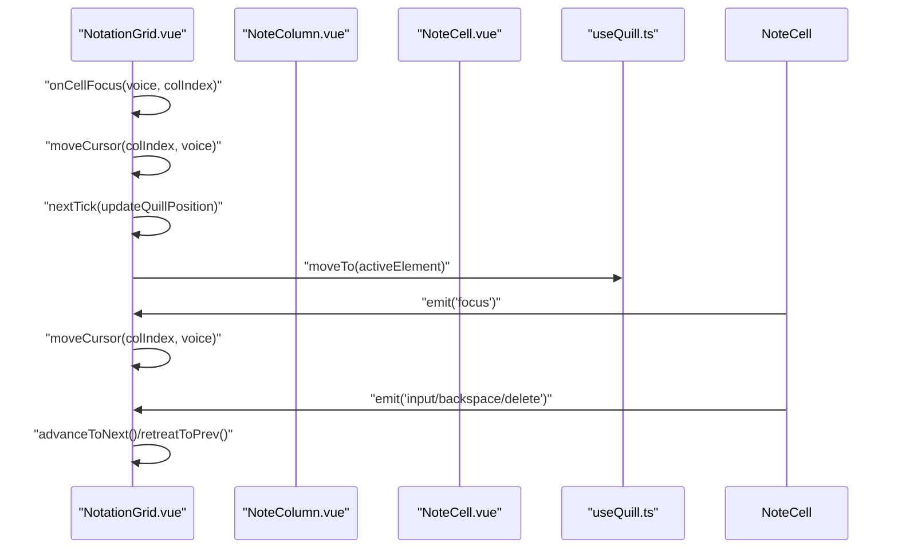
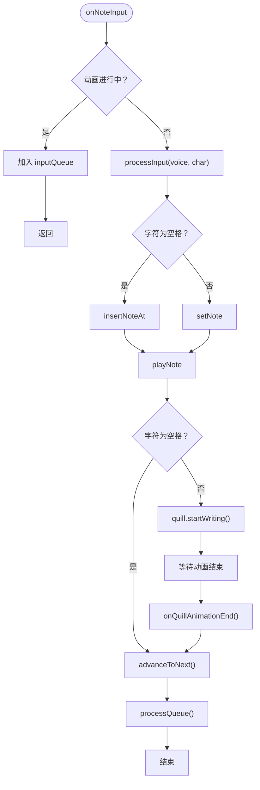
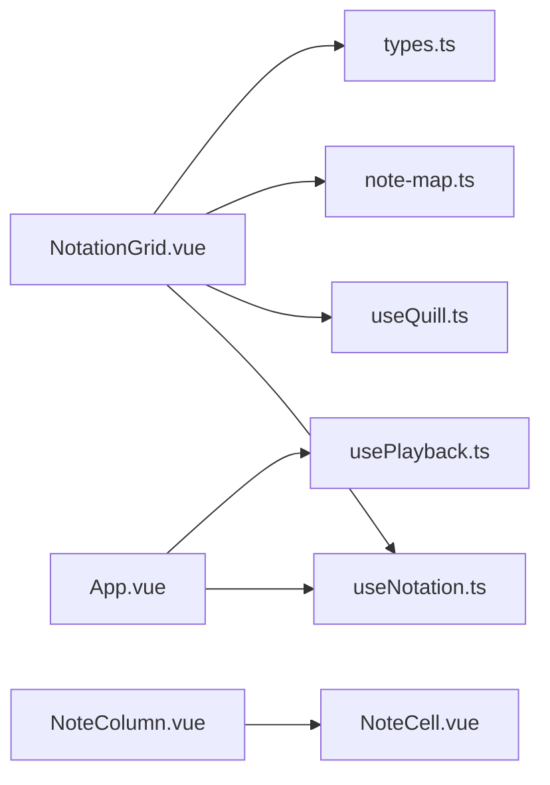

# 光标导航系统

<cite>
**本文引用的文件**
- [App.vue](file://src/App.vue)
- [NotationGrid.vue](file://src/components/NotationGrid.vue)
- [NoteColumn.vue](file://src/components/NoteColumn.vue)
- [NoteCell.vue](file://src/components/NoteCell.vue)
- [useNotation.ts](file://src/composables/useNotation.ts)
- [types.ts](file://src/core/types.ts)
- [useQuill.ts](file://src/composables/useQuill.ts)
- [note-map.ts](file://src/core/note-map.ts)
</cite>

## 目录
1. [简介](#简介)
2. [项目结构](#项目结构)
3. [核心组件](#核心组件)
4. [架构总览](#架构总览)
5. [详细组件分析](#详细组件分析)
6. [依赖关系分析](#依赖关系分析)
7. [性能考虑](#性能考虑)
8. [故障排除指南](#故障排除指南)
9. [结论](#结论)
10. [附录](#附录)

## 简介
本技术文档围绕记谱系统的光标导航系统展开，重点解释以下方面：
- 光标位置管理机制与边界检查
- 行列导航的实现（键盘方向键、Tab键、Enter键）
- 声部间切换的导航逻辑与声部索引管理
- 光标状态与NoteCell组件的同步机制（视觉反馈与焦点管理）
- 导航系统的使用指南与最佳实践（快捷键参考与用户体验优化）

该系统采用Vue 3 Composition API构建，通过组合式函数集中管理光标状态与记谱数据，并通过事件驱动的方式在组件间传递导航指令与输入事件。

## 项目结构
光标导航系统涉及的主要文件与职责如下：
- App.vue：应用入口，持有全局记谱状态与光标状态，负责事件转发与配置管理
- NotationGrid.vue：记谱网格容器，负责键盘导航、光标移动、输入队列与动画协调
- NoteColumn.vue：单列组件，承载三个声部的NoteCell并暴露聚焦方法
- NoteCell.vue：单个音符单元，负责输入验证、修饰符处理、焦点管理与视觉反馈
- useNotation.ts：组合式函数，提供光标移动、数据更新、写入/插入/删除等核心逻辑
- types.ts：类型定义，包括光标位置、声部索引等
- useQuill.ts：羽毛笔动画与位置管理
- note-map.ts：记谱到MIDI映射，用于播放音符

图表来源
- [App.vue:102-138](file://src/App.vue#L102-L138)
- [NotationGrid.vue:252-276](file://src/components/NotationGrid.vue#L252-L276)
- [NoteColumn.vue:30-44](file://src/components/NoteColumn.vue#L30-L44)
- [NoteCell.vue:181-198](file://src/components/NoteCell.vue#L181-L198)
- [useNotation.ts:15-116](file://src/composables/useNotation.ts#L15-L116)
- [types.ts:62-66](file://src/core/types.ts#L62-L66)
- [useQuill.ts:5-39](file://src/composables/useQuill.ts#L5-L39)
- [note-map.ts:83-100](file://src/core/note-map.ts#L83-L100)

章节来源
- [App.vue:102-138](file://src/App.vue#L102-L138)
- [NotationGrid.vue:252-276](file://src/components/NotationGrid.vue#L252-L276)
- [NoteColumn.vue:30-44](file://src/components/NoteColumn.vue#L30-L44)
- [NoteCell.vue:181-198](file://src/components/NoteCell.vue#L181-L198)
- [useNotation.ts:15-116](file://src/composables/useNotation.ts#L15-L116)
- [types.ts:62-66](file://src/core/types.ts#L62-L66)
- [useQuill.ts:5-39](file://src/composables/useQuill.ts#L5-L39)
- [note-map.ts:83-100](file://src/core/note-map.ts#L83-L100)

## 核心组件
本节概述光标导航系统的关键组件及其职责：
- 光标状态与数据管理：由useNotation.ts提供的组合式函数统一管理，包括光标位置、三个声部的数据以及移动光标的边界检查逻辑
- 记谱网格容器：NotationGrid.vue负责键盘事件处理、光标移动、输入队列与动画协调，同时维护当前播放列的视觉状态
- 单列组件：NoteColumn.vue承载三个声部的NoteCell，并提供按声部聚焦的方法
- 音符单元：NoteCell.vue负责输入验证、修饰符处理（升降号、八度）、焦点管理与抖动反馈
- 配置与事件桥接：App.vue持有全局状态并通过事件向上游派发与向下传递，实现跨组件通信

章节来源
- [useNotation.ts:15-116](file://src/composables/useNotation.ts#L15-L116)
- [NotationGrid.vue:186-244](file://src/components/NotationGrid.vue#L186-L244)
- [NoteColumn.vue:20-27](file://src/components/NoteColumn.vue#L20-L27)
- [NoteCell.vue:68-115](file://src/components/NoteCell.vue#L68-L115)
- [App.vue:13-23](file://src/App.vue#L13-L23)

## 架构总览
光标导航系统采用“组合式函数 + 组件事件”的架构模式：
- 数据与状态集中在useNotation.ts中，通过只读接口对外暴露，确保状态变更的可控性
- NotationGrid.vue作为事件中枢，接收键盘事件并根据光标位置计算新的目标位置
- NoteColumn与NoteCell通过ref与事件完成焦点同步，确保用户输入始终作用于正确的音符单元
- 鸽巢式事件流：App.vue监听来自NotationGrid的事件，调用useNotation.ts中的方法更新状态，再将最新状态回传给NotationGrid

图表来源
- [NotationGrid.vue:186-244](file://src/components/NotationGrid.vue#L186-L244)
- [NotationGrid.vue:49-51](file://src/components/NotationGrid.vue#L49-L51)
- [useNotation.ts:65-71](file://src/composables/useNotation.ts#L65-L71)
- [NoteColumn.vue:23-25](file://src/components/NoteColumn.vue#L23-L25)
- [NoteCell.vue:169-172](file://src/components/NoteCell.vue#L169-L172)
- [App.vue:62-64](file://src/App.vue#L62-L64)

## 详细组件分析

### 光标位置管理与边界检查
- 光标位置由CursorPosition接口定义，包含列索引与声部索引
- 边界检查规则：
  - 列索引必须在[0, score.length)范围内
  - 声部索引被限制在[0, 2]之间，超出范围会被截断到有效区间
- moveCursor函数负责更新光标状态，确保不会越界

图表来源
- [useNotation.ts:65-71](file://src/composables/useNotation.ts#L65-L71)
- [types.ts:62-66](file://src/core/types.ts#L62-L66)

章节来源
- [useNotation.ts:65-71](file://src/composables/useNotation.ts#L65-L71)
- [types.ts:62-66](file://src/core/types.ts#L62-L66)

### 行列导航实现（键盘方向键、Tab键、Enter键）
- 方向键导航：
  - 上/下：在声部维度移动，声部索引在[0,2]范围内循环
  - 左/右：在列维度移动，列索引在[0, score.length-1]范围内循环
- Tab键与Enter键：
  - 在当前实现中，Tab键与Enter键未在键盘事件处理中显式绑定，因此默认行为由浏览器处理
  - 若需支持Tab/Enter导航，可在onDocumentKeydown中添加相应分支并调用moveCursor与focusCell

图表来源
- [NotationGrid.vue:186-244](file://src/components/NotationGrid.vue#L186-L244)

章节来源
- [NotationGrid.vue:186-244](file://src/components/NotationGrid.vue#L186-L244)

### 声部间切换与索引管理
- 声部索引为VoiceIndex，取值为0、1、2，分别代表主旋律、和弦律、低频
- 上下声部移动：
  - 向上移动：当voice > 0时递减
  - 向下移动：当voice < 2时递增
- 索引管理：
  - moveCursor内部对声部索引进行边界裁剪，确保始终处于有效范围
  - focusVoice通过NoteColumn暴露的方法，将焦点设置到指定声部的NoteCell

图表来源
- [types.ts:47](file://src/core/types.ts#L47)
- [types.ts:62-66](file://src/core/types.ts#L62-L66)
- [NotationGrid.vue:49-51](file://src/components/NotationGrid.vue#L49-L51)
- [NoteColumn.vue:23-25](file://src/components/NoteColumn.vue#L23-L25)

章节来源
- [types.ts:47](file://src/core/types.ts#L47)
- [types.ts:62-66](file://src/core/types.ts#L62-L66)
- [NotationGrid.vue:49-51](file://src/components/NotationGrid.vue#L49-L51)
- [NoteColumn.vue:23-25](file://src/components/NoteColumn.vue#L23-L25)

### 光标状态与NoteCell组件的同步机制
- 状态同步路径：
  - 用户在NotationGrid中按下方向键或点击音符单元
  - NotationGrid调用moveCursor更新光标，同时调用focusVoice将焦点转移到目标NoteCell
  - NoteCell在onFocus中发出cell-focus事件，NotationGrid捕获后再次调用moveCursor以确保一致性
  - updateQuillPosition根据当前活动元素更新羽毛笔位置，提供视觉反馈
- 视觉反馈：
  - NoteCell在输入非法字符时触发抖动动画
  - NoteColumn在当前播放列时添加阴影效果
  - NoteCell在聚焦时动态调整输入框最大长度与显示内容

图表来源
- [NotationGrid.vue:180-183](file://src/components/NotationGrid.vue#L180-L183)
- [NotationGrid.vue:76-81](file://src/components/NotationGrid.vue#L76-L81)
- [NoteCell.vue:169-172](file://src/components/NoteCell.vue#L169-L172)
- [useQuill.ts:10-14](file://src/composables/useQuill.ts#L10-L14)

章节来源
- [NotationGrid.vue:180-183](file://src/components/NotationGrid.vue#L180-L183)
- [NotationGrid.vue:76-81](file://src/components/NotationGrid.vue#L76-L81)
- [NoteCell.vue:169-172](file://src/components/NoteCell.vue#L169-L172)
- [useQuill.ts:10-14](file://src/composables/useQuill.ts#L10-L14)

### 输入队列与动画协调
- 输入队列：
  - 在书写动画进行期间，后续输入被缓存到inputQueue，保证每格依次处理
  - processInput根据输入字符类型决定插入（空格）或覆盖（音符/延音线），完成后启动羽毛笔书写动画
- 动画结束：
  - handleQuillAnimationEnd重置动画状态并推进到下一格，随后批量处理队列中的输入
- 退格与删除：
  - Backspace：backspaceAt删除前一列音符并左移填补，末位补空格
  - Delete：deleteAt清空当前列音符，不触发位移

图表来源
- [NotationGrid.vue:113-148](file://src/components/NotationGrid.vue#L113-L148)
- [NotationGrid.vue:163-177](file://src/components/NotationGrid.vue#L163-L177)
- [useNotation.ts:36-56](file://src/composables/useNotation.ts#L36-L56)

章节来源
- [NotationGrid.vue:113-148](file://src/components/NotationGrid.vue#L113-L148)
- [NotationGrid.vue:163-177](file://src/components/NotationGrid.vue#L163-L177)
- [useNotation.ts:36-56](file://src/composables/useNotation.ts#L36-L56)

## 依赖关系分析
- NotationGrid依赖：
  - useNotation.ts：光标移动与数据更新
  - useQuill.ts：羽毛笔位置与动画
  - note-map.ts：音符到MIDI映射
  - types.ts：类型定义
- NoteColumn依赖：
  - NoteCell：三个声部的输入单元
- App.vue依赖：
  - useNotation.ts：全局状态与事件处理
  - usePlayback.ts：播放控制（与导航系统协同）

图表来源
- [NotationGrid.vue:53-54](file://src/components/NotationGrid.vue#L53-L54)
- [useNotation.ts:15-116](file://src/composables/useNotation.ts#L15-L116)
- [useQuill.ts:5-39](file://src/composables/useQuill.ts#L5-L39)
- [note-map.ts:83-100](file://src/core/note-map.ts#L83-L100)
- [types.ts:62-66](file://src/core/types.ts#L62-L66)
- [NoteColumn.vue:30-44](file://src/components/NoteColumn.vue#L30-L44)
- [NoteCell.vue:181-198](file://src/components/NoteCell.vue#L181-L198)
- [App.vue:13-23](file://src/App.vue#L13-L23)

章节来源
- [NotationGrid.vue:53-54](file://src/components/NotationGrid.vue#L53-L54)
- [useNotation.ts:15-116](file://src/composables/useNotation.ts#L15-L116)
- [useQuill.ts:5-39](file://src/composables/useQuill.ts#L5-L39)
- [note-map.ts:83-100](file://src/core/note-map.ts#L83-L100)
- [types.ts:62-66](file://src/core/types.ts#L62-L66)
- [NoteColumn.vue:30-44](file://src/components/NoteColumn.vue#L30-L44)
- [NoteCell.vue:181-198](file://src/components/NoteCell.vue#L181-L198)
- [App.vue:13-23](file://src/App.vue#L13-L23)

## 性能考虑
- 事件去抖与重复键处理：方向键长按重复由自定义计时器驱动（间隔 ARROW_REPEAT_INTERVAL=120ms），避免导航过快导致的光标混乱
- 输入队列与动画串行化：通过inputQueue确保每格依次处理，减少并发输入带来的状态竞争
- DOM访问最小化：updateQuillPosition仅在焦点变化时调用，且基于activeElement获取位置
- 边界检查前置：moveCursor在组件层与组合式函数层双重检查，降低无效渲染概率

## 故障排除指南
- 方向键无效：
  - 检查全局 keydown 监听器是否正常挂载（不依赖 INPUT 焦点状态）
  - 检查是否处于播放中或对话框打开状态（两种情况下不处理编辑按键）
  - 检查方向键长按节流计时器是否正常工作
- Tab/Enter导航缺失：
  - 在onDocumentKeydown中添加对Tab/Enter的处理分支
- 光标跳变或错位：
  - 确保cell-focus事件正确触发并调用moveCursor
  - 检查focusVoice是否正确调用NoteCell的focus方法
- 输入队列阻塞：
  - 确认onQuillAnimationEnd正确重置writingAnimationActive并处理队列
- 非法字符抖动：
  - NoteCell会在输入非法字符时触发抖动，属于预期行为

章节来源
- [NotationGrid.vue:186-244](file://src/components/NotationGrid.vue#L186-L244)
- [NoteCell.vue:68-115](file://src/components/NoteCell.vue#L68-L115)
- [NotationGrid.vue:151-156](file://src/components/NotationGrid.vue#L151-L156)

## 结论
光标导航系统通过清晰的职责分离与事件驱动架构实现了稳定的行列导航、声部切换与焦点同步。moveCursor的边界检查与输入队列机制确保了在复杂交互下的状态一致性。NoteCell的输入验证与视觉反馈进一步提升了用户体验。未来可扩展Tab/Enter导航与更丰富的快捷键组合，以满足不同用户的操作习惯。

## 附录

### 使用指南与最佳实践
- 快捷键参考
  - 方向键：上下左右进行行列与声部导航，长按按固定间隔连续移动
  - Backspace：删除前一格并左移填补，末位补空格
  - Delete：清空当前格且不移位
  - Ctrl/Cmd+Z：撤销上一步修改（含覆盖 / 插入 / 删除 / 清空 / 导入）
  - Ctrl/Cmd+Shift+Z 或 Ctrl/Cmd+Y：重做被撤销的修改
  - Tab/Enter：当前未绑定，可按需扩展
- 用户体验优化建议
  - 在onDocumentKeydown中增加对Tab/Enter的处理，实现列间快速跳转
  - 提供键盘导航的视觉提示（如高亮当前音符）
  - 长按方向键时按固定间隔（ARROW_REPEAT_INTERVAL=120ms）连续导航
  - 为不同声部提供不同的颜色或图标标识，便于区分