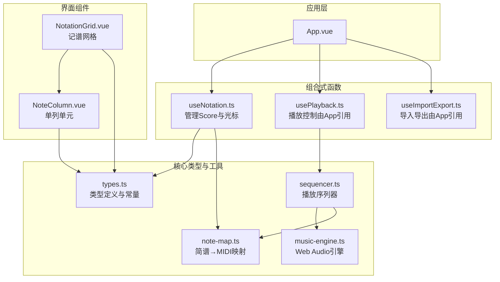
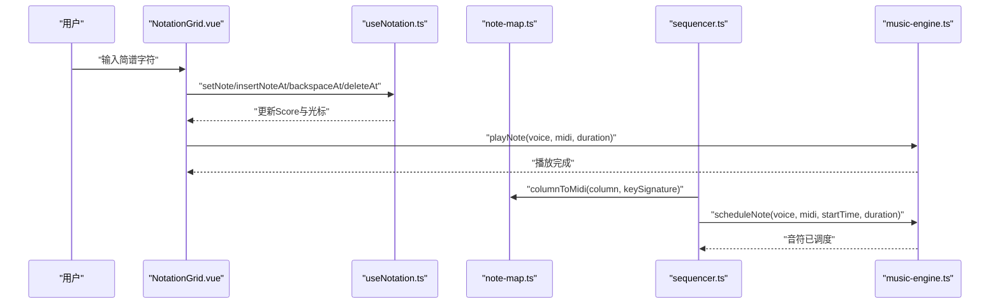
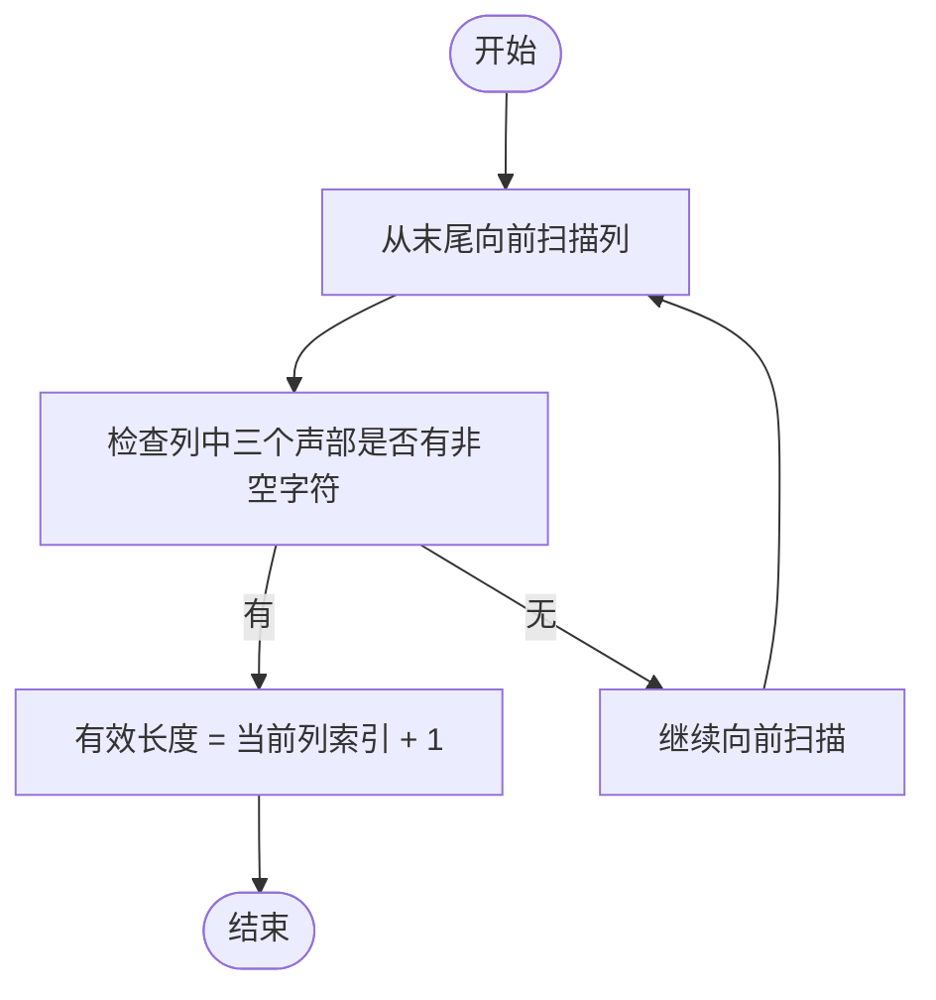
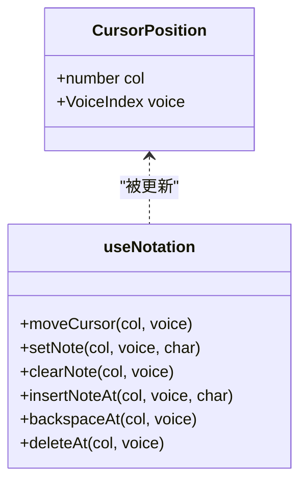
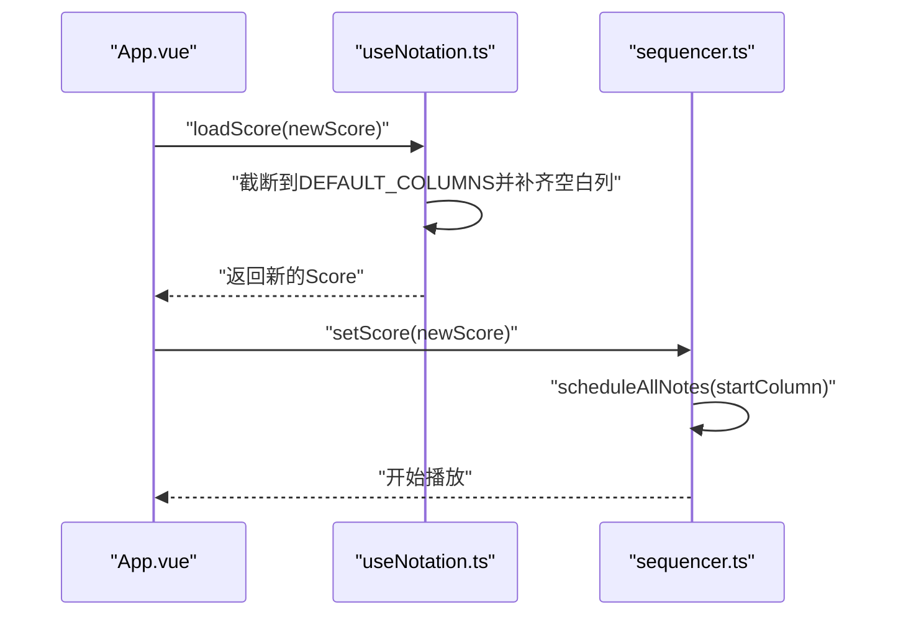
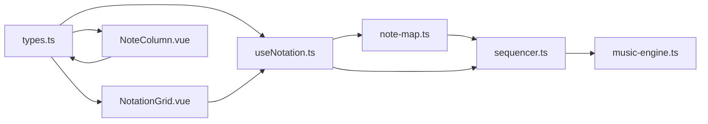

# 数据结构设计

<cite>
**本文引用的文件**
- [src/core/types.ts](file://src/core/types.ts)
- [src/composables/useNotation.ts](file://src/composables/useNotation.ts)
- [src/core/note-map.ts](file://src/core/note-map.ts)
- [src/core/sequencer.ts](file://src/core/sequencer.ts)
- [src/core/music-engine.ts](file://src/core/music-engine.ts)
- [src/components/NotationGrid.vue](file://src/components/NotationGrid.vue)
- [src/components/NoteColumn.vue](file://src/components/NoteColumn.vue)
- [src/App.vue](file://src/App.vue)
- [presets/jingle-bell.subor.json](file://presets/jingle-bell.subor.json)
</cite>

## 目录
1. [简介](#简介)
2. [项目结构](#项目结构)
3. [核心数据类型](#核心数据类型)
4. [架构总览](#架构总览)
5. [详细组件分析](#详细组件分析)
6. [依赖关系分析](#依赖关系分析)
7. [性能考量](#性能考量)
8. [故障排查指南](#故障排查指南)
9. [结论](#结论)
10. [附录](#附录)

## 简介
本技术文档围绕记谱系统的数据结构设计展开，重点解释以下方面：
- Score类型的三维数组设计：列（Column）与声部（Voice）的组织方式
- 三声部简谱的存储策略：主旋律、和弦律、低频声部的数据结构
- CursorPosition光标位置对象的设计：行列索引与声部索引的实现
- DEFAULT_COLUMNS默认列数的配置与扩展机制
- 数据结构的内存布局与使用示例，展示如何通过组合式函数访问与修改这些数据结构

## 项目结构
该系统采用Vue 3 + TypeScript构建，核心数据结构集中在core目录，界面组件位于components目录，应用入口在App.vue中协调各模块。

图表来源
- [src/App.vue:1-138](file://src/App.vue#L1-L138)
- [src/composables/useNotation.ts:1-116](file://src/composables/useNotation.ts#L1-L116)
- [src/core/types.ts:1-164](file://src/core/types.ts#L1-L164)
- [src/core/note-map.ts:1-119](file://src/core/note-map.ts#L1-L119)
- [src/core/sequencer.ts:1-354](file://src/core/sequencer.ts#L1-L354)
- [src/core/music-engine.ts:1-221](file://src/core/music-engine.ts#L1-L221)
- [src/components/NotationGrid.vue:1-292](file://src/components/NotationGrid.vue#L1-L292)
- [src/components/NoteColumn.vue:1-63](file://src/components/NoteColumn.vue#L1-L63)

章节来源
- [src/App.vue:1-138](file://src/App.vue#L1-L138)

## 核心数据类型
本节聚焦于Score、Column、CursorPosition等核心类型，以及它们在系统中的作用与约束。

- 声部索引与声部元信息
  - VoiceIndex：0=主旋律（方波·Lead）、1=和弦律（方波·Chord）、2=低频（三角波·Bass）
  - VOICES：提供声部标签与波形类型映射，便于UI与播放器识别

- 单列数据结构 Column
  - 类型定义为三元组：[主旋律, 和弦律, 低频]
  - 顺序严格对应VoiceIndex，确保列内三个声部一一对应

- 乐谱数据结构 Score
  - 类型定义为Column[]，即“N列”的二维数组
  - 实际长度由DEFAULT_COLUMNS决定，默认125列，便于编辑器提供稳定的列空间

- 光标位置 CursorPosition
  - 字段：col（列索引）、voice（声部索引）
  - 与VoiceIndex配合，确保光标始终指向有效的列与声部

- 默认列数 DEFAULT_COLUMNS
  - 常量：125
  - 作用：为乐谱提供固定的列数上限，便于渲染与播放器计算有效长度

章节来源
- [src/core/types.ts:41-79](file://src/core/types.ts#L41-L79)
- [src/core/types.ts:56-66](file://src/core/types.ts#L56-L66)
- [src/core/types.ts:98-100](file://src/core/types.ts#L98-L100)

## 架构总览
记谱系统的数据流从输入到播放贯穿以下路径：
- 输入层：NotationGrid接收键盘输入，派发事件给useNotation
- 数据层：useNotation维护Score与CursorPosition，提供增删改查与移动光标的方法
- 映射层：note-map将简谱字符串转换为MIDI编号
- 播放层：sequencer根据Score与BPM/调号预调度音符，music-engine生成具体波形

图表来源
- [src/components/NotationGrid.vue:112-140](file://src/components/NotationGrid.vue#L112-L140)
- [src/composables/useNotation.ts:19-63](file://src/composables/useNotation.ts#L19-L63)
- [src/core/note-map.ts:109-118](file://src/core/note-map.ts#L109-L118)
- [src/core/sequencer.ts:240-263](file://src/core/sequencer.ts#L240-L263)
- [src/core/music-engine.ts:69-150](file://src/core/music-engine.ts#L69-L150)

## 详细组件分析

### Score与Column：三声部简谱的存储策略
- 存储模型
  - Score为Column数组，每个Column为三元组，分别承载主旋律、和弦律、低频三个声部
  - 三元组顺序与VoiceIndex严格一致，确保读取与播放时的确定性

- 有效性与空白列
  - 乐谱固定DEFAULT_COLUMNS列，但实际有效长度由最后一列存在非空音符决定
  - 播放器通过getEffectiveLength()扫描末尾，跳过空白列，提升播放效率

- 与MIDI映射的关系
  - columnToMidi对单列三个声部分别调用noteToMidi，得到MIDI编号数组
  - 三角波（低频）音符时长略短，以匹配特定播放模式

图表来源
- [src/core/sequencer.ts:223-232](file://src/core/sequencer.ts#L223-L232)

章节来源
- [src/core/types.ts:56-66](file://src/core/types.ts#L56-L66)
- [src/core/sequencer.ts:223-232](file://src/core/sequencer.ts#L223-L232)
- [src/core/note-map.ts:109-118](file://src/core/note-map.ts#L109-L118)

### CursorPosition：行列索引与声部索引
- 设计要点
  - col：列索引，范围受Score长度约束
  - voice：声部索引，限定在0~2之间
  - 与useNotation.moveCursor配合，确保光标移动边界安全

- 与输入流程的协作
  - NotationGrid根据键盘事件更新光标，并同步到useNotation
  - 输入事件（set/clear/insert/backspace/delete）均以光标位置为起点

图表来源
- [src/core/types.ts:62-66](file://src/core/types.ts#L62-L66)
- [src/composables/useNotation.ts:66-71](file://src/composables/useNotation.ts#L66-L71)
- [src/components/NotationGrid.vue:186-244](file://src/components/NotationGrid.vue#L186-L244)

章节来源
- [src/core/types.ts:62-66](file://src/core/types.ts#L62-L66)
- [src/composables/useNotation.ts:66-71](file://src/composables/useNotation.ts#L66-L71)
- [src/components/NotationGrid.vue:186-244](file://src/components/NotationGrid.vue#L186-L244)

### DEFAULT_COLUMNS：默认列数与扩展机制
- 默认列数
  - DEFAULT_COLUMNS=125，用于初始化固定长度的Score
  - 有利于编辑器渲染稳定性和播放器预调度的统一基线

- 扩展与加载
  - useNotation.loadScore在导入时最多加载DEFAULT_COLUMNS列，并用空白列补齐至固定长度
  - 这种策略确保了播放器的有效长度计算与渲染一致性

- 与播放器的协同
  - getEffectiveLength()在播放时动态计算有效长度，避免在空白列上浪费时间
  - setBpm/setKeySignature在播放中变更参数时，基于lastScheduleBaseTime与lastScheduleStartCol进行选择性停止与重调度

图表来源
- [src/composables/useNotation.ts:82-101](file://src/composables/useNotation.ts#L82-L101)
- [src/core/sequencer.ts:51-53](file://src/core/sequencer.ts#L51-L53)
- [src/core/sequencer.ts:240-263](file://src/core/sequencer.ts#L240-L263)

章节来源
- [src/core/types.ts:98-100](file://src/core/types.ts#L98-L100)
- [src/composables/useNotation.ts:82-101](file://src/composables/useNotation.ts#L82-L101)
- [src/core/sequencer.ts:51-53](file://src/core/sequencer.ts#L51-L53)

### 数据结构内存布局与使用示例
- 内存布局
  - Score为数组，每个元素为长度为3的数组（Column）
  - Column内部按声部顺序存放字符串（简谱字符或空格）
  - 光标对象为轻量对象，包含两个数值字段

- 组合式函数访问与修改
  - 设置/清除/插入/回删/删除：通过useNotation提供的方法直接修改Score
  - 移动光标：通过moveCursor更新CursorPosition
  - 导入/导出：loadScore与exportScore配合useImportExport

- 示例（路径指引）
  - 创建空白Score：[src/composables/useNotation.ts:10-13](file://src/composables/useNotation.ts#L10-L13)
  - 设置音符：[src/composables/useNotation.ts:19-24](file://src/composables/useNotation.ts#L19-L24)
  - 插入音符：[src/composables/useNotation.ts:33-42](file://src/composables/useNotation.ts#L33-L42)
  - 回删音符：[src/composables/useNotation.ts:44-56](file://src/composables/useNotation.ts#L44-L56)
  - 删除音符：[src/composables/useNotation.ts:58-63](file://src/composables/useNotation.ts#L58-L63)
  - 移动光标：[src/composables/useNotation.ts:65-71](file://src/composables/useNotation.ts#L65-L71)
  - 导入乐谱：[src/composables/useNotation.ts:82-101](file://src/composables/useNotation.ts#L82-L101)
  - 简谱→MIDI映射：[src/core/note-map.ts:83-100](file://src/core/note-map.ts#L83-L100)
  - 单列→MIDI映射：[src/core/note-map.ts:109-118](file://src/core/note-map.ts#L109-L118)
  - 播放器调度：[src/core/sequencer.ts:240-263](file://src/core/sequencer.ts#L240-L263)

章节来源
- [src/composables/useNotation.ts:10-13](file://src/composables/useNotation.ts#L10-L13)
- [src/composables/useNotation.ts:19-24](file://src/composables/useNotation.ts#L19-L24)
- [src/composables/useNotation.ts:33-42](file://src/composables/useNotation.ts#L33-L42)
- [src/composables/useNotation.ts:44-56](file://src/composables/useNotation.ts#L44-L56)
- [src/composables/useNotation.ts:58-63](file://src/composables/useNotation.ts#L58-L63)
- [src/composables/useNotation.ts:65-71](file://src/composables/useNotation.ts#L65-L71)
- [src/composables/useNotation.ts:82-101](file://src/composables/useNotation.ts#L82-L101)
- [src/core/note-map.ts:83-100](file://src/core/note-map.ts#L83-L100)
- [src/core/note-map.ts:109-118](file://src/core/note-map.ts#L109-L118)
- [src/core/sequencer.ts:240-263](file://src/core/sequencer.ts#L240-L263)

## 依赖关系分析
- 类型与常量
  - types.ts提供VoiceIndex、Column、Score、CursorPosition、DEFAULT_COLUMNS等基础定义
- 数据管理
  - useNotation.ts依赖types.ts，负责Score与光标的响应式管理
- 映射与播放
  - note-map.ts将简谱映射为MIDI，供sequencer与music-engine使用
  - sequencer.ts依赖music-engine.ts与note-map.ts，负责预调度与播放控制
- 界面集成
  - NotationGrid.vue与NoteColumn.vue消费Score与CursorPosition，驱动输入与渲染

图表来源
- [src/core/types.ts:1-164](file://src/core/types.ts#L1-L164)
- [src/composables/useNotation.ts:1-116](file://src/composables/useNotation.ts#L1-L116)
- [src/core/note-map.ts:1-119](file://src/core/note-map.ts#L1-L119)
- [src/core/sequencer.ts:1-354](file://src/core/sequencer.ts#L1-L354)
- [src/core/music-engine.ts:1-221](file://src/core/music-engine.ts#L1-L221)
- [src/components/NotationGrid.vue:1-292](file://src/components/NotationGrid.vue#L1-L292)
- [src/components/NoteColumn.vue:1-63](file://src/components/NoteColumn.vue#L1-L63)

章节来源
- [src/core/types.ts:1-164](file://src/core/types.ts#L1-L164)
- [src/composables/useNotation.ts:1-116](file://src/composables/useNotation.ts#L1-L116)
- [src/core/note-map.ts:1-119](file://src/core/note-map.ts#L1-L119)
- [src/core/sequencer.ts:1-354](file://src/core/sequencer.ts#L1-L354)
- [src/core/music-engine.ts:1-221](file://src/core/music-engine.ts#L1-L221)
- [src/components/NotationGrid.vue:1-292](file://src/components/NotationGrid.vue#L1-L292)
- [src/components/NoteColumn.vue:1-63](file://src/components/NoteColumn.vue#L1-L63)

## 性能考量
- 预调度播放模式
  - sequencer一次性计算所有音符的绝对时间并创建振荡器，避免播放时的实时计算开销
- 有效长度优化
  - getEffectiveLength()跳过空白列，减少不必要的音符调度与UI更新
- 选择性停止
  - setBpm/setKeySignature在播放中仅停止未来音符，保留当前正在播放的音符，避免卡顿
- 内存占用
  - 固定DEFAULT_COLUMNS列数，便于批量分配与垃圾回收，同时避免频繁扩容

## 故障排查指南
- 输入字符合法性
  - 使用isValidNoteChar与isValidNoteValue进行单字符与完整值校验
- 光标越界
  - moveCursor对col与voice进行边界收敛，避免越界访问
- 插入/回删异常
  - insertNoteAt与backspaceAt在col越界时直接返回，避免错误位移
- 导入数据长度
  - loadScore最多加载DEFAULT_COLUMNS列，并用空白列补齐，确保固定长度

章节来源
- [src/core/types.ts:84-96](file://src/core/types.ts#L84-L96)
- [src/composables/useNotation.ts:66-71](file://src/composables/useNotation.ts#L66-L71)
- [src/composables/useNotation.ts:36-42](file://src/composables/useNotation.ts#L36-L42)
- [src/composables/useNotation.ts:48-56](file://src/composables/useNotation.ts#L48-L56)
- [src/composables/useNotation.ts:82-101](file://src/composables/useNotation.ts#L82-L101)

## 结论
本系统通过Score/Column/CursorPosition三者协作，实现了三声部简谱的高效存储与播放。DEFAULT_COLUMNS提供了稳定的列数基线，结合useNotation的组合式函数与note-map的简谱→MIDI映射，使输入、编辑、播放与导出流程清晰且可扩展。播放器采用预调度与有效长度优化策略，在保证音质的同时兼顾性能与用户体验。

## 附录
- 示例乐谱文件
  - 预设曲目：[presets/jingle-bell.subor.json](file://presets/jingle-bell.subor.json)
- 关键实现路径
  - Score初始化与固定长度：[src/composables/useNotation.ts:10-13](file://src/composables/useNotation.ts#L10-L13)
  - 光标移动与边界保护：[src/composables/useNotation.ts:66-71](file://src/composables/useNotation.ts#L66-L71)
  - 单列MIDI映射：[src/core/note-map.ts:109-118](file://src/core/note-map.ts#L109-L118)
  - 播放器预调度：[src/core/sequencer.ts:240-263](file://src/core/sequencer.ts#L240-L263)