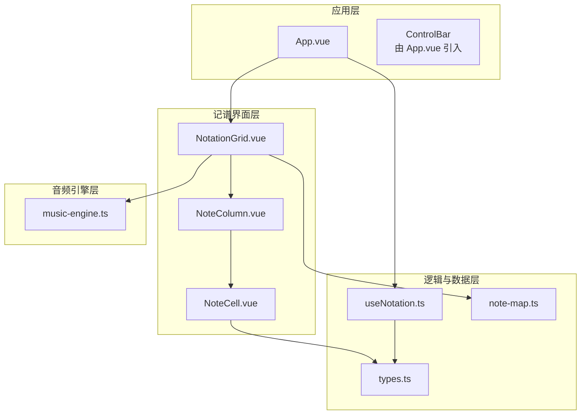
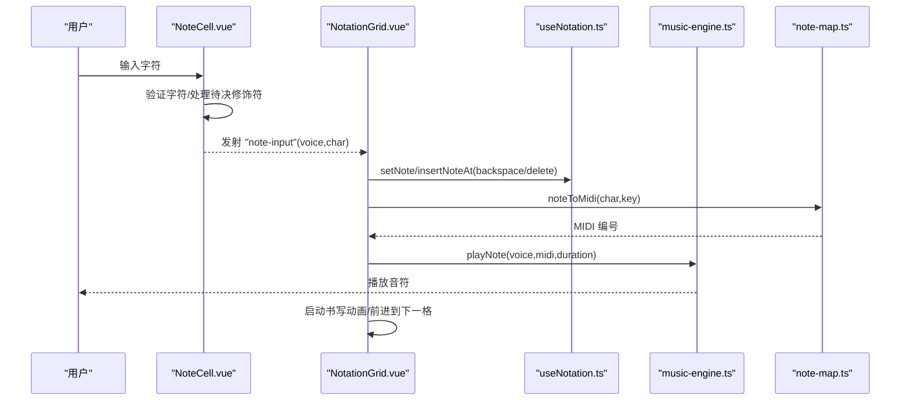
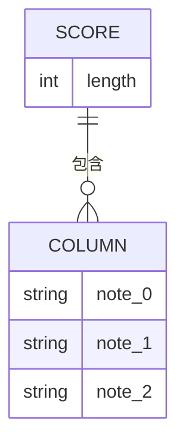
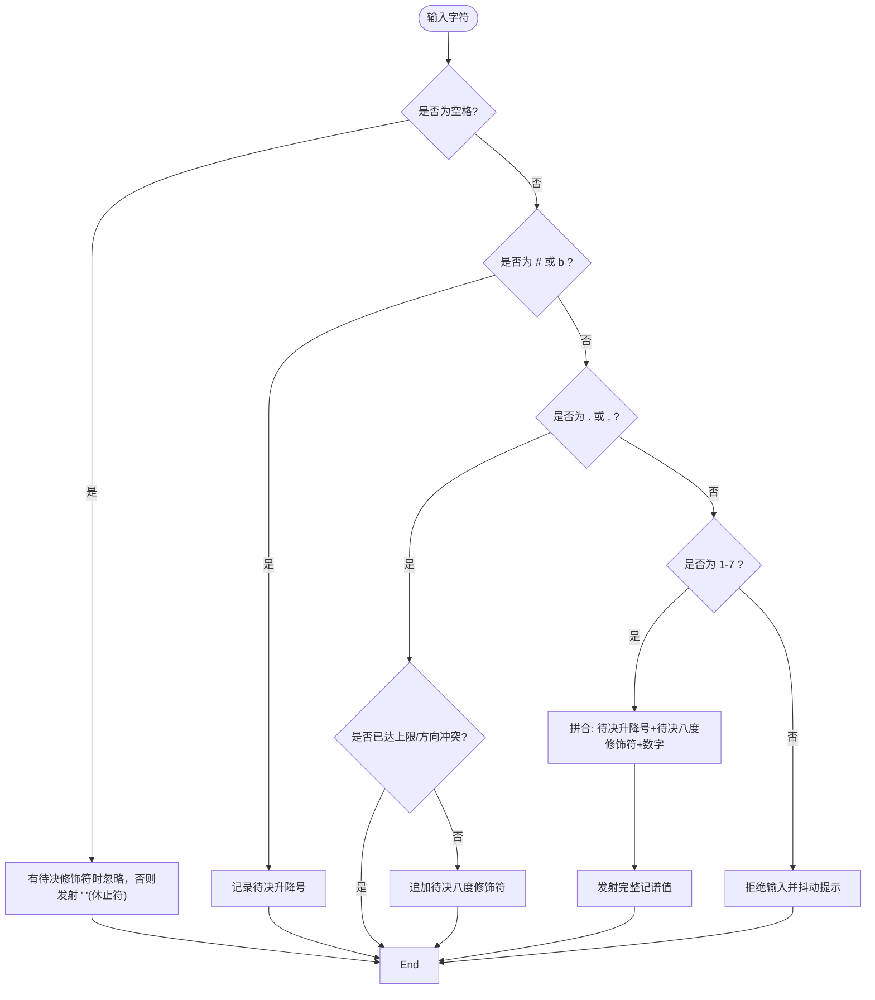
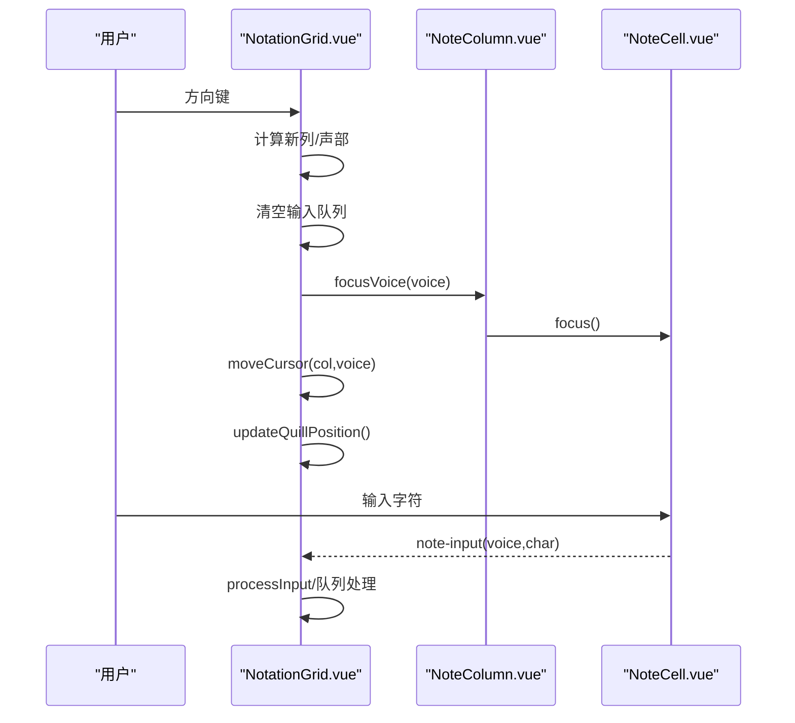
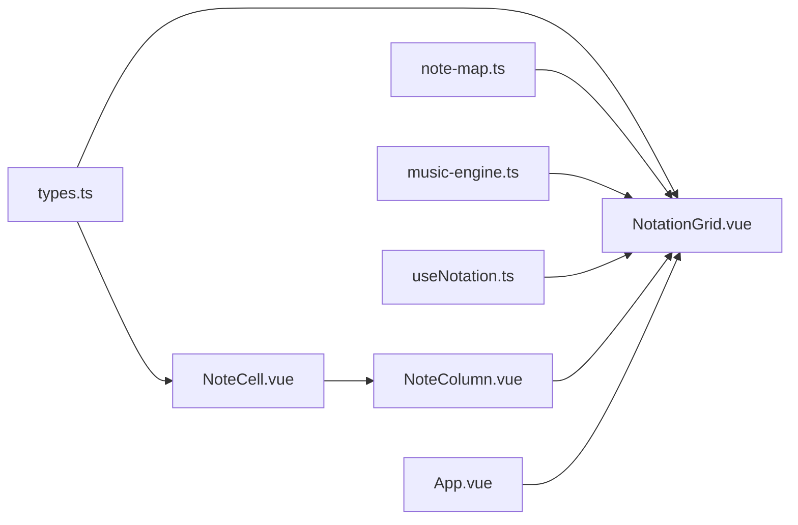

# 记谱系统

<cite>
**本文引用的文件**
- [src/core/types.ts](file://src/core/types.ts)
- [src/components/NoteCell.vue](file://src/components/NoteCell.vue)
- [src/components/NotationGrid.vue](file://src/components/NotationGrid.vue)
- [src/components/NoteColumn.vue](file://src/components/NoteColumn.vue)
- [src/composables/useNotation.ts](file://src/composables/useNotation.ts)
- [src/core/note-map.ts](file://src/core/note-map.ts)
- [src/core/music-engine.ts](file://src/core/music-engine.ts)
- [src/App.vue](file://src/App.vue)
- [presets/jingle-bell.subor.json](file://presets/jingle-bell.subor.json)
</cite>

## 目录
1. [简介](#简介)
2. [项目结构](#项目结构)
3. [核心组件](#核心组件)
4. [架构总览](#架构总览)
5. [详细组件分析](#详细组件分析)
6. [依赖关系分析](#依赖关系分析)
7. [性能考量](#性能考量)
8. [故障排查指南](#故障排查指南)
9. [结论](#结论)
10. [附录](#附录)

## 简介
本技术文档面向“记谱系统”的使用者与开发者，系统基于 Vue 3 + TypeScript + Vite 构建，采用简谱记谱法，支持三声部（主旋律、和弦律、低频）记谱与播放。文档重点涵盖：
- Score 数据结构设计与三维数组组织方式
- 简谱记谱法的实现细节（数字音符、升降号、八度修饰符）
- NoteCell 组件的输入验证机制（键盘事件、输入限制、错误提示）
- 光标导航系统（行列定位、键盘快捷键、鼠标交互）
- 记谱规则（音符时值、休止符、连音线等音乐符号表示）
- 数据模型定义与使用示例

## 项目结构
系统采用组件化与组合式 API 设计，核心模块如下：
- 核心类型与工具：types.ts、note-map.ts、music-engine.ts
- 记谱界面：NoteCell.vue、NoteColumn.vue、NotationGrid.vue
- 记谱逻辑：useNotation.ts
- 应用入口与控制栏：App.vue
- 示例数据：presets/*.subor.json

图表来源
- [src/App.vue:102-138](file://src/App.vue#L102-L138)
- [src/components/NotationGrid.vue:1-292](file://src/components/NotationGrid.vue#L1-L292)
- [src/components/NoteColumn.vue:1-63](file://src/components/NoteColumn.vue#L1-L63)
- [src/components/NoteCell.vue:1-278](file://src/components/NoteCell.vue#L1-L278)
- [src/composables/useNotation.ts:1-116](file://src/composables/useNotation.ts#L1-L116)
- [src/core/types.ts:1-164](file://src/core/types.ts#L1-L164)
- [src/core/note-map.ts:1-119](file://src/core/note-map.ts#L1-L119)
- [src/core/music-engine.ts:1-221](file://src/core/music-engine.ts#L1-L221)

章节来源
- [src/App.vue:102-138](file://src/App.vue#L102-L138)
- [src/components/NotationGrid.vue:1-292](file://src/components/NotationGrid.vue#L1-L292)
- [src/components/NoteColumn.vue:1-63](file://src/components/NoteColumn.vue#L1-L63)
- [src/components/NoteCell.vue:1-278](file://src/components/NoteCell.vue#L1-L278)
- [src/composables/useNotation.ts:1-116](file://src/composables/useNotation.ts#L1-L116)
- [src/core/types.ts:1-164](file://src/core/types.ts#L1-L164)
- [src/core/note-map.ts:1-119](file://src/core/note-map.ts#L1-L119)
- [src/core/music-engine.ts:1-221](file://src/core/music-engine.ts#L1-L221)

## 核心组件
- Score 数据结构：二维数组，每列包含三个声部的记谱字符串，顺序对应 VoiceIndex（0=主旋律，1=和弦律，2=低频）。初始列数 125，可随输入/导入动态扩展。
- NoteCell：单个音符单元格，负责输入验证、待决修饰符（升降号、八度）管理、键盘事件与错误提示。
- NotationGrid：网格容器，负责光标移动、按输入字符类型写入/插入音符、Backspace/Delete 行为、播放音符、书写动画与队列处理。
- useNotation：记谱逻辑组合式函数，提供设置/插入/删除音符、Backspace、移动光标、重置/加载乐谱等能力。
- note-map：简谱到 MIDI 的映射，支持调号与八度修饰符。
- music-engine：Web Audio API 音频引擎，按声部音域与波形类型播放音符。

章节来源
- [src/core/types.ts:47-66](file://src/core/types.ts#L47-L66)
- [src/components/NoteCell.vue:1-278](file://src/components/NoteCell.vue#L1-L278)
- [src/components/NotationGrid.vue:1-292](file://src/components/NotationGrid.vue#L1-L292)
- [src/composables/useNotation.ts:1-116](file://src/composables/useNotation.ts#L1-L116)
- [src/core/note-map.ts:1-119](file://src/core/note-map.ts#L1-L119)
- [src/core/music-engine.ts:1-221](file://src/core/music-engine.ts#L1-L221)

## 架构总览
系统采用“视图-逻辑-数据-音频”分层：
- 视图层：NoteCell/NoteColumn/NotationGrid 负责渲染与交互
- 逻辑层：useNotation 提供纯数据操作
- 数据层：types 定义 Score/Column/NoteChar 等类型
- 音频层：music-engine 通过 Web Audio API 播放

图表来源
- [src/components/NoteCell.vue:68-115](file://src/components/NoteCell.vue#L68-L115)
- [src/components/NotationGrid.vue:112-140](file://src/components/NotationGrid.vue#L112-L140)
- [src/composables/useNotation.ts:19-63](file://src/composables/useNotation.ts#L19-L63)
- [src/core/note-map.ts:83-100](file://src/core/note-map.ts#L83-L100)
- [src/core/music-engine.ts:69-75](file://src/core/music-engine.ts#L69-L75)

## 详细组件分析

### Score 数据结构与三声部存储策略
- Score 是 Column[]，Column 为长度固定的三元组 [主旋律, 和弦律, 低频]。
- 初始列数为 125（DEFAULT_COLUMNS），输入越过末尾或导入更长数据时自动扩展，不再设硬上限。
- 每个单元格存储简谱字符串（如 "1", "#.1", "b,3"），空格表示休止符。八度修饰符位于数字之前（. 高八度、, 低八度）。
- 读取时按列遍历，逐声部渲染；写入时通过 useNotation 的 setNote/insertNoteAt/backspaceAt/deleteAt 控制。

图表来源
- [src/core/types.ts:56-60](file://src/core/types.ts#L56-L60)
- [src/composables/useNotation.ts:5-13](file://src/composables/useNotation.ts#L5-L13)

章节来源
- [src/core/types.ts:56-60](file://src/core/types.ts#L56-L60)
- [src/composables/useNotation.ts:5-13](file://src/composables/useNotation.ts#L5-L13)

### 简谱记谱法实现（数字音符、升降号、八度修饰符）
- 支持字符集：1-7（音高）、#（升）、b（降）、.（高八度，上加点）、,（低八度，下加点）、-（延音线）、空格（休止符）。
- 输入层验证：isValidNoteChar 与 isValidNoteValue 分别用于单字符与完整值校验。
- 解析与显示：parseNoteValue 将存储值拆分为 display 与 octaveClass；noteToMidi 将简谱映射为 MIDI 编号，考虑调号与八度修饰符。
- 修饰符优先级：先输入的修饰符会暂存在待决区，随后输入数字时合并为完整记谱值。

图表来源
- [src/components/NoteCell.vue:68-115](file://src/components/NoteCell.vue#L68-L115)
- [src/core/types.ts:77-96](file://src/core/types.ts#L77-L96)
- [src/core/note-map.ts:35-74](file://src/core/note-map.ts#L35-L74)

章节来源
- [src/core/types.ts:77-96](file://src/core/types.ts#L77-L96)
- [src/core/note-map.ts:35-74](file://src/core/note-map.ts#L35-L74)
- [src/components/NoteCell.vue:68-115](file://src/components/NoteCell.vue#L68-L115)

### NoteCell 组件输入验证机制
- 单字符验证：仅允许 1-7、#、b、.、,、-、空格。
- 完整值验证：允许 "1"、"#1"、"b3"、".1"、",1"、"#.1"、"b,3" 等组合，空串/空格视为有效。
- 待决修饰符：输入 #/b 或 ./, 时由 NotationGrid 暂存（各最多 1 个），随后输入数字时拼合为完整记谱值提交。
- 键盘事件：字符键按下时自动全选覆盖、长按 repeat 事件节流；Backspace/Delete 行为由 NotationGrid 全局键盘监听统一处理。
- 错误提示：非法输入时触发抖动动画反馈。

章节来源
- [src/components/NoteCell.vue:1-278](file://src/components/NoteCell.vue#L1-L278)
- [src/core/types.ts:77-96](file://src/core/types.ts#L77-L96)

### 光标导航系统
- 行列定位：光标包含列索引与声部索引，移动范围受列数与声部数量约束。
- 键盘快捷键：方向键上下左右移动；Backspace 删除前一格并左移填补、末位补空格；Delete 清空当前格且不移位；Ctrl/Cmd+Z 撤销上一步修改；Ctrl/Cmd+Shift+Z 或 Ctrl/Cmd+Y 重做。
- 鼠标交互：点击音符单元格聚焦；NotationGrid 同步更新光标并更新羽毛笔位置。
- 队列与动画：输入过程通过队列与书写动画协调，避免并发冲突。

图表来源
- [src/components/NotationGrid.vue:185-244](file://src/components/NotationGrid.vue#L185-L244)
- [src/components/NoteColumn.vue:23-27](file://src/components/NoteColumn.vue#L23-L27)
- [src/components/NoteCell.vue:137-177](file://src/components/NoteCell.vue#L137-L177)

章节来源
- [src/components/NotationGrid.vue:185-244](file://src/components/NotationGrid.vue#L185-L244)
- [src/components/NoteColumn.vue:23-27](file://src/components/NoteColumn.vue#L23-L27)
- [src/components/NoteCell.vue:137-177](file://src/components/NoteCell.vue#L137-L177)

### 记谱规则与音乐符号表示
- 音符时值：系统以“格”为单位推进，输入后前进到下一格；休止符不播放，直接前进。
- 休止符：空格字符表示休止符，noteToMidi 返回 null，不触发播放。
- 连音线：输入 "-" 表示延音线，延续前一个音符的时值，每多一个 `-` 延长一个格子时长；延音线不触发播放。
- 调号：支持 C、D、F、G、♭B；noteToMidi 基于调号映射表计算基准音高。
- 八度修饰符：. 上加点（高八度）、, 下加点（低八度），仅支持一级。

章节来源
- [src/core/note-map.ts:10-27](file://src/core/note-map.ts#L10-L27)
- [src/core/note-map.ts:83-100](file://src/core/note-map.ts#L83-L100)
- [src/components/NotationGrid.vue:131-136](file://src/components/NotationGrid.vue#L131-L136)

### 数据模型定义与使用示例
- Score/Column/NoteChar/KeySignature/ExportData 等类型定义见 types.ts。
- 使用示例（路径参考）：
  - 创建空白乐谱：[src/composables/useNotation.ts:10-13](file://src/composables/useNotation.ts#L10-L13)
  - 设置/插入/删除音符：[src/composables/useNotation.ts:19-63](file://src/composables/useNotation.ts#L19-L63)
  - 导入/导出乐谱：[src/App.vue:44-53](file://src/App.vue#L44-L53)，[presets/jingle-bell.subor.json:1-106](file://presets/jingle-bell.subor.json#L1-L106)
  - 简谱到 MIDI 映射：[src/core/note-map.ts:83-100](file://src/core/note-map.ts#L83-L100)

章节来源
- [src/core/types.ts:145-164](file://src/core/types.ts#L145-L164)
- [src/composables/useNotation.ts:10-13](file://src/composables/useNotation.ts#L10-L13)
- [src/composables/useNotation.ts:19-63](file://src/composables/useNotation.ts#L19-L63)
- [src/App.vue:44-53](file://src/App.vue#L44-L53)
- [presets/jingle-bell.subor.json:1-106](file://presets/jingle-bell.subor.json#L1-L106)
- [src/core/note-map.ts:83-100](file://src/core/note-map.ts#L83-L100)

## 依赖关系分析
- NotationGrid 依赖 useNotation（数据操作）、note-map（MIDI 映射）、music-engine（播放）、Quill（书写动画）。
- NoteCell 依赖 types（验证与解析）、NoteColumn（暴露 focus）。
- App.vue 作为根组件，聚合 useNotation、usePlayback、useImportExport 并传递给 NotationGrid。

图表来源
- [src/components/NotationGrid.vue:1-292](file://src/components/NotationGrid.vue#L1-L292)
- [src/components/NoteColumn.vue:1-63](file://src/components/NoteColumn.vue#L1-L63)
- [src/components/NoteCell.vue:1-278](file://src/components/NoteCell.vue#L1-L278)
- [src/composables/useNotation.ts:1-116](file://src/composables/useNotation.ts#L1-L116)
- [src/core/types.ts:1-164](file://src/core/types.ts#L1-L164)
- [src/core/note-map.ts:1-119](file://src/core/note-map.ts#L1-L119)
- [src/core/music-engine.ts:1-221](file://src/core/music-engine.ts#L1-L221)
- [src/App.vue:102-138](file://src/App.vue#L102-L138)

章节来源
- [src/components/NotationGrid.vue:1-292](file://src/components/NotationGrid.vue#L1-L292)
- [src/components/NoteColumn.vue:1-63](file://src/components/NoteColumn.vue#L1-L63)
- [src/components/NoteCell.vue:1-278](file://src/components/NoteCell.vue#L1-L278)
- [src/composables/useNotation.ts:1-116](file://src/composables/useNotation.ts#L1-L116)
- [src/core/types.ts:1-164](file://src/core/types.ts#L1-L164)
- [src/core/note-map.ts:1-119](file://src/core/note-map.ts#L1-L119)
- [src/core/music-engine.ts:1-221](file://src/core/music-engine.ts#L1-L221)
- [src/App.vue:102-138](file://src/App.vue#L102-L138)

## 性能考量
- 输入队列与动画：NotationGrid 通过 inputQueue 与 writingAnimationActive 控制输入节奏，避免并发写入导致的闪烁或错位。
- 音频调度：music-engine 使用精确的时间锚点与线性包络，减少不必要的节点创建与连接，降低 CPU/GPU 开销。
- DOM 更新：NoteCell 通过 computed 属性与最小化 DOM 修改（仅更新 maxlength、displayValue、octaveClass），提升渲染效率。
- 列数扩展：初始 DEFAULT_COLUMNS=125，随输入/导入动态扩展；超出可视区域的部分由网格换行生成新行并以滚动条浏览（不再截断）。

## 故障排查指南
- 输入无效字符：NoteCell 会在非法输入时触发抖动动画，检查输入字符是否属于 1-7/#/b/./,,/-/空格。
- 八度修饰符冲突：. 与 , 不能同时出现，且仅支持一级；若出现无效组合，会被忽略。
- Backspace/Delete 行为异常：Backspace 删除前一格并左移填补、末位补空格；Delete 清空当前格且不移位。
- 光标跳转错乱：方向键长按时会忽略 repeat 事件，确保导航稳定；若仍异常，检查 inputQueue 是否被意外清空。
- 休止符不前进：休止符不触发书写动画，直接前进到下一格；若未前进，检查 NotationGrid 的 advanceToNext 逻辑。

章节来源
- [src/components/NoteCell.vue:68-115](file://src/components/NoteCell.vue#L68-L115)
- [src/components/NotationGrid.vue:158-177](file://src/components/NotationGrid.vue#L158-L177)
- [src/components/NotationGrid.vue:185-244](file://src/components/NotationGrid.vue#L185-L244)

## 结论
该记谱系统以简洁的数据模型与清晰的组件职责实现了简谱记谱与播放功能。Score 采用二维数组与三声部存储策略，NoteCell 提供严格的输入验证与修饰符管理，NotationGrid 负责导航、输入写入与播放/动画协调。note-map 与 music-engine 将简谱映射为 MIDI 并通过 Web Audio API 播放，整体架构易于扩展与维护。

## 附录
- 示例乐谱：[presets/jingle-bell.subor.json:1-106](file://presets/jingle-bell.subor.json#L1-L106)
- 关键实现路径参考：
  - Score/类型定义：[src/core/types.ts:47-66](file://src/core/types.ts#L47-L66)
  - 输入验证与解析：[src/core/types.ts:77-96](file://src/core/types.ts#L77-L96)
  - 简谱到 MIDI：[src/core/note-map.ts:83-100](file://src/core/note-map.ts#L83-L100)
  - 记谱逻辑：[src/composables/useNotation.ts:19-63](file://src/composables/useNotation.ts#L19-L63)
  - 网格与导航：[src/components/NotationGrid.vue:185-244](file://src/components/NotationGrid.vue#L185-L244)
  - 单元格输入：[src/components/NoteCell.vue:68-115](file://src/components/NoteCell.vue#L68-L115)
  - 音频引擎：[src/core/music-engine.ts:69-75](file://src/core/music-engine.ts#L69-L75)