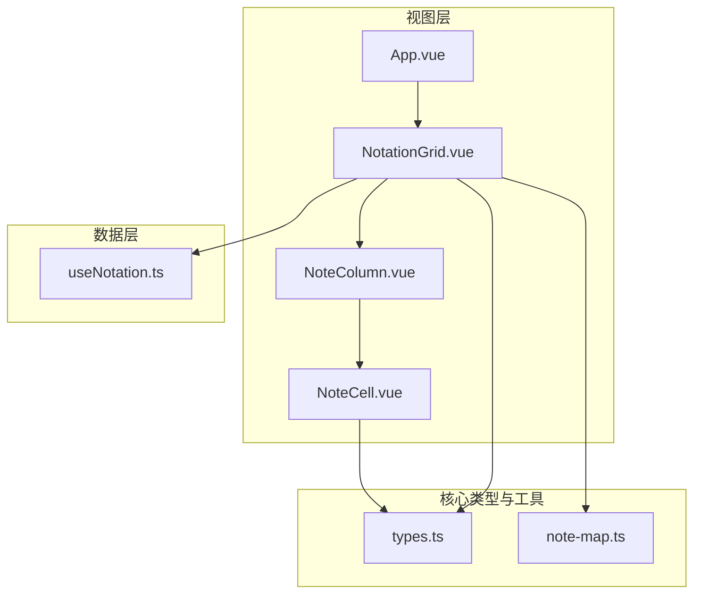
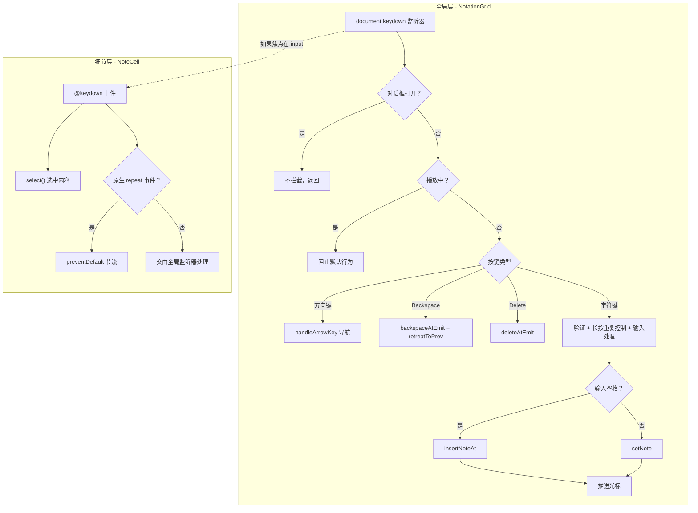
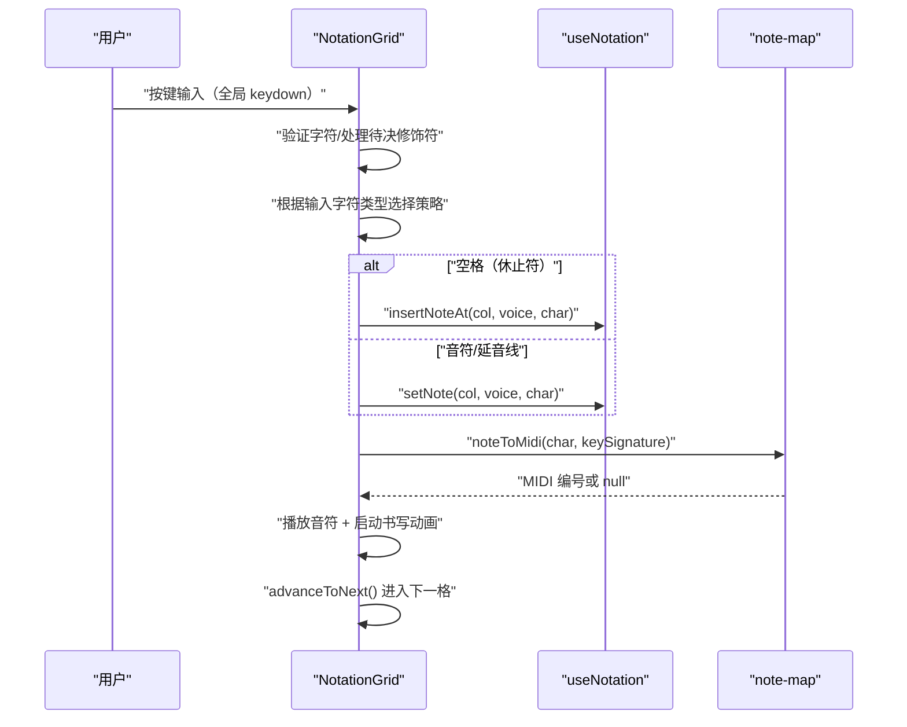
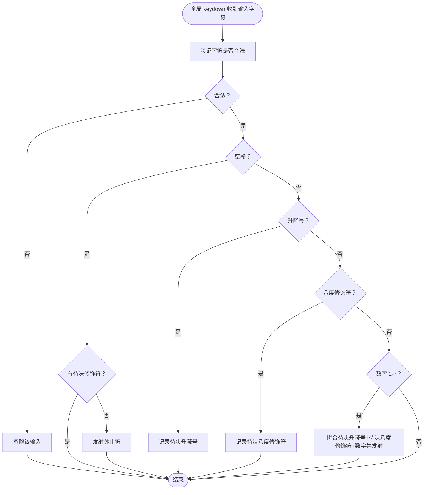
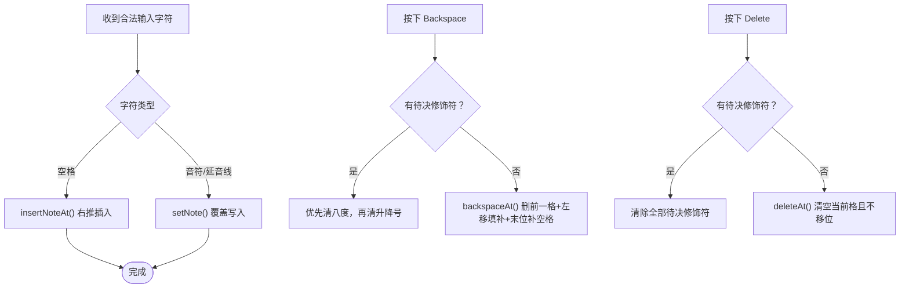
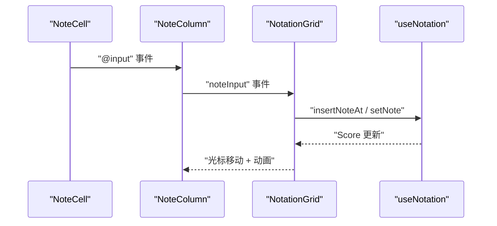
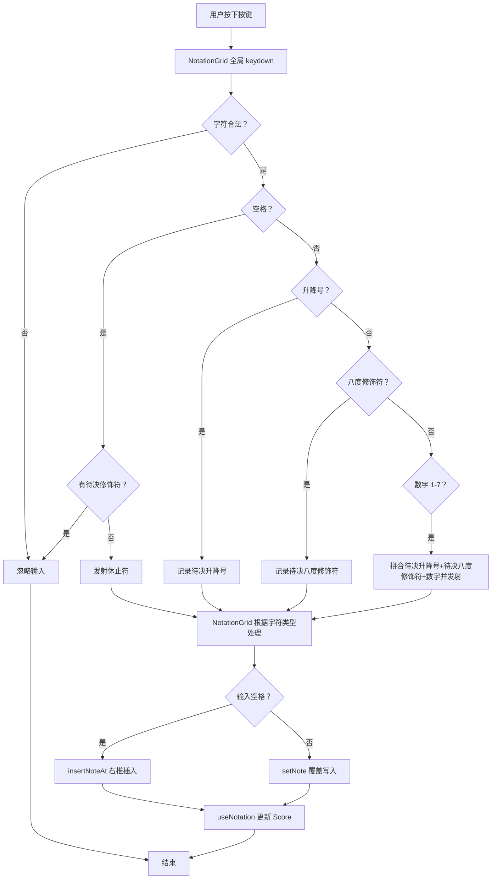
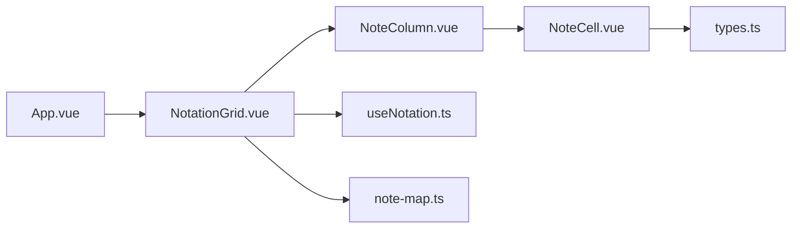

# 输入处理机制

<cite>
**本文引用的文件**
- [NoteCell.vue](file://src/components/NoteCell.vue)
- [useNotation.ts](file://src/composables/useNotation.ts)
- [types.ts](file://src/core/types.ts)
- [note-map.ts](file://src/core/note-map.ts)
- [NotationGrid.vue](file://src/components/NotationGrid.vue)
- [NoteColumn.vue](file://src/components/NoteColumn.vue)
- [App.vue](file://src/App.vue)
</cite>

## 目录
1. [简介](#简介)
2. [项目结构](#项目结构)
3. [核心组件](#核心组件)
4. [架构总览](#架构总览)
5. [详细组件分析](#详细组件分析)
6. [依赖关系分析](#依赖关系分析)
7. [性能考虑](#性能考虑)
8. [故障排除指南](#故障排除指南)
9. [结论](#结论)

## 简介
本文档深入解析记谱系统的输入处理机制，重点围绕 NoteCell 组件的键盘事件处理逻辑、音符字符验证规则、按输入字符类型区分的覆盖/插入行为，以及**以光标为中心的全局键盘监听架构**。文档提供完整的输入流程图与代码示例路径，帮助开发者理解从用户输入到数据更新的全过程。

**核心设计理念：** 采用"以光标为中心"的设计思想，通过全局键盘监听处理输入，而非依赖具体 input 元素的焦点状态。这确保了用户在任何 UI 交互后都能继续流畅地输入音符，无需重新点击输入框获得焦点。

## 项目结构
记谱系统采用分层设计：
- 视图层：NoteCell、NoteColumn、NotationGrid、App 等 Vue 组件
- 数据层：useNotation 组合式函数管理乐谱数据与光标
- 核心类型与工具：types.ts 定义类型与验证规则，note-map.ts 提供音符到 MIDI 的映射



图表来源
- [App.vue:102-138](file://src/App.vue#L102-L138)
- [NotationGrid.vue:1-292](file://src/components/NotationGrid.vue#L1-L292)
- [NoteColumn.vue:1-63](file://src/components/NoteColumn.vue#L1-L63)
- [NoteCell.vue:1-278](file://src/components/NoteCell.vue#L1-L278)
- [useNotation.ts:15-116](file://src/composables/useNotation.ts#L15-L116)
- [types.ts:77-96](file://src/core/types.ts#L77-L96)
- [note-map.ts:83-119](file://src/core/note-map.ts#L83-L119)

章节来源
- [App.vue:102-138](file://src/App.vue#L102-L138)
- [NotationGrid.vue:1-292](file://src/components/NotationGrid.vue#L1-L292)
- [NoteColumn.vue:1-63](file://src/components/NoteColumn.vue#L1-L63)
- [NoteCell.vue:1-278](file://src/components/NoteCell.vue#L1-L278)
- [useNotation.ts:15-116](file://src/composables/useNotation.ts#L15-L116)
- [types.ts:77-96](file://src/core/types.ts#L77-L96)
- [note-map.ts:83-119](file://src/core/note-map.ts#L83-L119)

## 核心组件
- **NoteCell**：负责单个音符单元的视觉呈现、修饰符处理和细节交互（如 select、长按重复）
- **NotationGrid**：**全局键盘事件中心**，协调输入写入、光标移动、播放与书写动画，并将输入转发给 useNotation
- **useNotation**：提供乐谱数据结构、光标管理、覆盖/插入/删除等数据操作方法
- **types**：定义合法字符验证、音符显示解析等核心类型与规则
- **note-map**：将简谱字符串解析为 MIDI 音符编号，支持调号映射

### 键盘事件处理架构

系统采用两层键盘事件处理架构：

1. **全局层（NotationGrid）**：通过 `document.addEventListener('keydown')` 捕获所有按键
   - 处理方向键导航
   - 处理 Backspace/Delete 删除操作
   - 处理音符字符输入（带长按重复控制）
   - 根据应用状态（播放/编辑）和上下文（对话框）智能路由

2. **细节层（NoteCell）**：通过 `@keydown` 处理视觉反馈
   - `select()` 选中内容实现覆盖效果
   - 长按字符键的原生 repeat 事件节流



章节来源
- [NotationGrid.vue:336-409](file://src/components/NotationGrid.vue#L336-L409)
- [NoteCell.vue:174-210](file://src/components/NoteCell.vue#L174-L210)

章节来源
- [NoteCell.vue:1-278](file://src/components/NoteCell.vue#L1-L278)
- [NotationGrid.vue:1-292](file://src/components/NotationGrid.vue#L1-L292)
- [useNotation.ts:15-116](file://src/composables/useNotation.ts#L15-L116)
- [types.ts:77-96](file://src/core/types.ts#L77-L96)
- [note-map.ts:83-119](file://src/core/note-map.ts#L83-L119)

## 架构总览
输入处理从 NotationGrid 的全局键盘监听开始，经过字符验证与修饰符拼接，再根据输入字符类型选择插入或覆盖策略（空格插入、音符/延音线覆盖），最终通过 useNotation 更新乐谱数据。同时，系统支持播放与书写动画反馈。



图表来源
- [NoteCell.vue:68-115](file://src/components/NoteCell.vue#L68-L115)
- [NotationGrid.vue:112-140](file://src/components/NotationGrid.vue#L112-L140)
- [useNotation.ts:36-42](file://src/composables/useNotation.ts#L36-L42)
- [useNotation.ts:19-24](file://src/composables/useNotation.ts#L19-L24)
- [note-map.ts:83-100](file://src/core/note-map.ts#L83-L100)

## 详细组件分析

### NoteCell 组件：键盘事件与输入处理

**注意：** NoteCell 的键盘处理主要负责视觉反馈，修饰符待决、特殊键与长按重复等业务逻辑均在 NotationGrid 的全局监听器中实现。

- **输入验证（安全网）**
  - 正常键盘输入被全局监听器 preventDefault，不会触发 input 事件；NoteCell 的 onInput 仅处理粘贴/IME 等边缘情况，重置为受控值
  - 中文输入法下全角 "，" 自动转半角 ","、"。" 转 "."，并转发给 NotationGrid 的修饰符暂存逻辑
  - 非法输入触发抖动反馈并清空
- **修饰符显示**
  - 待决升降号/八度修饰符由 NotationGrid 暂存，经 props（pendingAccidental/pendingOctave）传入 NoteCell 提前显示
  - 聚焦时显示完整值（含升降号），失焦时隐藏前缀，八度标记通过 CSS 类上下加点
- **长按 repeat 节流**
  - 原生 `e.repeat` 事件在 NoteCell 层被 preventDefault，统一交由 NotationGrid 的自定义计时器处理
- **视觉反馈**
  - 新输入时自动 `select()` 当前内容，实现覆盖效果



图表来源
- [NoteCell.vue:68-115](file://src/components/NoteCell.vue#L68-L115)
- [types.ts:84-86](file://src/core/types.ts#L84-L86)

章节来源
- [NoteCell.vue:68-115](file://src/components/NoteCell.vue#L68-L115)
- [NoteCell.vue:137-157](file://src/components/NoteCell.vue#L137-L157)
- [types.ts:77-96](file://src/core/types.ts#L77-L96)

### NotationGrid 全局键盘监听器

NotationGrid 通过 `document.addEventListener('keydown', onDocumentKeydown)` 实现全局键盘监听，这是系统的核心输入处理入口。

#### 智能路由策略

```typescript
function onDocumentKeydown(e: KeyboardEvent) {
  // 1. 对话框检查：不干扰对话框内交互
  if (document.querySelector('dialog[open]')) {
    return
  }

  // 2. 播放状态检查：播放时阻止所有编辑操作
  if (isPlaying.value) {
    e.preventDefault()
    return
  }

  // 3. 根据按键类型路由到不同处理器
  // - 方向键 → handleArrowKey()
  // - Backspace → backspaceAtEmit() + retreatToPrev()
  // - Delete → deleteAtEmit()
  // - 字符键 → 验证 + 输入处理
}
```

#### 音符字符输入处理

```typescript
// 处理音符字符输入（单字符且非控制键）
if (e.key.length === 1 && !e.ctrlKey && !e.metaKey && !e.altKey) {
  const char = e.key
  
  // 验证是否为合法音符字符
  if (!isValidNoteChar(char)) {
    return
  }

  // 长按重复由自定义计时器驱动，忽略原生 repeat 事件
  if (e.repeat) {
    e.preventDefault()
    return
  }

  e.preventDefault()

  // 根据输入字符类型处理：空格插入，音符/延音线覆盖
  if (char === ' ') {
    insertNoteAt(props.cursor.col, props.cursor.voice, char)
  } else {
    setNote(props.cursor.col, props.cursor.voice, char)
  }

  // 推进光标到下一列
  const nextCol = props.cursor.col + 1
  if (nextCol < props.score.length) {
    moveCursor(nextCol, props.cursor.voice)
    focusCell(nextCol, props.cursor.voice)
  }
}
```

**关键特性：**
- ✅ **不依赖焦点**：无论 input 是否聚焦都能响应输入
- ✅ **长按重复**：由自定义计时器驱动，首次延迟 350ms（NOTE_REPEAT_INITIAL_DELAY），随后每 110ms（NOTE_REPEAT_INTERVAL）重复一次原始字符
- ✅ **自动推进**：输入后自动移动光标到下一列
- ✅ **字符类型感知**：空格插入、音符/延音线覆盖，与格子是否为空无关

章节来源
- [NotationGrid.vue:336-409](file://src/components/NotationGrid.vue#L336-L409)

### 音符字符验证规则
- 单字符验证（按键级）
  - 允许字符：数字 1-7、升降号 #/b、八度修饰符 .,/、延音线 -、空格
  - 用途：过滤非法按键，保证输入层安全
- 完整值验证（组合级）
  - 格式：[升降号?][八度修饰符?][1-7]
  - 有效示例："1"、".1"、",1"、"#.1"、"b,3"
  - 休止符：空格或空串
- 显示解析
  - 将存储值解析为 display 与八度 CSS 类，用于 UI 展示

章节来源
- [types.ts:77-96](file://src/core/types.ts#L77-L96)
- [types.ts:21-39](file://src/core/types.ts#L21-L39)

### 输入行为说明：覆盖与插入
系统的写入行为由**输入字符类型**决定，与格子是否为空、与任何模式开关无关：
- 音符/延音线（-）
  - 调用 setNote 直接覆盖当前位置内容，不触发移位
- 空格（休止符）
  - 调用 insertNoteAt 在当前位置插入，后续同声部音符右移一位，末位丢弃
- Backspace
  - 调用 backspaceAt：删除前一位置音符，后续左移填补，末位补空格
  - 若存在待决修饰符，则优先清除待决八度修饰符，再清待决升降号
- Delete
  - 调用 deleteAt：清空当前位置音符，不移位
  - 若存在待决修饰符，则清除全部待决修饰符



图表来源
- [NotationGrid.vue:190-195](file://src/components/NotationGrid.vue#L190-L195)
- [App.vue:56-60](file://src/App.vue#L56-L60)
- [NotationGrid.vue:122-128](file://src/components/NotationGrid.vue#L122-L128)
- [useNotation.ts:36-42](file://src/composables/useNotation.ts#L36-L42)
- [useNotation.ts:19-24](file://src/composables/useNotation.ts#L19-L24)

章节来源
- [NotationGrid.vue:122-128](file://src/components/NotationGrid.vue#L122-L128)
- [NotationGrid.vue:163-170](file://src/components/NotationGrid.vue#L163-L170)
- [useNotation.ts:36-42](file://src/composables/useNotation.ts#L36-L42)
- [useNotation.ts:48-56](file://src/composables/useNotation.ts#L48-L56)
- [useNotation.ts:19-24](file://src/composables/useNotation.ts#L19-L24)

### NoteCell 与 useNotation 的交互
- 数据绑定
  - NoteColumn 将列数据传入 NoteCell 的 value 属性，NoteCell 通过解析函数渲染显示
- 事件传递
  - NoteCell 发射 input/backspace/delete/focus 事件
  - NoteColumn 将这些事件冒泡到 NotationGrid
  - NotationGrid 根据输入字符类型选择 insertNoteAt（空格）或 setNote（音符/延音线），并调用 useNotation 的相应方法
- 数据更新
  - useNotation 提供 setNote、insertNoteAt、backspaceAt、deleteAt 等方法，统一维护 Score 与光标



图表来源
- [NoteColumn.vue:38-41](file://src/components/NoteColumn.vue#L38-L41)
- [NotationGrid.vue:29-47](file://src/components/NotationGrid.vue#L29-L47)
- [useNotation.ts:19-24](file://src/composables/useNotation.ts#L19-L24)
- [useNotation.ts:36-42](file://src/composables/useNotation.ts#L36-L42)

章节来源
- [NoteColumn.vue:30-43](file://src/components/NoteColumn.vue#L30-L43)
- [NotationGrid.vue:29-47](file://src/components/NotationGrid.vue#L29-L47)
- [useNotation.ts:19-24](file://src/composables/useNotation.ts#L19-L24)
- [useNotation.ts:36-42](file://src/composables/useNotation.ts#L36-L42)

### 输入处理完整流程图
以下流程图展示了从用户输入到数据更新的完整过程，涵盖字符验证、修饰符拼接、写入策略选择与数据写入。



图表来源
- [NoteCell.vue:68-115](file://src/components/NoteCell.vue#L68-L115)
- [NotationGrid.vue:122-128](file://src/components/NotationGrid.vue#L122-L128)
- [useNotation.ts:36-42](file://src/composables/useNotation.ts#L36-L42)
- [useNotation.ts:19-24](file://src/composables/useNotation.ts#L19-L24)

## 依赖关系分析
- NoteCell 依赖 types.ts 的字符验证与显示解析
- NotationGrid 依赖 useNotation.ts 的数据操作方法
- note-map.ts 为 NotationGrid 提供音符到 MIDI 的转换能力
- NoteColumn 作为 NoteCell 的容器，负责事件冒泡与聚焦控制



图表来源
- [NoteCell.vue:1-278](file://src/components/NoteCell.vue#L1-L278)
- [types.ts:77-96](file://src/core/types.ts#L77-L96)
- [NoteColumn.vue:1-63](file://src/components/NoteColumn.vue#L1-L63)
- [NotationGrid.vue:1-292](file://src/components/NotationGrid.vue#L1-L292)
- [useNotation.ts:15-116](file://src/composables/useNotation.ts#L15-L116)
- [note-map.ts:83-119](file://src/core/note-map.ts#L83-L119)
- [App.vue:102-138](file://src/App.vue#L102-L138)

章节来源
- [NoteCell.vue:1-278](file://src/components/NoteCell.vue#L1-L278)
- [types.ts:77-96](file://src/core/types.ts#L77-L96)
- [NoteColumn.vue:1-63](file://src/components/NoteColumn.vue#L1-L63)
- [NotationGrid.vue:1-292](file://src/components/NotationGrid.vue#L1-L292)
- [useNotation.ts:15-116](file://src/composables/useNotation.ts#L15-L116)
- [note-map.ts:83-119](file://src/core/note-map.ts#L83-L119)
- [App.vue:102-138](file://src/App.vue#L102-L138)

## 性能考虑
- 输入验证在前端即时执行，减少无效数据进入 useNotation
- 空格输入触发的右推插入操作为 O(n) 复杂度，建议在批量输入时考虑队列缓冲（NotationGrid 已内置输入队列）
- 音符播放与书写动画异步进行，避免阻塞输入处理
- NoteCell 的 maxlength 动态调整，减少 DOM 重排开销

## 故障排除指南
- **输入无效字符**
  - 现象：输入框抖动并清空
  - 原因：字符不在允许集合内
  - 处理：检查 types.ts 的字符验证规则
- **升降号/八度修饰符无效**
  - 现象：输入被忽略或不生效
  - 原因：修饰符已达上限或方向冲突
  - 处理：确认修饰符数量与方向规则
- **失焦后无法输入音符**（已修复）
  - 现象：点击其他按钮后，按键无响应
  - 旧原因：依赖 input 焦点状态
  - **新方案**：采用全局键盘监听，无论焦点在哪都能输入
  - 处理：确保 `document.addEventListener('keydown')` 正常工作
- **长按时重复行为异常**
  - 现象：长按不重复、重复过快或到达末列后仍重复
  - 原因：长按重复计时器未正确启动或停止
  - 处理：检查 NOTE_REPEAT_INITIAL_DELAY/NOTE_REPEAT_INTERVAL 计时器，以及到达末列、打开对话框或开始播放时是否停止重复
- **Backspace/Delete 行为异常**
  - 现象：删除位置错误或未触发移位
  - 原因：光标位置不一致或待决修饰符未按优先级清除
  - 处理：核对 NotationGrid 的删除分支与光标移动逻辑，以及待决修饰符的清除顺序

章节来源
- [types.ts:84-86](file://src/core/types.ts#L84-L86)
- [NoteCell.vue:98-106](file://src/components/NoteCell.vue#L98-L106)
- [NotationGrid.vue:190-195](file://src/components/NotationGrid.vue#L190-L195)
- [NotationGrid.vue:163-170](file://src/components/NotationGrid.vue#L163-L170)

## 结论

本系统通过**以光标为中心的全局键盘监听架构**，实现了高效、直观的记谱输入体验。核心改进包括：

1. **解耦焦点与输入**：通过 `document.addEventListener('keydown')` 实现全局监听，无论 input 是否聚焦都能响应输入
2. **智能事件路由**：NotationGrid 作为全局事件中心，根据应用状态和上下文智能分发按键事件
3. **自定义长按重复**：首次延迟 350ms（NOTE_REPEAT_INITIAL_DELAY）、间隔 110ms（NOTE_REPEAT_INTERVAL），忽略原生 `e.repeat` 事件
4. **清晰的职责分离**：NotationGrid 负责业务逻辑，NoteCell 负责视觉反馈和待决修饰符处理

音符到 MIDI 的映射与播放/动画反馈进一步增强了交互性。建议在复杂场景下结合输入队列缓冲，提升用户体验与稳定性。

### 最佳实践总结

✅ **推荐做法：**
- 采用全局键盘监听处理编辑操作
- 根据应用状态（播放/编辑）和上下文（对话框）智能路由
- 在多个层级实现长按重复控制，确保一致性
- 将业务逻辑集中在顶层组件，细节处理放在子组件

❌ **避免做法：**
- 依赖具体 input 元素的焦点状态来判断是否可输入
- 在多层组件中重复处理相同的按键逻辑
- 依赖原生 `e.repeat` 实现长按重复（应使用自定义计时器驱动）