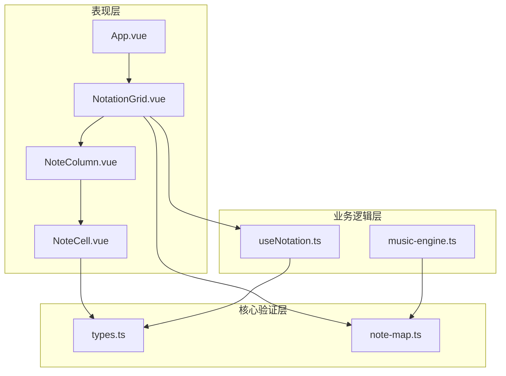
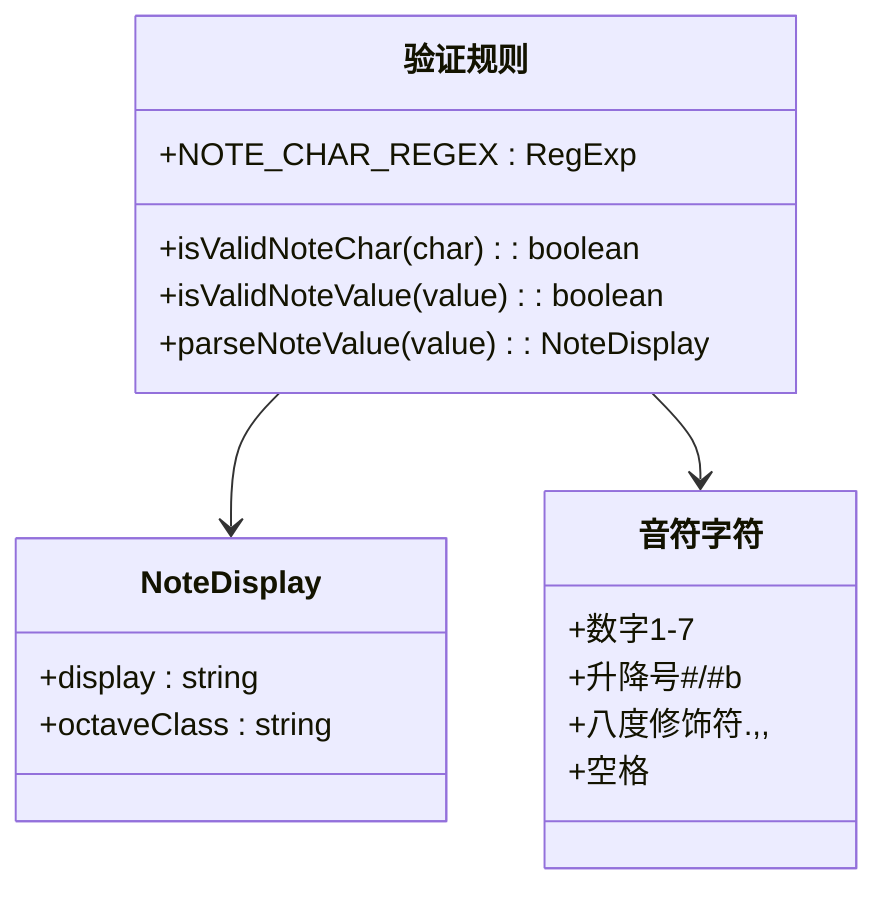
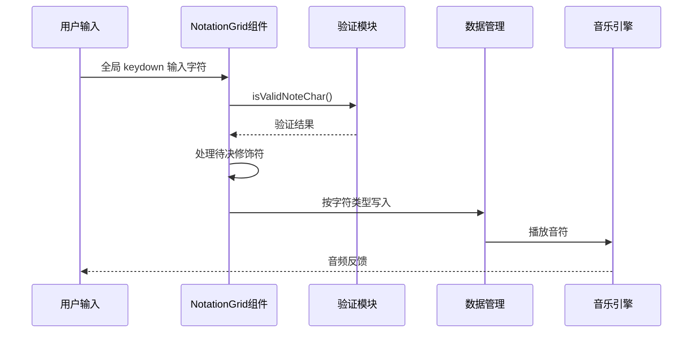
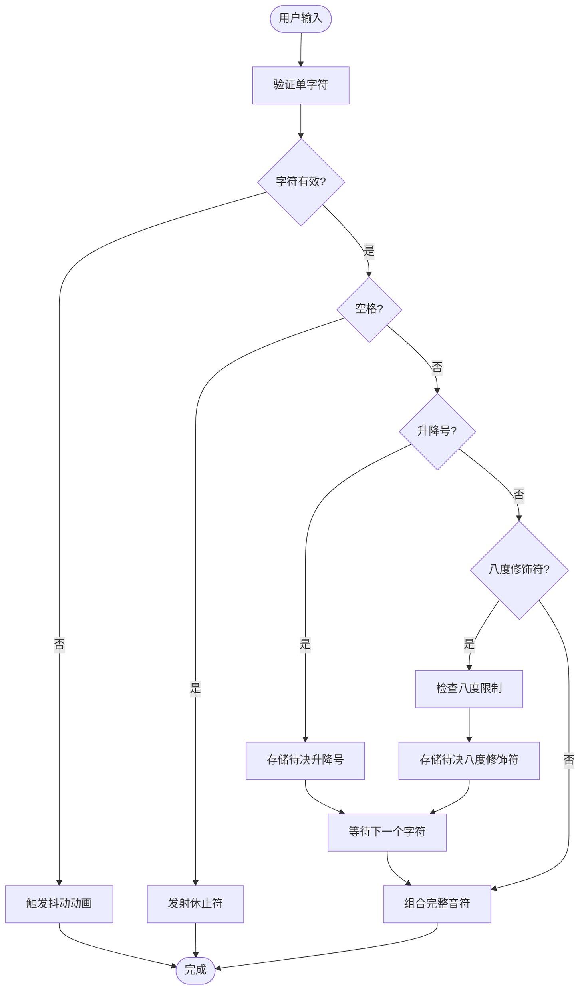
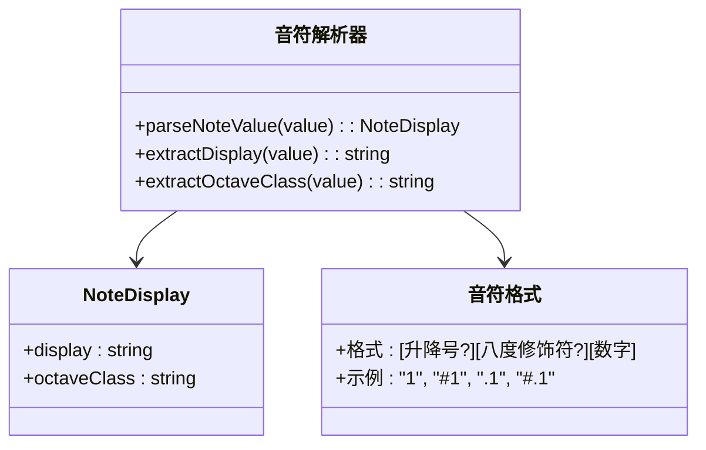
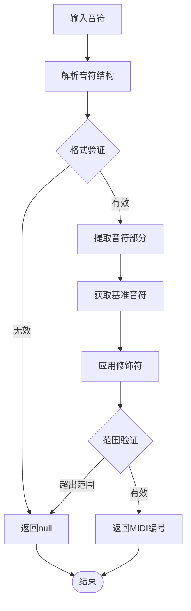
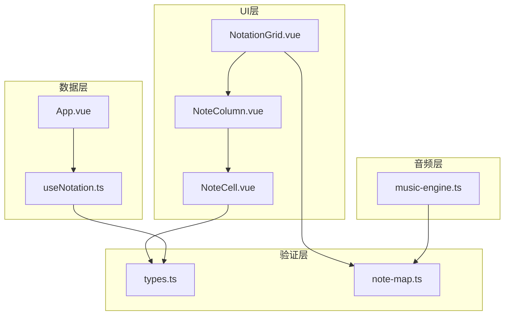
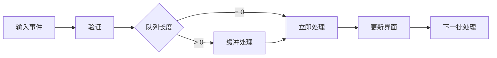

# 输入验证机制

<cite>
**本文引用的文件**
- [types.ts](file://src/core/types.ts)
- [note-map.ts](file://src/core/note-map.ts)
- [NoteCell.vue](file://src/components/NoteCell.vue)
- [NoteColumn.vue](file://src/components/NoteColumn.vue)
- [NotationGrid.vue](file://src/components/NotationGrid.vue)
- [useNotation.ts](file://src/composables/useNotation.ts)
- [music-engine.ts](file://src/core/music-engine.ts)
- [App.vue](file://src/App.vue)
</cite>

## 目录
1. [简介](#简介)
2. [项目结构](#项目结构)
3. [核心组件](#核心组件)
4. [架构概览](#架构概览)
5. [详细组件分析](#详细组件分析)
6. [依赖关系分析](#依赖关系分析)
7. [性能考虑](#性能考虑)
8. [故障排除指南](#故障排除指南)
9. [结论](#结论)

## 简介

本文档深入分析了记谱系统的输入验证机制，重点解释音符字符的有效性检查、音符时值和修饰符的组合验证、输入缓冲区的验证机制以及错误处理和用户反馈机制。该系统采用Vue 3 + TypeScript构建，提供了完整的简谱输入验证解决方案。

## 项目结构

记谱系统采用分层架构设计，主要分为以下层次：

**图表来源**
- [App.vue:1-138](file://src/App.vue#L1-L138)
- [NotationGrid.vue:1-292](file://src/components/NotationGrid.vue#L1-L292)
- [NoteCell.vue:1-278](file://src/components/NoteCell.vue#L1-L278)

**章节来源**
- [App.vue:1-138](file://src/App.vue#L1-L138)
- [NotationGrid.vue:1-292](file://src/components/NotationGrid.vue#L1-L292)

## 核心组件

### 验证规则定义

系统的核心验证逻辑集中在类型定义文件中，提供了完整的字符验证规则：

**图表来源**
- [types.ts:77-96](file://src/core/types.ts#L77-L96)
- [types.ts:21-39](file://src/core/types.ts#L21-L39)

系统支持的音符字符类型：
- **数字音符**：1, 2, 3, 4, 5, 6, 7
- **升降号**：#（升号）、b（降号）
- **八度修饰符**：.（高音，上加点）、,（低音，下加点），位于数字之前
- **延音线**：-（延续前一个音符）
- **休止符**：空格字符

**章节来源**
- [types.ts:77-96](file://src/core/types.ts#L77-L96)

## 架构概览

输入验证机制在整个系统中的工作流程如下：

**图表来源**
- [NoteCell.vue:68-115](file://src/components/NoteCell.vue#L68-L115)
- [NotationGrid.vue:113-140](file://src/components/NotationGrid.vue#L113-L140)
- [useNotation.ts:19-24](file://src/composables/useNotation.ts#L19-L24)

## 详细组件分析

### NoteCell组件验证机制

NoteCell组件是输入验证的边缘防线：单字符验证由 NotationGrid 的全局键盘监听器调用验证模块完成，NoteCell 的 input 事件作为安全网处理粘贴/IME 等边缘情况，重置为受控值并触发抖动反馈：

#### 字符验证流程

**图表来源**
- [NoteCell.vue:68-115](file://src/components/NoteCell.vue#L68-L115)

#### 待决修饰符管理系统

系统实现了智能的待决修饰符管理机制：

| 修饰符类型 | 作用 | 限制 | 显示方式 |
|------------|------|------|----------|
| 升降号 (#/b) | 改变音高 | 1个 | 输入框左侧显示 |
| 高音点 (.) | 提升八度 | 1级 | 音符上方点标记 |
| 低音点 (,) | 降低八度 | 1级 | 音符下方点标记 |

**章节来源**
- [NoteCell.vue:22-46](file://src/components/NoteCell.vue#L22-L46)

### 音符值解析机制

音符值解析器负责将用户输入转换为内部表示：

**图表来源**
- [types.ts:21-39](file://src/core/types.ts#L21-L39)

**章节来源**
- [types.ts:21-39](file://src/core/types.ts#L21-L39)

### 音符到MIDI转换验证

音符映射模块提供了完整的音符到MIDI转换验证：

**图表来源**
- [note-map.ts:35-74](file://src/core/note-map.ts#L35-L74)

**章节来源**
- [note-map.ts:35-74](file://src/core/note-map.ts#L35-L74)

## 依赖关系分析

输入验证机制涉及多个组件间的复杂依赖关系：

**图表来源**
- [NoteCell.vue:3](file://src/components/NoteCell.vue#L3)
- [NotationGrid.vue:7](file://src/components/NotationGrid.vue#L7)
- [useNotation.ts:2](file://src/composables/useNotation.ts#L2)

**章节来源**
- [NoteCell.vue:1-278](file://src/components/NoteCell.vue#L1-L278)
- [NotationGrid.vue:1-292](file://src/components/NotationGrid.vue#L1-L292)

## 性能考虑

### 验证算法优化

系统采用了高效的验证策略：

1. **正则表达式优化**：使用预编译的正则表达式进行快速字符验证
2. **短路求值**：在验证失败时立即返回，避免不必要的计算
3. **内存优化**：使用响应式数据结构减少内存占用
4. **批量处理**：支持输入队列机制，避免频繁DOM操作

### 实时性能监控

**图表来源**
- [NotationGrid.vue:58-61](file://src/components/NotationGrid.vue#L58-L61)

## 故障排除指南

### 常见验证错误及解决方案

| 错误类型 | 症状 | 原因 | 解决方案 |
|----------|------|------|----------|
| 非法字符 | 输入被拒绝，出现抖动效果 | 字符不在允许范围内 | 使用正确的音符字符（1-7、#、b、.、,、空格） |
| 八度修饰符冲突 | 八度修饰符被忽略 | 同时输入高低音修饰符 | 分别输入单一修饰符 |
| 升降号位置错误 | 升降号被当作普通字符 | 升降号不是前缀 | 确保升降号在数字之前输入 |
| 输入超时 | 输入延迟或丢失 | 验证过程阻塞 | 检查浏览器性能和内存使用 |

### 调试技巧

1. **启用开发者工具**：观察控制台中的验证日志
2. **检查CSS类**：验证抖动动画是否正确触发
3. **监控数据流**：确认音符值是否正确传递到数据层
4. **测试边界条件**：验证各种组合输入的正确性

**章节来源**
- [NoteCell.vue:65-78](file://src/components/NoteCell.vue#L65-L78)

## 结论

记谱系统的输入验证机制通过多层次的设计实现了高效、可靠的音符输入处理。系统的核心优势包括：

1. **完整的字符验证**：支持简谱标准的所有字符类型
2. **智能修饰符管理**：提供灵活的升降号和八度修饰符处理
3. **实时反馈机制**：通过视觉和听觉反馈改善用户体验
4. **高性能实现**：优化的算法和数据结构确保流畅的输入体验

该验证机制为音乐创作提供了坚实的技术基础，支持复杂的音乐表达需求，同时保持了良好的用户体验。