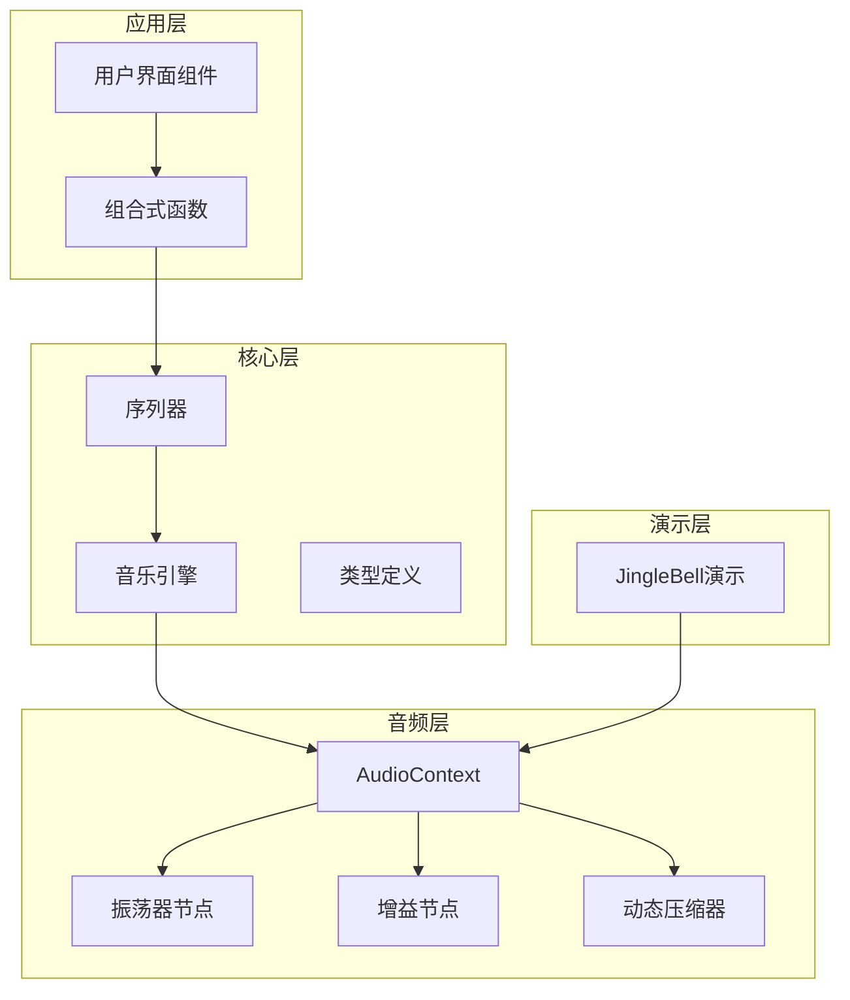
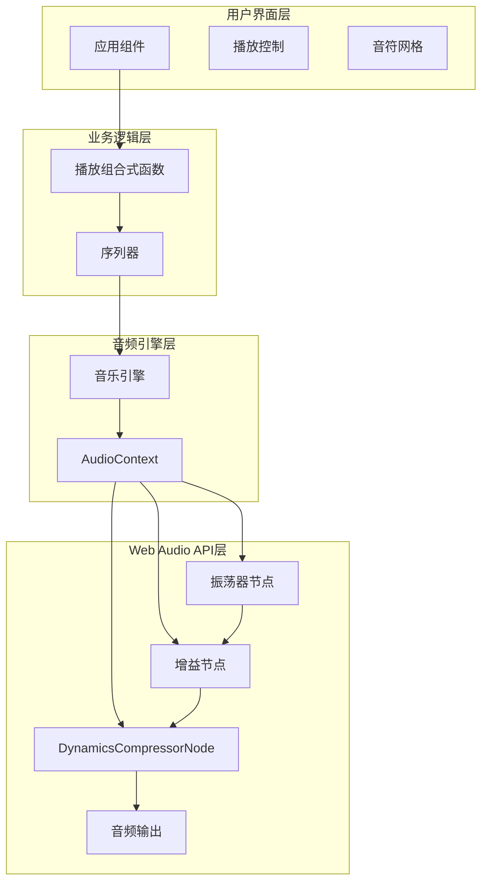
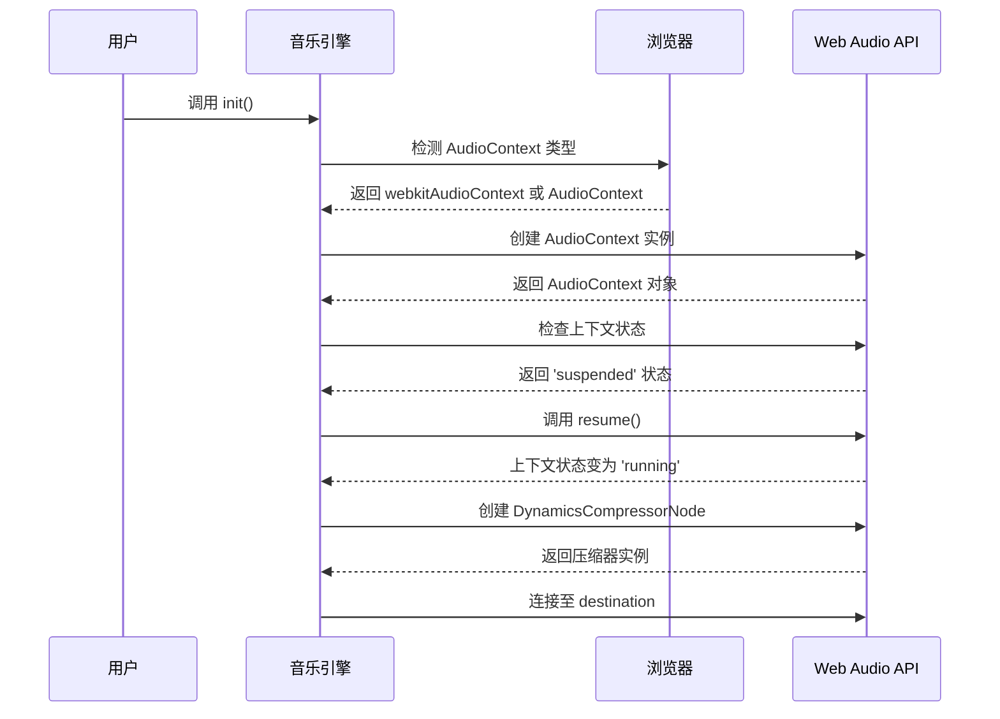
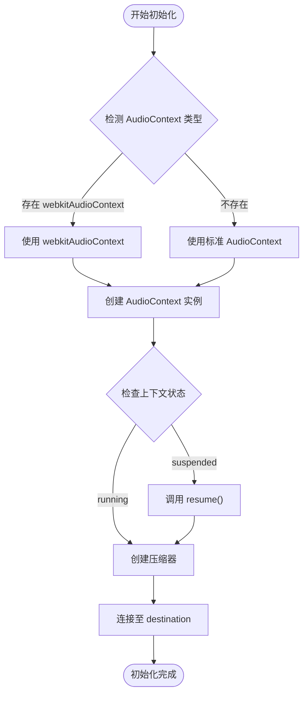
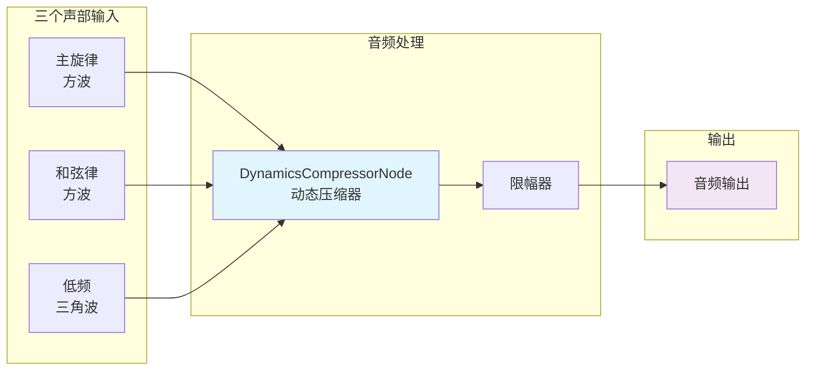
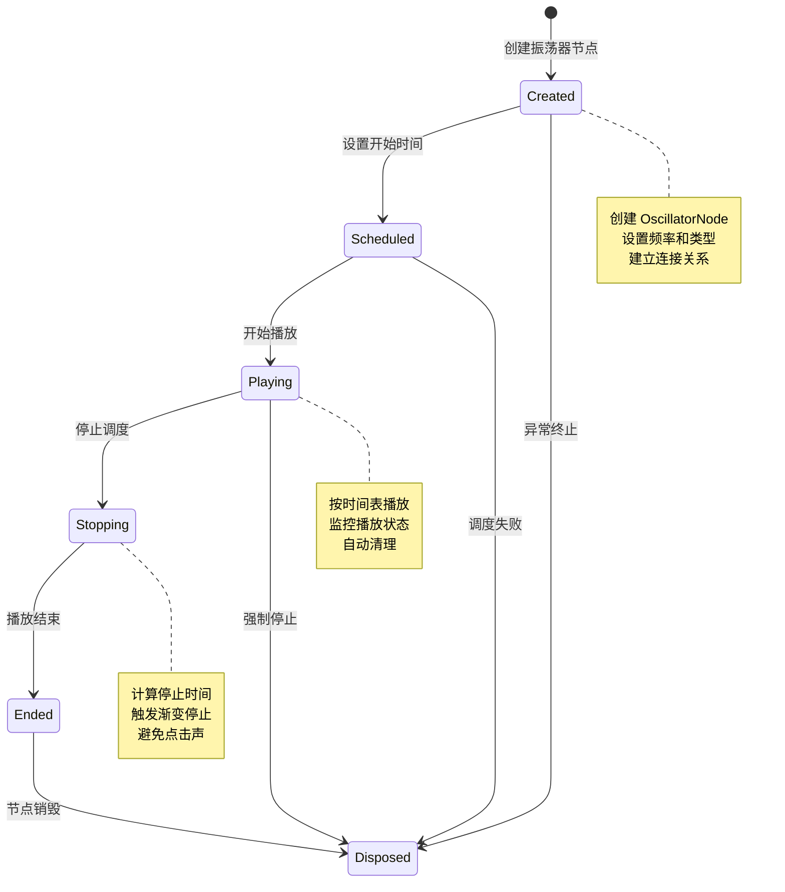
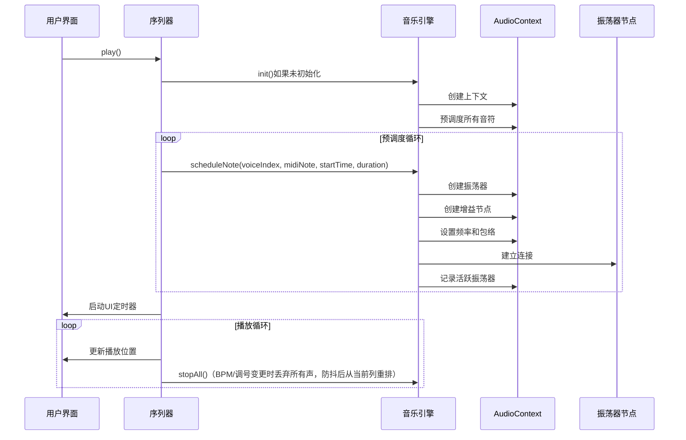
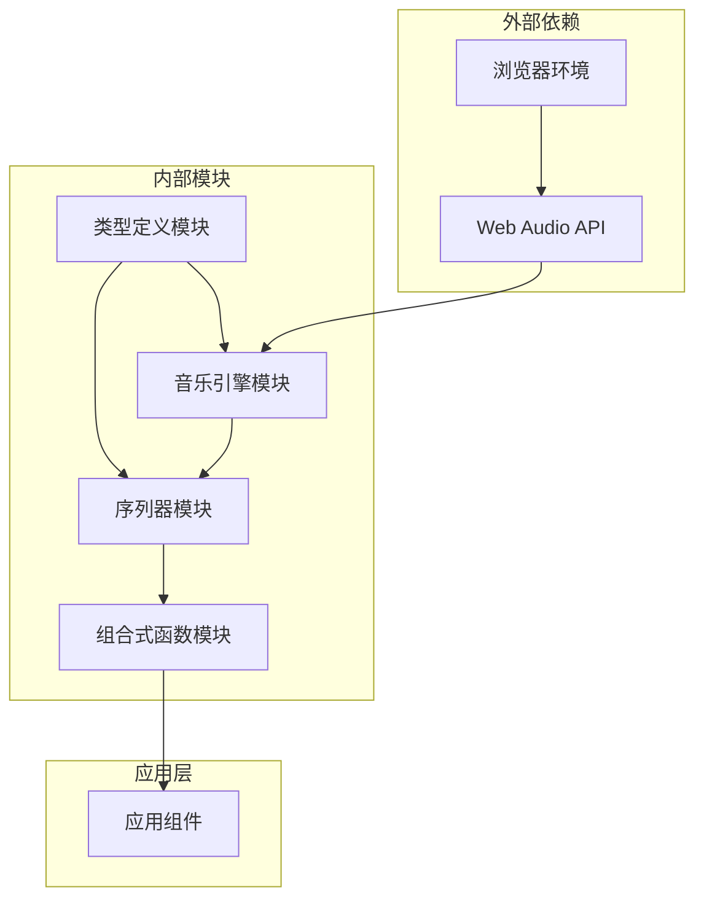

# Web Audio API封装

<cite>
**本文引用的文件**
- [music-engine.ts](file://src/core/music-engine.ts)
- [sequencer.ts](file://src/core/sequencer.ts)
- [types.ts](file://src/core/types.ts)
- [usePlayback.ts](file://src/composables/usePlayback.ts)
- [jinglebell.html](file://demos/jinglebell.html)
</cite>

## 目录
1. [简介](#简介)
2. [项目结构](#项目结构)
3. [核心组件](#核心组件)
4. [架构概览](#架构概览)
5. [详细组件分析](#详细组件分析)
6. [依赖关系分析](#依赖关系分析)
7. [性能考量](#性能考量)
8. [故障排除指南](#故障排除指南)
9. [结论](#结论)

## 简介

这是一个基于原生Web Audio API的音乐播放器封装，完全独立于第三方音频库（如Tone.js）。项目实现了精确的音频节点调度系统，支持三个声部的独立振荡器节点，采用预调度模式确保音频播放的同步性和准确性。

该封装的核心设计理念是：
- 使用原生Web Audio API，避免外部依赖
- 实现精确的音频节点生命周期管理
- 提供浏览器兼容性处理（支持webkitAudioContext）
- 采用预调度模式确保多声部同步播放
- 通过DynamicsCompressorNode实现统一的音频输出处理

## 项目结构

项目采用模块化设计，主要分为以下层次：

**图表来源**
- [music-engine.ts:1-221](file://src/core/music-engine.ts#L1-L221)
- [sequencer.ts:1-354](file://src/core/sequencer.ts#L1-L354)
- [types.ts:1-164](file://src/core/types.ts#L1-L164)

**章节来源**
- [music-engine.ts:1-221](file://src/core/music-engine.ts#L1-L221)
- [sequencer.ts:1-354](file://src/core/sequencer.ts#L1-L354)
- [types.ts:1-164](file://src/core/types.ts#L1-L164)

## 核心组件

### 音乐引擎（MusicEngine）

音乐引擎是整个系统的核心，负责AudioContext的创建和管理，以及音频节点的生命周期控制。

**主要特性：**
- 单例模式确保全局唯一实例
- 支持浏览器兼容性处理（webkitAudioContext）
- 实现音频上下文状态管理
- 精确的音频节点调度机制
- 完整的资源清理功能

**章节来源**
- [music-engine.ts:17-221](file://src/core/music-engine.ts#L17-L221)

### 序列器（Sequencer）

序列器负责乐谱数据的解析和播放控制，实现预调度模式的音频播放。

**主要特性：**
- 预调度所有音符，确保播放同步性
- 支持实时BPM和调号变更
- 精确的播放位置跟踪
- 循环播放功能
- 与音乐引擎的紧密集成

**章节来源**
- [sequencer.ts:21-354](file://src/core/sequencer.ts#L21-L354)

### 类型系统

项目提供了完整的类型定义，确保代码的类型安全性和可维护性。

**主要类型：**
- 声部索引（VoiceIndex）
- 乐谱数据结构（Score、Column）
- 播放状态（PlaybackState）
- BPM档位（BPM_LIST）
- 导出数据格式（ExportData）

**章节来源**
- [types.ts:47-164](file://src/core/types.ts#L47-L164)

## 架构概览

系统采用分层架构设计，从底层的Web Audio API到上层的应用界面，形成了清晰的职责分离：

**图表来源**
- [music-engine.ts:17-60](file://src/core/music-engine.ts#L17-L60)
- [sequencer.ts:144-167](file://src/core/sequencer.ts#L144-L167)
- [usePlayback.ts:14-95](file://src/composables/usePlayback.ts#L14-L95)

## 详细组件分析

### 音频上下文初始化流程

音乐引擎的初始化过程体现了对浏览器兼容性的深度考虑：

**图表来源**
- [music-engine.ts:41-60](file://src/core/music-engine.ts#L41-L60)

**章节来源**
- [music-engine.ts:41-60](file://src/core/music-engine.ts#L41-L60)

### 浏览器兼容性处理

项目实现了对不同浏览器AudioContext实现的兼容处理：

**图表来源**
- [music-engine.ts:45-57](file://src/core/music-engine.ts#L45-L57)

**章节来源**
- [music-engine.ts:45-57](file://src/core/music-engine.ts#L45-L57)

### DynamicsCompressorNode 设计理念

DynamicsCompressorNode作为主输出节点的设计体现了以下理念：

**设计理念：**
- **统一处理**：所有声部共享同一个压缩器，确保音色一致性
- **动态范围控制**：通过压缩器控制音频动态范围，避免过载
- **保真度**：保持原始音频信号的完整性
- **性能优化**：减少音频节点数量，提高处理效率

**章节来源**
- [music-engine.ts:10-11](file://src/core/music-engine.ts#L10-L11)
- [music-engine.ts:54-57](file://src/core/music-engine.ts#L54-L57)

### 音频节点生命周期管理

音频节点的生命周期管理是系统的核心机制：

**图表来源**
- [music-engine.ts:110-150](file://src/core/music-engine.ts#L110-L150)
- [music-engine.ts:155-197](file://src/core/music-engine.ts#L155-L197)

**章节来源**
- [music-engine.ts:110-150](file://src/core/music-engine.ts#L110-L150)
- [music-engine.ts:155-197](file://src/core/music-engine.ts#L155-L197)

### 振荡器节点的创建、配置和销毁

振荡器节点的完整生命周期管理：

**创建阶段：**
- 根据声部索引选择波形类型（方波或三角波）
- 计算音高频率（考虑八度缩放因子）
- 设置频率值到精确的时间点

**配置阶段：**
- 为三角波添加微量增益包络消除点击声
- 为方波实现精确的线性增益包络
- 建立完整的音频连接链路

**销毁阶段：**
- 清理活跃振荡器映射表
- 断开所有音频连接
- 释放内存资源

**章节来源**
- [music-engine.ts:100-150](file://src/core/music-engine.ts#L100-L150)

### 预调度播放机制

序列器实现了精确的预调度播放机制：

**图表来源**
- [sequencer.ts:144-167](file://src/core/sequencer.ts#L144-L167)
- [sequencer.ts:240-263](file://src/core/sequencer.ts#L240-L263)

**章节来源**
- [sequencer.ts:144-167](file://src/core/sequencer.ts#L144-L167)
- [sequencer.ts:240-263](file://src/core/sequencer.ts#L240-L263)

## 依赖关系分析

系统的依赖关系清晰且层次分明：

**图表来源**
- [music-engine.ts:1-221](file://src/core/music-engine.ts#L1-L221)
- [sequencer.ts:1-354](file://src/core/sequencer.ts#L1-L354)
- [types.ts:1-164](file://src/core/types.ts#L1-L164)

**章节来源**
- [music-engine.ts:1-221](file://src/core/music-engine.ts#L1-L221)
- [sequencer.ts:1-354](file://src/core/sequencer.ts#L1-L354)
- [types.ts:1-164](file://src/core/types.ts#L1-L164)

## 性能考量

### 预调度模式的优势

系统采用预调度模式而非实时生成音频，具有以下性能优势：

- **CPU效率**：音频生成在创建时完成，播放时只需触发现有节点
- **同步性**：所有音符在同一时间轴上精确调度，避免播放偏差
- **响应性**：播放控制（暂停、停止、BPM变更）响应迅速
- **资源管理**：精确的节点生命周期管理，避免内存泄漏

### 内存管理策略

- **活跃节点追踪**：使用Map结构跟踪所有活跃振荡器，便于精确控制
- **自动清理**：振荡器播放结束后自动从映射表中移除
- **批量停止**：支持批量停止操作，提高停止效率
- **资源释放**：dispose方法确保完全释放所有资源

### 音频质量优化

- **包络设计**：为三角波添加微量增益包络消除点击声
- **压缩处理**：统一的动态压缩器处理，保持音色一致性
- **频率计算**：精确的频率计算公式，确保音准准确
- **八度分配**：合理的八度分配策略，形成丰富的和声层次

## 故障排除指南

### 常见问题及解决方案

**问题1：音频无法播放**
- 检查AudioContext状态是否为'suspended'
- 确认用户手势触发了resume()
- 验证浏览器是否支持Web Audio API

**问题2：播放卡顿或延迟**
- 检查是否有过多活跃的振荡器节点
- 确认BPM设置是否过高
- 验证音频节点连接是否正确

**问题3：点击声或爆音**
- 检查增益包络设置是否正确
- 确认振荡器停止时机是否恰当
- 验证频率设置是否在合理范围内

**问题4：内存泄漏**
- 检查活跃振荡器映射表是否正确清理
- 确认dispose方法是否被调用
- 验证事件监听器是否正确移除

### 调试技巧

**音频调试工具：**
- 使用浏览器开发者工具的性能面板监控CPU使用率
- 利用Web Audio Inspector检查音频节点连接
- 通过console.log跟踪音频事件的触发时机

**代码调试建议：**
- 在关键节点添加日志输出
- 使用断点调试音频调度流程
- 监控活跃振荡器数量的变化

**章节来源**
- [music-engine.ts:155-197](file://src/core/music-engine.ts#L155-L197)
- [sequencer.ts:84-115](file://src/core/sequencer.ts#L84-L115)

## 结论

这个Web Audio API封装项目展现了现代前端音频处理的最佳实践。通过精心设计的架构和完善的错误处理机制，系统实现了：

- **完全的浏览器兼容性**：支持多种AudioContext实现
- **精确的音频控制**：预调度模式确保播放同步性
- **优雅的资源管理**：完整的生命周期控制机制
- **优秀的性能表现**：高效的音频处理和内存管理

项目的代码结构清晰，职责分离明确，为类似音频应用的开发提供了优秀的参考模板。通过遵循本文档中的最佳实践，开发者可以构建出高质量的Web音频应用程序。