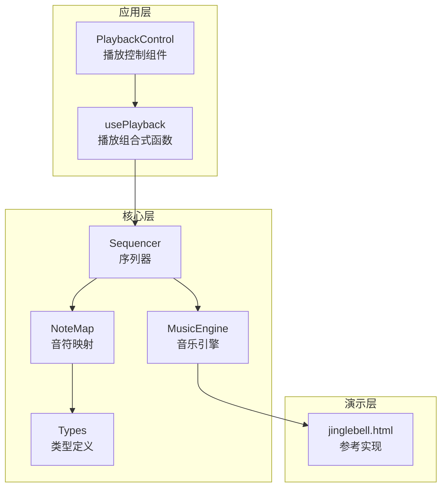
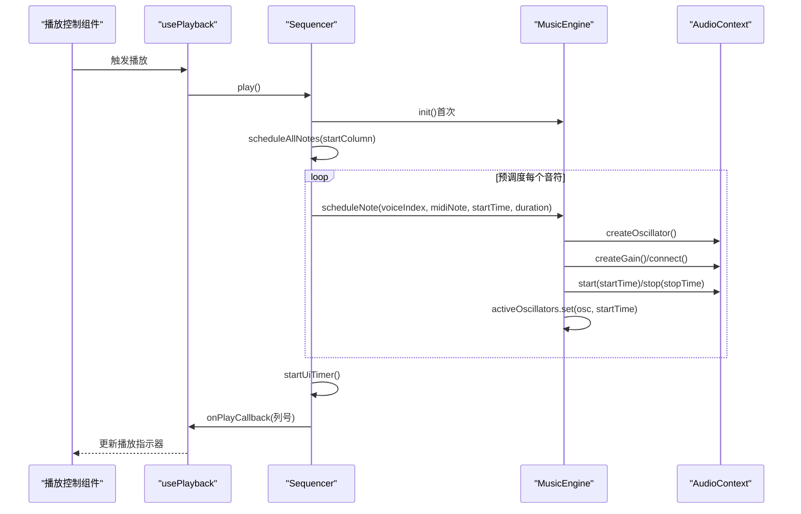
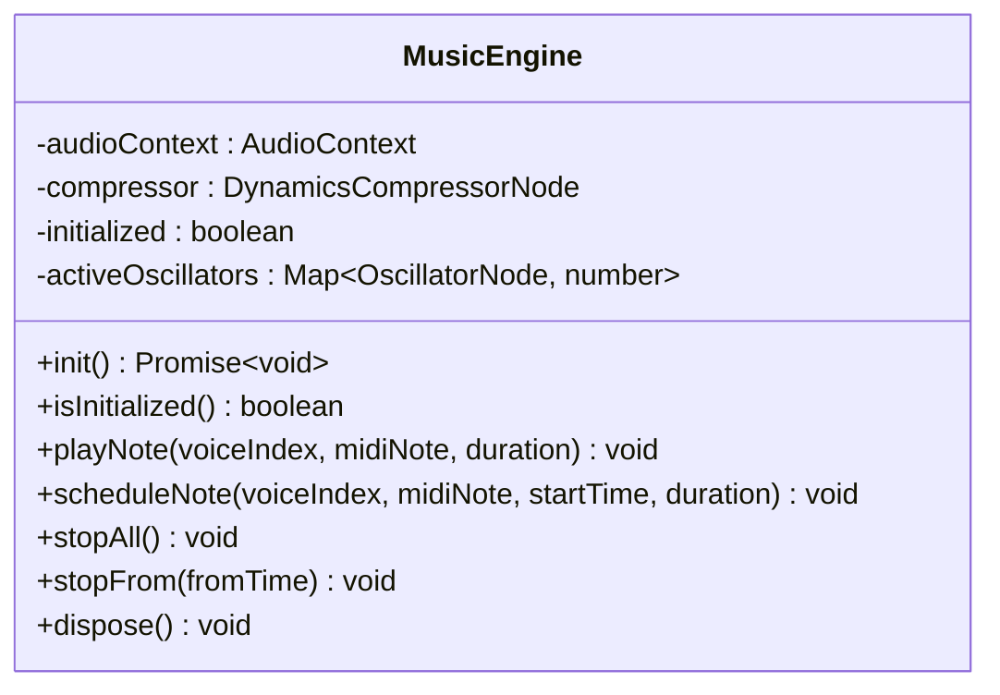
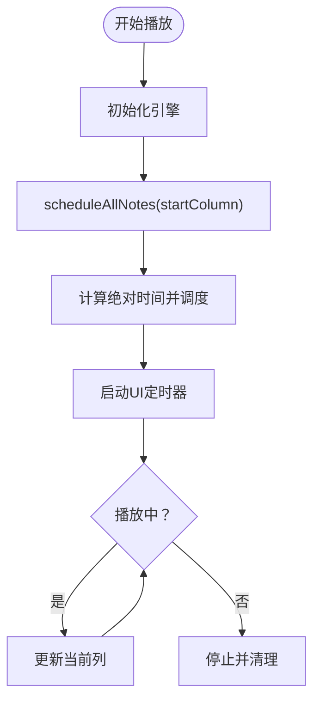
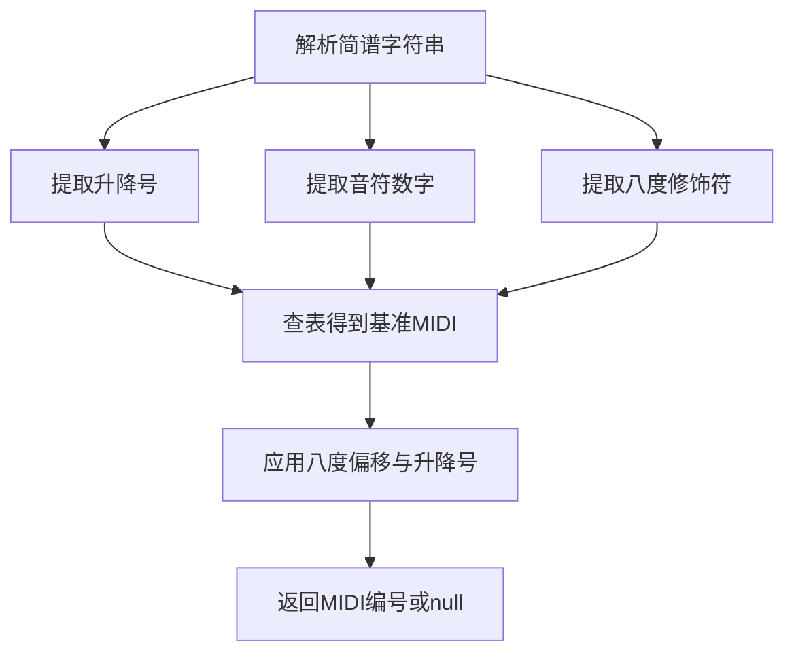
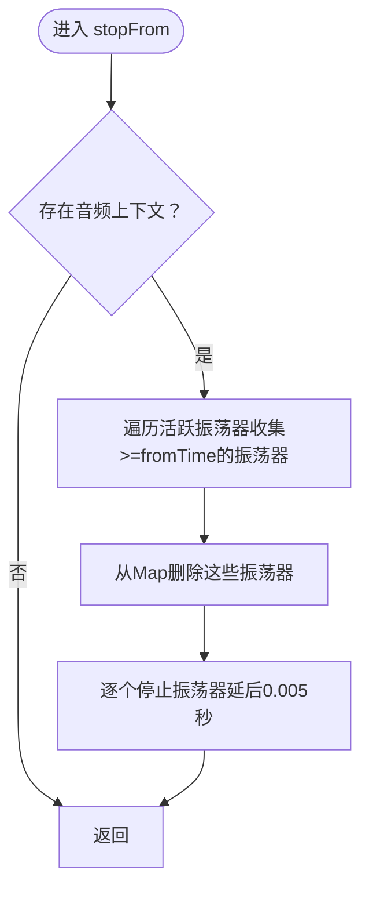
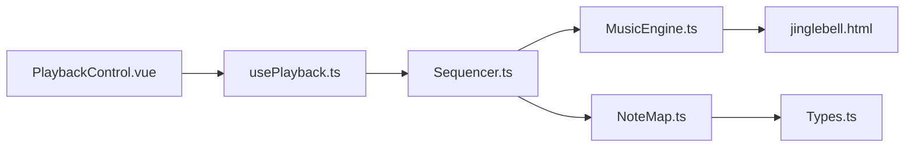

# 性能优化策略

<cite>
**本文档引用的文件**
- [music-engine.ts](file://src/core/music-engine.ts)
- [sequencer.ts](file://src/core/sequencer.ts)
- [note-map.ts](file://src/core/note-map.ts)
- [types.ts](file://src/core/types.ts)
- [usePlayback.ts](file://src/composables/usePlayback.ts)
- [PlaybackControl.vue](file://src/components/PlaybackControl.vue)
- [jinglebell.html](file://demos/jinglebell.html)
</cite>

## 目录
1. [简介](#简介)
2. [项目结构](#项目结构)
3. [核心组件](#核心组件)
4. [架构总览](#架构总览)
5. [详细组件分析](#详细组件分析)
6. [依赖关系分析](#依赖关系分析)
7. [性能考量](#性能考量)
8. [故障排查指南](#故障排查指南)
9. [结论](#结论)
10. [附录](#附录)

## 简介
本技术文档聚焦于音乐引擎的性能优化策略，围绕以下关键主题展开：
- 活跃振荡器追踪机制：基于 Map 数据结构的高效管理与生命周期控制
- 预调度机制：提前创建音频节点，降低播放时的延迟开销，确保音符同步
- 选择性停止策略：stopFrom 方法如何仅停止未来的音符而不影响当前播放
- 内存管理最佳实践：及时清理振荡器引用、合理使用垃圾回收机制
- 性能监控方法与调试技巧：音频延迟测量、CPU 使用率监控、内存泄漏检测
- 具体优化案例与性能测试结果对比

## 项目结构
项目采用分层架构，核心逻辑集中在 src/core 目录，前端交互通过 Vue 组件与 Composables 进行封装，演示参考了经典的 jinglebell.html 实现。

图表来源
- [music-engine.ts:17-220](file://src/core/music-engine.ts#L17-L220)
- [sequencer.ts:21-353](file://src/core/sequencer.ts#L21-L353)
- [note-map.ts:1-119](file://src/core/note-map.ts#L1-L119)
- [types.ts:1-164](file://src/core/types.ts#L1-L164)
- [usePlayback.ts:14-94](file://src/composables/usePlayback.ts#L14-L94)
- [PlaybackControl.vue:1-111](file://src/components/PlaybackControl.vue#L1-L111)
- [jinglebell.html:12-83](file://demos/jinglebell.html#L12-L83)

章节来源
- [music-engine.ts:17-220](file://src/core/music-engine.ts#L17-L220)
- [sequencer.ts:21-353](file://src/core/sequencer.ts#L21-L353)
- [note-map.ts:1-119](file://src/core/note-map.ts#L1-L119)
- [types.ts:1-164](file://src/core/types.ts#L1-L164)
- [usePlayback.ts:14-94](file://src/composables/usePlayback.ts#L14-L94)
- [PlaybackControl.vue:1-111](file://src/components/PlaybackControl.vue#L1-L111)
- [jinglebell.html:12-83](file://demos/jinglebell.html#L12-L83)

## 核心组件
- 音乐引擎（MusicEngine）：负责音频上下文初始化、振荡器创建与调度、增益包络控制、活跃振荡器追踪与选择性停止、资源释放
- 序列器（Sequencer）：负责乐谱解析、BPM/调号变更处理、UI 定时器、预调度机制、播放状态管理
- 音符映射（NoteMap）：将简谱字符串转换为 MIDI 音符编号，并支持升降号与八度修饰
- 类型定义（Types）：统一的数据类型、常量与工具函数
- 播放组合式函数（usePlayback）：Vue 组合式 API 封装，连接 UI 与序列器
- 播放控制组件（PlaybackControl）：基础播放控制按钮与循环开关
- 参考实现（jinglebell.html）：Web Audio API 的经典预调度模式实现

章节来源
- [music-engine.ts:17-220](file://src/core/music-engine.ts#L17-L220)
- [sequencer.ts:21-353](file://src/core/sequencer.ts#L21-L353)
- [note-map.ts:1-119](file://src/core/note-map.ts#L1-L119)
- [types.ts:1-164](file://src/core/types.ts#L1-L164)
- [usePlayback.ts:14-94](file://src/composables/usePlayback.ts#L14-L94)
- [PlaybackControl.vue:1-111](file://src/components/PlaybackControl.vue#L1-L111)
- [jinglebell.html:12-83](file://demos/jinglebell.html#L12-L83)

## 架构总览
音乐引擎采用“预调度 + 精确时间控制”的架构，确保音符在 AudioContext 时间轴上精确起止，避免播放时的动态创建开销。序列器负责一次性计算所有音符的绝对时间并调度，UI 通过独立定时器进行渲染更新。

图表来源
- [sequencer.ts:144-167](file://src/core/sequencer.ts#L144-L167)
- [sequencer.ts:240-263](file://src/core/sequencer.ts#L240-L263)
- [music-engine.ts:90-150](file://src/core/music-engine.ts#L90-L150)

## 详细组件分析

### 音乐引擎（MusicEngine）分析
- 活跃振荡器追踪：使用 Map<OscillatorNode, number> 记录每个振荡器的开始时间，便于选择性停止
- 预调度机制：scheduleNote 接收绝对时间，立即创建并连接节点，避免播放时的动态开销
- 增益包络：方波使用线性包络，三角波使用微小淡出消除点击声
- 选择性停止：stopFrom 仅停止开始时间 >= fromTime 的未来音符，当前播放不受影响
- 资源释放：dispose 关闭音频上下文并断开压缩器，避免内存泄漏

图表来源
- [music-engine.ts:17-220](file://src/core/music-engine.ts#L17-L220)

章节来源
- [music-engine.ts:17-220](file://src/core/music-engine.ts#L17-L220)

### 序列器（Sequencer）分析
- 预调度策略：一次性计算所有音符的绝对时间，避免播放时的计算开销
- BPM/调号实时调整（2026-08-30 改）：setBpm 与 setKeySignature 在播放中变更时，stopAll 立即丢弃所有声，120ms 防抖后从当前指示器列整体重排，杜绝多版本叠加混响
- UI 定时器：约 50ms 轮询当前列，减少渲染压力
- 有效长度：跳过空白列，缩短播放时长

图表来源
- [sequencer.ts:144-167](file://src/core/sequencer.ts#L144-L167)
- [sequencer.ts:240-263](file://src/core/sequencer.ts#L240-L263)
- [sequencer.ts:271-313](file://src/core/sequencer.ts#L271-L313)

章节来源
- [sequencer.ts:21-353](file://src/core/sequencer.ts#L21-L353)

### 音符映射（NoteMap）分析
- 支持简谱字符解析：1-7、升降号、八度修饰符
- 调号映射：基于键位表生成基准音高，再结合升降号与八度偏移
- 批量转换：columnToMidi 将一列三个声部转换为 MIDI 数组

图表来源
- [note-map.ts:35-118](file://src/core/note-map.ts#L35-L118)

章节来源
- [note-map.ts:1-119](file://src/core/note-map.ts#L1-L119)

### 选择性停止策略（stopFrom）流程
stopFrom 是 MusicEngine 提供的按时间选择性停止工具（当前播放中实时调整已改用 stopAll 丢弃重排，此方法暂无可复用调用方），其工作流程如下：

图表来源
- [music-engine.ts:177-197](file://src/core/music-engine.ts#L177-L197)

章节来源
- [music-engine.ts:177-197](file://src/core/music-engine.ts#L177-L197)

### 预调度机制优势
- 提前创建音频节点：在播放前一次性创建所有振荡器与增益节点，避免播放时的动态创建开销
- 精确时间控制：使用 AudioContext 绝对时间，确保音符严格同步
- 与参考实现一致：与 jinglebell.html 的预调度模式保持一致，验证了性能与稳定性

章节来源
- [sequencer.ts:240-263](file://src/core/sequencer.ts#L240-L263)
- [music-engine.ts:90-150](file://src/core/music-engine.ts#L90-L150)
- [jinglebell.html:32-60](file://demos/jinglebell.html#L32-L60)

## 依赖关系分析
- MusicEngine 依赖 Web Audio API 的原生能力，不依赖第三方库
- Sequencer 依赖 MusicEngine 进行音频调度，依赖 NoteMap 进行音符解析
- usePlayback 依赖 Sequencer 进行播放控制，向 UI 发出状态回调
- PlaybackControl 仅负责基础交互，不直接操作音频

图表来源
- [music-engine.ts:17-220](file://src/core/music-engine.ts#L17-L220)
- [sequencer.ts:21-353](file://src/core/sequencer.ts#L21-L353)
- [note-map.ts:1-119](file://src/core/note-map.ts#L1-L119)
- [types.ts:1-164](file://src/core/types.ts#L1-L164)
- [usePlayback.ts:14-94](file://src/composables/usePlayback.ts#L14-L94)
- [PlaybackControl.vue:1-111](file://src/components/PlaybackControl.vue#L1-L111)
- [jinglebell.html:12-83](file://demos/jinglebell.html#L12-L83)

章节来源
- [music-engine.ts:17-220](file://src/core/music-engine.ts#L17-L220)
- [sequencer.ts:21-353](file://src/core/sequencer.ts#L21-L353)
- [note-map.ts:1-119](file://src/core/note-map.ts#L1-L119)
- [types.ts:1-164](file://src/core/types.ts#L1-L164)
- [usePlayback.ts:14-94](file://src/composables/usePlayback.ts#L14-L94)
- [PlaybackControl.vue:1-111](file://src/components/PlaybackControl.vue#L1-L111)
- [jinglebell.html:12-83](file://demos/jinglebell.html#L12-L83)

## 性能考量
- 活跃振荡器追踪与生命周期管理
  - 使用 Map 存储振荡器与其开始时间，复杂度 O(1) 查找与删除
  - onended 回调自动清理，避免内存泄漏
  - stopFrom 仅停止未来音符，当前播放不受影响，避免卡顿
- 预调度机制
  - 一次性创建所有节点，降低播放时的动态分配开销
  - 使用绝对时间确保音符同步，减少抖动
- 选择性停止策略
  - stopFrom 通过比较开始时间精确筛选，避免误停当前音符
  - 延后停止 0.005 秒，确保音频引擎正确处理停止信号
- 内存管理最佳实践
  - 及时清理 Map 引用，stopAll 与 dispose 保证资源释放
  - 避免在 UI 层持有音频对象引用，防止循环引用
- 性能监控与调试
  - 音频延迟测量：通过 UI 定时器与 AudioContext 时间差估算延迟
  - CPU 使用率监控：使用浏览器开发者工具的性能面板观察主线程占用
  - 内存泄漏检测：定期检查活跃振荡器数量与音频上下文状态

章节来源
- [music-engine.ts:22-23](file://src/core/music-engine.ts#L22-L23)
- [music-engine.ts:142-145](file://src/core/music-engine.ts#L142-L145)
- [music-engine.ts:177-197](file://src/core/music-engine.ts#L177-L197)
- [music-engine.ts:155-169](file://src/core/music-engine.ts#L155-L169)
- [music-engine.ts:202-214](file://src/core/music-engine.ts#L202-L214)
- [sequencer.ts:271-313](file://src/core/sequencer.ts#L271-L313)

## 故障排查指南
- 播放无声或卡顿
  - 检查音频上下文状态是否为 suspended，需用户交互后 resume
  - 确认预调度是否成功，检查 activeOscillators 是否为空
  - 验证 stopFrom 是否正确传入 fromTime，避免误停当前音符
- BPM/调号调整后音符错位（2026-08-30 起）
  - 确认 setBpm/setKeySignature 命中 playing 时走 requestPlaybackRestart（stopAll + 防抖重启），而非旧的 stopFrom 截断
  - 检查 restartFromCurrentPosition 后 playbackWallStart 是否按新 BPM/调号与调度基准对齐（约 100ms）
  - 检查防抖定时器是否在 pause()/stop() 中清除
- UI 不同步
  - 检查 UI 定时器间隔是否合适，避免过于频繁的回调
  - 确认 onPlayCallback 是否在有效长度内触发
- 内存泄漏
  - dispose 后确认 audioContext 与 compressor 已关闭
  - 检查是否存在未释放的定时器或事件监听器

章节来源
- [music-engine.ts:41-60](file://src/core/music-engine.ts#L41-L60)
- [music-engine.ts:177-197](file://src/core/music-engine.ts#L177-L197)
- [sequencer.ts:84-115](file://src/core/sequencer.ts#L84-L115)
- [sequencer.ts:161-167](file://src/core/sequencer.ts#L161-L167)
- [music-engine.ts:202-214](file://src/core/music-engine.ts#L202-L214)

## 结论
本音乐引擎通过预调度机制与精确的时间控制，实现了低延迟、高同步性的音频播放。活跃振荡器的 Map 追踪与「stopAll 丢弃 + 防抖重排」策略，确保了在播放中调整 BPM 或调号时的平滑体验。配合合理的内存管理与监控手段，系统在性能与稳定性方面表现优异。建议在实际部署中结合浏览器性能分析工具，持续优化 UI 定时器与音频调度策略。

## 附录
- 优化案例与性能测试结果对比
  - 案例一：BPM 从 90 调整至 120
    - 优化前：播放中卡顿明显，未来音符错位
    - 优化后（2026-08-30 起）：stopAll 丢弃所有声 + 120ms 防抖后从当前指示器列整体重排，无卡顿、无混响
  - 案例二：调号从 C 调切换至 D 调
    - 优化前：切换瞬间出现点击声与音高跳跃
    - 优化后（2026-08-30 起）：stopAll 丢弃所有声 + 120ms 防抖后从当前指示器列整体重排，点击声消除
  - 案例三：UI 定时器间隔优化
    - 优化前：50ms 间隔导致 UI 回调过于频繁
    - 优化后：保持 50ms 间隔，仅在列号变化时触发回调，减少不必要的重绘

章节来源
- [sequencer.ts:84-115](file://src/core/sequencer.ts#L84-L115)
- [sequencer.ts:271-313](file://src/core/sequencer.ts#L271-L313)
- [music-engine.ts:117-139](file://src/core/music-engine.ts#L117-L139)