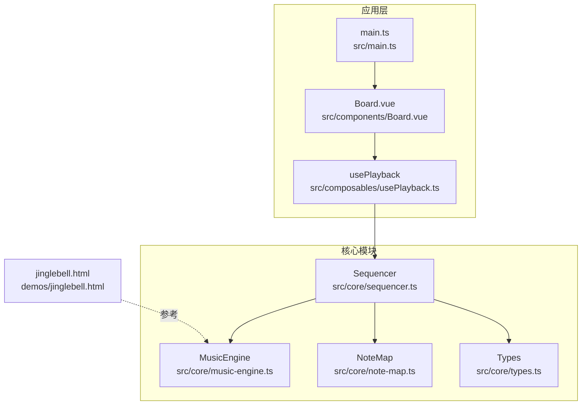
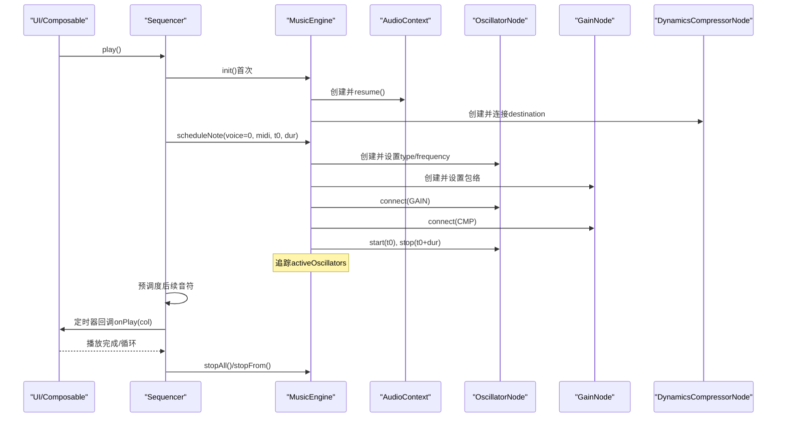
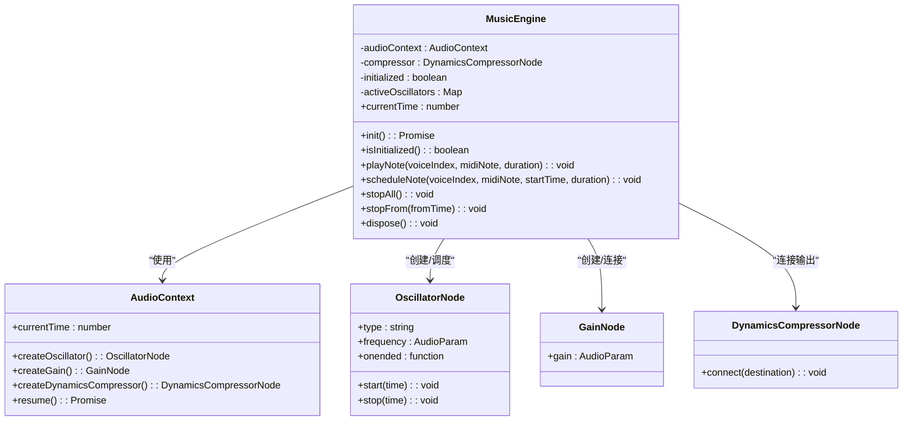
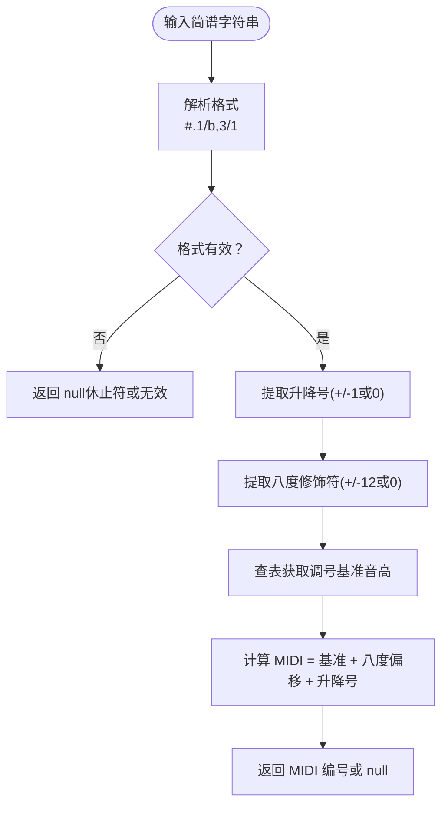
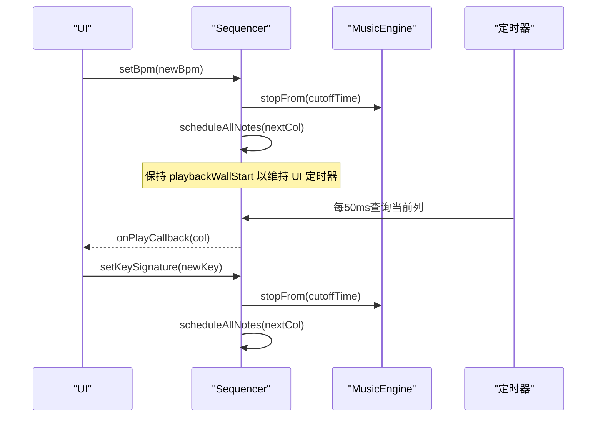
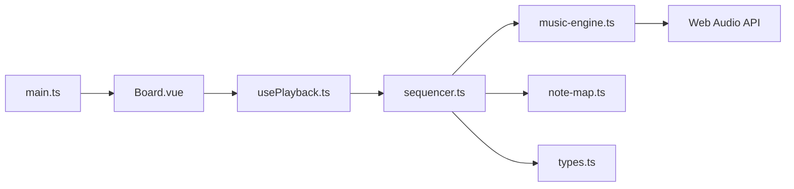

# 音乐引擎核心

<cite>
**本文引用的文件**
- [music-engine.ts](file://src/core/music-engine.ts)
- [note-map.ts](file://src/core/note-map.ts)
- [sequencer.ts](file://src/core/sequencer.ts)
- [types.ts](file://src/core/types.ts)
- [usePlayback.ts](file://src/composables/usePlayback.ts)
- [jinglebell.html](file://demos/jinglebell.html)
- [Board.vue](file://src/components/Board.vue)
- [main.ts](file://src/main.ts)
</cite>

## 更新摘要
**变更内容**
- 更新了三声部音阶调整机制，详细说明了主旋律×2、和弦律×1、低频×0.5的频率倍率策略
- 新增了三角波低频声部的2.5倍增益补偿技术说明
- 补充了抗点击淡出技术的实现细节
- 更新了音频合成算法的频率计算公式和增益包络策略

## 目录
1. [简介](#简介)
2. [项目结构](#项目结构)
3. [核心组件](#核心组件)
4. [架构总览](#架构总览)
5. [详细组件分析](#详细组件分析)
6. [依赖关系分析](#依赖关系分析)
7. [性能考量](#性能考量)
8. [故障排除指南](#故障排除指南)
9. [结论](#结论)
10. [附录](#附录)

## 简介
本技术文档聚焦于音乐引擎核心模块，系统解析 MusicEngine 类的实现细节，涵盖 Web Audio API 的封装方式、音频节点连接策略、信号处理流程、音频合成算法（方波、三角波等波形类型）、频率计算公式与简谱音符到音频频率的转换机制、音频缓冲区管理、延迟补偿与实时性能优化策略，并提供具体的代码示例路径、音频事件与错误处理实践以及调试技巧与性能监控方法。

## 项目结构
该项目采用前端单页应用架构，核心音乐功能集中在 src/core 目录：
- music-engine.ts：音乐引擎，封装 Web Audio API，负责音符调度与播放
- note-map.ts：简谱到 MIDI 音符映射与解析
- sequencer.ts：序列器，负责预调度播放、BPM/调号动态切换、UI 定时器驱动
- types.ts：类型定义与常量（BPM、调号、列数等）
- usePlayback.ts：Vue 组合式函数，桥接 UI 与序列器
- demos/jinglebell.html：参考实现，验证预调度模式与增益包络
- 组件与入口：Board.vue、main.ts 等

**图表来源**
- [music-engine.ts:17-226](file://src/core/music-engine.ts#L17-L226)
- [note-map.ts:1-119](file://src/core/note-map.ts#L1-L119)
- [sequencer.ts:1-354](file://src/core/sequencer.ts#L1-L354)
- [types.ts:1-164](file://src/core/types.ts#L1-L164)
- [usePlayback.ts:1-95](file://src/composables/usePlayback.ts#L1-L95)
- [Board.vue:1-68](file://src/components/Board.vue#L1-L68)
- [main.ts:1-8](file://src/main.ts#L1-L8)
- [jinglebell.html:1-83](file://demos/jinglebell.html#L1-L83)

## 核心组件
- MusicEngine：单例引擎，封装 AudioContext、DynamicsCompressorNode，负责每个音符的独立 OscillatorNode + GainNode 预调度播放，支持立即停止与选择性停止未来音符
- NoteMap：将简谱字符串解析为 MIDI 音符编号，支持升降号与八度修饰符
- Sequencer：预调度播放器，基于 AudioContext 绝对时间进行音符调度，支持 BPM/调号动态切换、循环播放、UI 定时器驱动
- Types：定义 BPM、调号、列数、播放状态等类型与常量
- usePlayback：Vue 组合式函数，暴露播放控制与状态，监听 BPM/调号变化并委托给 Sequencer

## 架构总览
音乐引擎采用"预调度 + 精确时间"策略，避免 UI 与音频渲染耦合，提升实时性与稳定性。核心流程如下：
- 序列器根据 BPM 计算列间隔与音符时长，计算起始时间基点
- 将乐谱列转换为 MIDI 音符，按声部类型（方波/三角波）与八度倍率生成频率
- 为每个音符创建独立的振荡器与增益节点，设置精确的起止时间与包络
- 所有声部共享压缩器作为主输出，减少节点数量与连接复杂度

**图表来源**
- [sequencer.ts:144-167](file://src/core/sequencer.ts#L144-L167)
- [music-engine.ts:41-60](file://src/core/music-engine.ts#L41-L60)
- [music-engine.ts:90-155](file://src/core/music-engine.ts#L90-L155)
- [music-engine.ts:157-202](file://src/core/music-engine.ts#L157-L202)

## 详细组件分析

### MusicEngine 组件分析
MusicEngine 是音乐引擎的核心，负责：
- 单例初始化与 AudioContext 管理
- 预调度音符：为每个音符创建独立的振荡器与增益节点
- 增益包络：方波使用线性包络，三角波使用微弱淡出消除点击声
- 声部频率与八度：基于 MIDI 音符与声部倍率计算频率
- 停止策略：立即停止全部或选择性停止未来音符，避免卡顿

**更新** 新增了三声部音阶调整机制和三角波增益补偿技术

**图表来源**
- [music-engine.ts:17-226](file://src/core/music-engine.ts#L17-L226)

关键实现要点：
- 初始化与唤醒：检测并 resume AudioContext，创建压缩器并连接输出
- 预调度：使用 AudioContext 绝对时间精确 start/stop，避免 UI 与音频耦合
- **三声部音阶调整**：主旋律×2（高八度）、和弦律×1（原始音高）、低频×0.5（低八度），形成高、中、低音域分层
- **三角波增益补偿**：低频声部使用2.5倍增益补偿，补偿原因包括八度降频、人耳等响曲线效应和音量平衡需求
- **抗点击淡出技术**：三角波在终止前3ms淡出至0，消除起止点击声
- 增益包络：方波使用线性包络，三角波在终止前 3ms 淡出，消除点击声
- 停止策略：stopAll 与 stopFrom 避免卡顿，仅停止未来音符

**章节来源**
- [music-engine.ts:17-226](file://src/core/music-engine.ts#L17-L226)

### NoteMap 组件分析
NoteMap 负责将简谱字符串解析为 MIDI 音符编号，支持：
- 升降号解析（#、b）
- 八度修饰符（. 高八度、, 低八度）
- 调号映射：根据调号返回简谱 1-7 对应的 MIDI 基准音高
- 批量转换：将单列三个声部转换为 MIDI 数组

**图表来源**
- [note-map.ts:35-100](file://src/core/note-map.ts#L35-L100)

**章节来源**
- [note-map.ts:1-119](file://src/core/note-map.ts#L1-L119)

### Sequencer 组件分析
Sequencer 实现了"预调度"播放模型：
- 计算列间隔与音符时长：每列八分音符，间隔 = 30 / BPM
- 预调度：一次性计算所有剩余音符的绝对起始时间并创建节点
- BPM/调号动态切换：仅停止未来音符并从下一列开始重新调度，避免卡顿
- UI 定时器：约 50ms 轮询当前列，触发 UI 回调
- 循环播放：到达末尾时重置并重新调度

**更新** 三角波音符时长调整为 noteDuration × 0.93，与方波形成更好的音色平衡

**图表来源**
- [sequencer.ts:84-115](file://src/core/sequencer.ts#L84-L115)
- [sequencer.ts:240-263](file://src/core/sequencer.ts#L240-L263)
- [sequencer.ts:271-313](file://src/core/sequencer.ts#L271-L313)

**章节来源**
- [sequencer.ts:21-354](file://src/core/sequencer.ts#L21-L354)

### 类型与常量
types.ts 定义了播放状态、BPM 列表、调号、列数、导出格式等：
- BPM_LIST：速度档位（60-135，共 6 档：60/75/90/105/120/135）
- DEFAULT_BPM：默认 90
- KEY_SIGNATURES：调号集合（C/D/F/G/♭B 共 5 个大调）
- DEFAULT_KEY_SIGNATURE：默认 C 大调
- DEFAULT_COLUMNS：默认列数 125
- VOICES：三个声部元信息（主旋律、和弦律、低频）

这些常量为 Sequencer 的 BPM/调号/列数计算提供依据。

**章节来源**
- [types.ts:1-164](file://src/core/types.ts#L1-L164)

### 与 UI 的集成
usePlayback.ts 将 Vue 组合式函数与 Sequencer 结合：
- 监听 BPM 与调号变化，调用 Sequencer.setBpm/setKeySignature
- 暴露播放控制（play/pause/stop/togglePlayPause/toggleLoop）
- 通过 onPlay/ onComplete 回调同步 UI 状态

**章节来源**
- [usePlayback.ts:1-95](file://src/composables/usePlayback.ts#L1-L95)

## 依赖关系分析
- Sequencer 依赖 MusicEngine（调度音符）、NoteMap（简谱转 MIDI）、Types（BPM/调号/列数）
- MusicEngine 依赖 Web Audio API（AudioContext、OscillatorNode、GainNode、DynamicsCompressorNode）
- usePlayback 依赖 Sequencer 与 Types
- Board.vue 与 main.ts 提供 UI 层入口

**图表来源**
- [music-engine.ts:17-226](file://src/core/music-engine.ts#L17-L226)
- [note-map.ts:1-119](file://src/core/note-map.ts#L1-L119)
- [sequencer.ts:1-354](file://src/core/sequencer.ts#L1-L354)
- [types.ts:1-164](file://src/core/types.ts#L1-L164)
- [usePlayback.ts:1-95](file://src/composables/usePlayback.ts#L1-L95)
- [Board.vue:1-68](file://src/components/Board.vue#L1-L68)
- [main.ts:1-8](file://src/main.ts#L1-L8)

## 性能考量
- 预调度策略：一次性计算所有剩余音符的绝对时间，避免 UI 定时器与音频渲染耦合，降低抖动
- 节点复用：三个声部共享压缩器，减少连接层级与内存占用
- 增益包络：方波使用线性包络，三角波在终止前 3ms 淡出，避免点击声且不影响感知
- **三声部频率优化**：通过不同的八度倍率实现音域分层，提高听觉层次感
- **三角波增益补偿**：2.5倍增益补偿确保低频声部音量平衡
- 选择性停止：BPM/调号变更时仅停止未来音符，当前音符自然结束，避免卡顿
- UI 定时器：约 50ms 轮询，兼顾响应性与 CPU 占用
- 频率计算：基于 MIDI 音符与倍率计算，避免频繁对象创建

## 故障排除指南
常见问题与排查步骤：
- 首次播放无声：确认 AudioContext 已初始化并处于运行状态；检查初始化流程与用户手势
  - 参考路径：[music-engine.ts:41-60](file://src/core/music-engine.ts#L41-L60)
- 播放卡顿或跳过：检查 BPM/调号动态切换时是否正确调用 stopFrom；确认未在 UI 定时器中重复调度
  - 参考路径：[sequencer.ts:84-115](file://src/core/sequencer.ts#L84-L115)
- 点击声或爆音：确认三角波在终止前有 3ms 淡出；方波增益包络正确
  - 参考路径：[music-engine.ts:117-155](file://src/core/music-engine.ts#L117-L155)
- 停止无效：确保调用 stopAll 或 stopFrom 时传入正确的截止时间；注意 try/catch 忽略已停止的振荡器
  - 参考路径：[music-engine.ts:157-202](file://src/core/music-engine.ts#L157-L202)
- 频率不正确：核对简谱解析与调号映射；检查八度修饰符与升降号处理
  - 参考路径：[note-map.ts:35-100](file://src/core/note-map.ts#L35-L100)
- **音量不平衡**：检查三角波增益补偿设置；确认三声部倍率配置正确
  - 参考路径：[music-engine.ts:100-108](file://src/core/music-engine.ts#L100-L108)

**章节来源**
- [music-engine.ts:41-60](file://src/core/music-engine.ts#L41-L60)
- [music-engine.ts:117-155](file://src/core/music-engine.ts#L117-L155)
- [music-engine.ts:157-202](file://src/core/music-engine.ts#L157-L202)
- [sequencer.ts:84-115](file://src/core/sequencer.ts#L84-L115)
- [note-map.ts:35-100](file://src/core/note-map.ts#L35-L100)

## 结论
该音乐引擎通过预调度与精确时间控制，结合 Web Audio API 的原生能力，实现了稳定、低延迟的三声部合成播放。MusicEngine 的单例设计与节点生命周期管理确保了资源可控；Sequencer 的动态 BPM/调号切换与 UI 定时器解耦提升了用户体验。NoteMap 提供了灵活的简谱解析与调号映射。**新增的三声部音阶调整机制和三角波增益补偿技术**进一步优化了音色层次和听觉体验，整体架构清晰、可维护性强，适合进一步扩展为完整的音乐创作与播放平台。

## 附录

### 音频合成算法与波形类型
- 方波（Square）：高频谐波丰富，适合主旋律与和弦律；使用线性增益包络实现断奏效果
- 三角波（Triangle）：谐波衰减更快，适合作为低频基础；在终止前 3ms 淡出消除点击声
- 正弦波与锯齿波：可通过修改振荡器类型实现，遵循相同预调度与包络策略

**更新** 三角波低频声部采用2.5倍增益补偿，确保低频段音量平衡

**章节来源**
- [music-engine.ts:111-155](file://src/core/music-engine.ts#L111-L155)

### 频率计算与简谱转换机制
- 频率公式：f = 27.5 × 2^((MIDI-21)/12) × 声部倍率
- **声部倍率优化**：主旋律×2（高八度）、和弦律×1（原始音高）、低频×0.5（低八度）
- 简谱到 MIDI：解析升降号与八度修饰符，查表获取调号基准音高，再叠加偏移

**更新** 详细的三声部音阶调整策略和倍率计算机制

**章节来源**
- [music-engine.ts:100-108](file://src/core/music-engine.ts#L100-L108)
- [note-map.ts:83-100](file://src/core/note-map.ts#L83-L100)

### 音频缓冲区管理与延迟补偿
- 预调度：在 AudioContext 绝对时间上安排音符，避免 UI 与音频不同步
- 延迟补偿：在调度时加入 0.1s 基准时基，预留系统处理时间
- 有效长度：仅调度实际包含音符的列，缩短播放时长，减少资源浪费
- **三角波时长调整**：三角波音符时长设为方波的0.93倍，形成更好的音色平衡

**更新** 新增三角波时长调整和增益补偿策略

**章节来源**
- [sequencer.ts:240-263](file://src/core/sequencer.ts#L240-L263)
- [sequencer.ts:223-232](file://src/core/sequencer.ts#L223-L232)

### 实时性能优化策略
- 减少节点数量：三个声部共享压缩器
- 选择性停止：仅停止未来音符，保留当前音符自然结束
- UI 定时器：约 50ms 轮询，平衡响应性与性能
- 预留调度时间：在 currentTime 基础上增加 0.1s，避免边界误差
- **三声部频率分层**：通过不同的倍率实现音域分离，提高听觉层次感
- **抗点击技术**：三角波终止前3ms淡出，消除起止点击声

**更新** 新增三声部频率分层和抗点击技术优化

**章节来源**
- [music-engine.ts:157-202](file://src/core/music-engine.ts#L157-L202)
- [sequencer.ts:249-251](file://src/core/sequencer.ts#L249-L251)

### 代码示例路径（不含具体代码内容）
- 初始化音频上下文与压缩器
  - [music-engine.ts:41-60](file://src/core/music-engine.ts#L41-L60)
- 预调度音符（方波/三角波）
  - [music-engine.ts:90-155](file://src/core/music-engine.ts#L90-L155)
- 动态 BPM 切换（仅停止未来音符）
  - [sequencer.ts:84-115](file://src/core/sequencer.ts#L84-L115)
- 动态调号切换（仅停止未来音符）
  - [sequencer.ts:55-82](file://src/core/sequencer.ts#L55-L82)
- 简谱解析与 MIDI 转换
  - [note-map.ts:35-100](file://src/core/note-map.ts#L35-L100)
- **三声部频率与倍率计算**
  - [music-engine.ts:100-108](file://src/core/music-engine.ts#L100-L108)
- **三角波增益补偿与抗点击技术**
  - [music-engine.ts:117-155](file://src/core/music-engine.ts#L117-L155)
- 参考实现（jinglebell.html）
  - [jinglebell.html:32-61](file://demos/jinglebell.html#L32-L61)

**更新** 新增三角波增益补偿和抗点击技术的代码示例路径

**章节来源**
- [music-engine.ts:41-155](file://src/core/music-engine.ts#L41-L155)
- [sequencer.ts:55-115](file://src/core/sequencer.ts#L55-L115)
- [note-map.ts:35-100](file://src/core/note-map.ts#L35-L100)
- [jinglebell.html:32-61](file://demos/jinglebell.html#L32-L61)