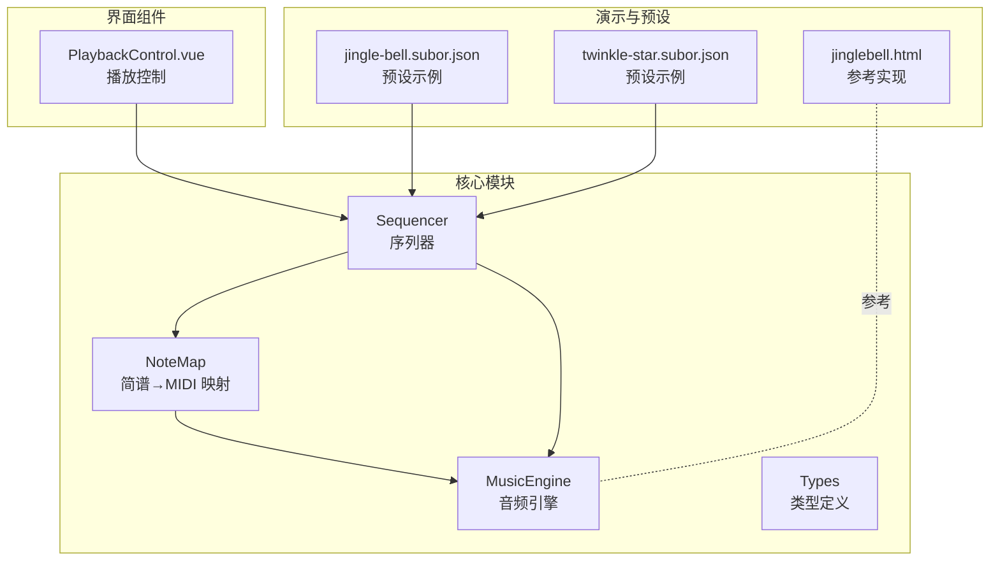
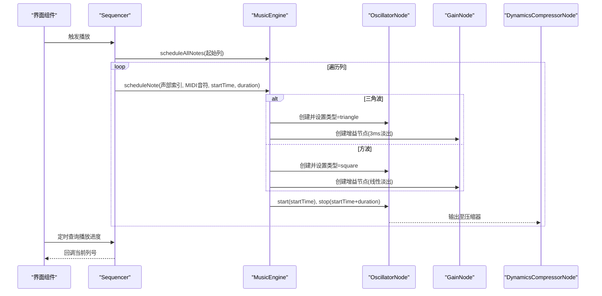
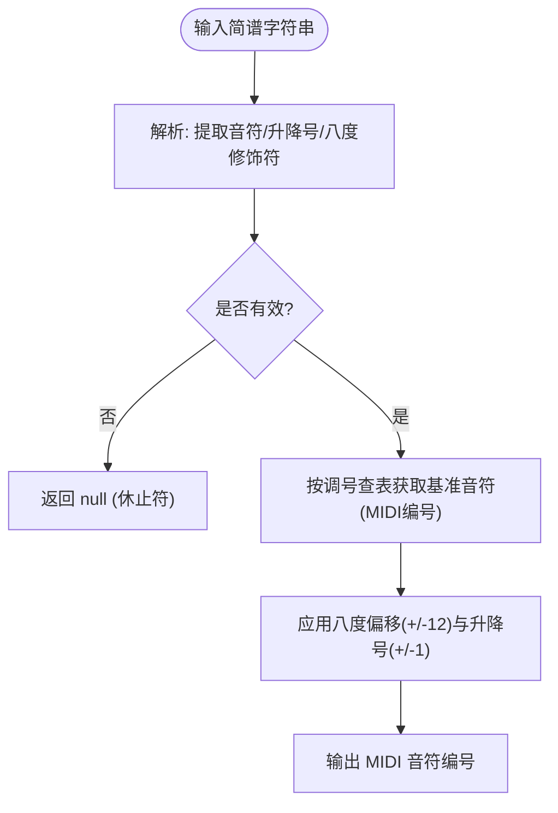
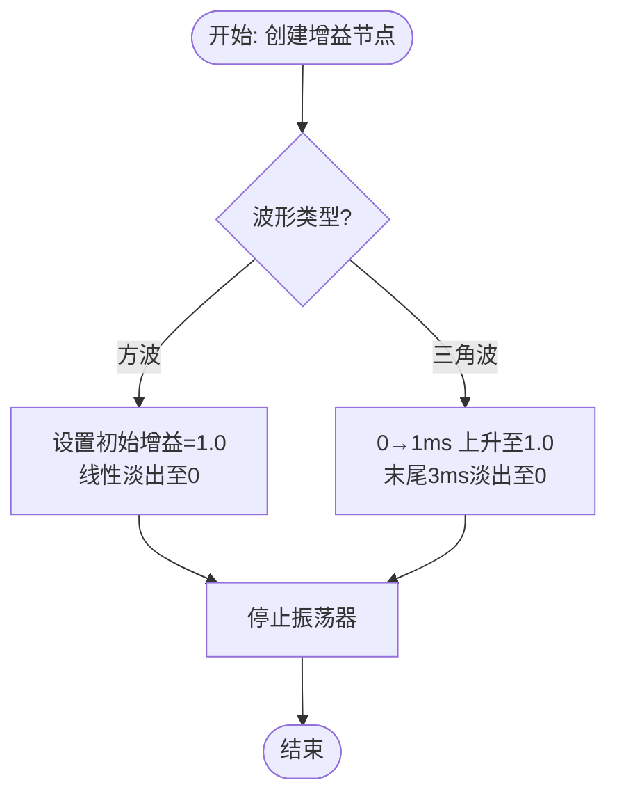
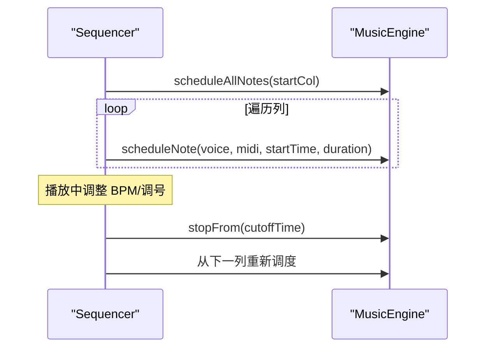
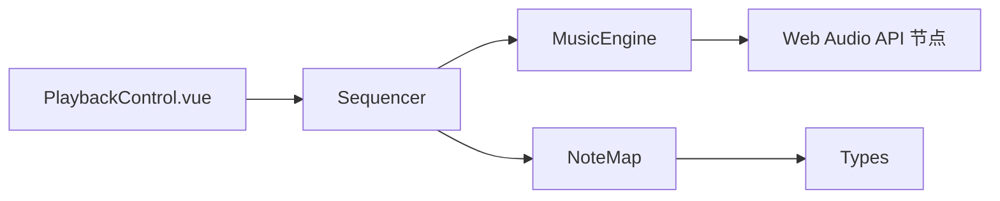

# 音频合成算法

<cite>
**本文引用的文件**
- [music-engine.ts](file://src/core/music-engine.ts)
- [note-map.ts](file://src/core/note-map.ts)
- [sequencer.ts](file://src/core/sequencer.ts)
- [types.ts](file://src/core/types.ts)
- [jinglebell.html](file://demos/jinglebell.html)
- [PlaybackControl.vue](file://src/components/PlaybackControl.vue)
- [jingle-bell.subor.json](file://presets/jingle-bell.subor.json)
- [coffin-dance.subor.json](file://presets/coffin-dance.subor.json)
</cite>

## 目录
1. [简介](#简介)
2. [项目结构](#项目结构)
3. [核心组件](#核心组件)
4. [架构总览](#架构总览)
5. [详细组件分析](#详细组件分析)
6. [依赖关系分析](#依赖关系分析)
7. [性能考量](#性能考量)
8. [故障排查指南](#故障排查指南)
9. [结论](#结论)
10. [附录](#附录)

## 简介
本技术文档围绕“音频合成算法”展开，基于仓库中的 Web Audio API 实现，系统解析以下要点：
- 音符频率计算公式与 A440 基准频率、MIDI 音符编号系统的关联
- 三声部音域分配策略：主旋律（×2 高八度）、和弦律（×1 原始音高）、低频（×0.5 低八度）
- 波形类型生成原理：方波与三角波的特性对比及适用场景
- 增益包络调度算法：方波的线性淡出与三角波的 3ms 淡出策略
- 频率转换计算示例：从简谱音符到 MIDI 音符编号，再到音频频率值的完整流程

## 项目结构
该项目采用前端单页应用架构，核心音频合成逻辑集中在 src/core 目录，配合演示与预设文件进行验证与使用。

图表来源
- [music-engine.ts:17-221](file://src/core/music-engine.ts#L17-L221)
- [sequencer.ts:21-354](file://src/core/sequencer.ts#L21-L354)
- [note-map.ts:1-119](file://src/core/note-map.ts#L1-L119)
- [types.ts:1-164](file://src/core/types.ts#L1-L164)
- [jinglebell.html:1-83](file://demos/jinglebell.html#L1-L83)
- [PlaybackControl.vue:1-111](file://src/components/PlaybackControl.vue#L1-L111)
- [jingle-bell.subor.json:1-106](file://presets/jingle-bell.subor.json#L1-L106)
- [coffin-dance.subor.json:1-103](file://presets/coffin-dance.subor.json#L1-L103)

章节来源
- [music-engine.ts:17-221](file://src/core/music-engine.ts#L17-L221)
- [sequencer.ts:21-354](file://src/core/sequencer.ts#L21-L354)
- [note-map.ts:1-119](file://src/core/note-map.ts#L1-L119)
- [types.ts:1-164](file://src/core/types.ts#L1-L164)

## 核心组件
- 音乐引擎（MusicEngine）：封装 Web Audio API，负责创建振荡器与增益节点，执行预调度播放，管理压缩器与活跃振荡器集合，并提供停止与销毁能力。
- 序列器（Sequencer）：负责乐谱的预调度播放，计算列间隔与音符时长，处理 BPM 与调号的动态切换，维护 UI 定时器与播放状态。
- 简谱映射（NoteMap）：将简谱字符串解析为 MIDI 音符编号，支持升降号与八度修饰符，提供批量列转换。
- 类型定义（Types）：定义声部索引、调号、BPM 列表、合法输入字符等类型与常量。

章节来源
- [music-engine.ts:17-221](file://src/core/music-engine.ts#L17-L221)
- [sequencer.ts:21-354](file://src/core/sequencer.ts#L21-L354)
- [note-map.ts:1-119](file://src/core/note-map.ts#L1-L119)
- [types.ts:41-54](file://src/core/types.ts#L41-L54)

## 架构总览
音频合成采用“预调度”模式：在播放开始时一次性计算所有音符的绝对起止时间，创建并连接振荡器与增益节点，随后由 UI 定时器驱动播放进度。

图表来源
- [sequencer.ts:240-263](file://src/core/sequencer.ts#L240-L263)
- [music-engine.ts:90-150](file://src/core/music-engine.ts#L90-L150)

## 详细组件分析

### 音符频率计算与 A440 基准
- 频率公式：f = 27.5 × 2^((n−21)/12)
  - 该公式以 MIDI 音符编号 n=21 对应 27.5 Hz（A0），与 A440 基准频率存在换算关系：A4=440Hz 对应 MIDI 音符编号 69。
  - 通过该公式，可将任意 MIDI 音符编号转换为对应的频率（Hz）。
- 三声部音域分配
  - 主旋律（声部 0，方波）：×2 高八度，使主旋律位于较高音区，突出旋律线条。
  - 和弦律（声部 1，方波）：×1 原始音高，保持和弦律的中音区平衡。
  - 低频（声部 2，三角波）：×0.5 低八度，形成低音基础，三角波的柔和特性减少低频噪音。
- 与参考实现的对应
  - 参考 jinglebell.html 中的八度缩放策略与波形类型选择，本实现严格复刻了相同的音域分布与波形配置。

章节来源
- [music-engine.ts:100-108](file://src/core/music-engine.ts#L100-L108)
- [music-engine.ts:106](file://src/core/music-engine.ts#L106)
- [jinglebell.html:71-77](file://demos/jinglebell.html#L71-L77)

### 简谱到 MIDI 的转换流程
- 输入格式：支持“1-7”音符、升降号（#、b）与八度修饰符（. 高八度、, 低八度，置于数字之前，如 “.1”、“,1”），空格表示休止符，“-”表示延音线。
- 转换步骤：
  1) 解析简谱字符串，提取音符编号、升降号与八度偏移。
  2) 根据当前调号查表获取基准音符（C4=60）。
  3) 应用八度偏移（每级12半音）与升降号（±1），得到 MIDI 音符编号。
- 示例（来自预设）：
  - “3”在 C 大调中对应 MIDI 音符编号 64（E4）。
  - “.1” 对应高八度的 C5（MIDI 72）。
  - “b,3” 对应低八度的降E（Eb3，MIDI 51）。

图表来源
- [note-map.ts:35-74](file://src/core/note-map.ts#L35-L74)
- [note-map.ts:83-100](file://src/core/note-map.ts#L83-L100)

章节来源
- [note-map.ts:10-27](file://src/core/note-map.ts#L10-L27)
- [note-map.ts:35-100](file://src/core/note-map.ts#L35-L100)

### 频率转换计算示例
- 示例 1：简谱“3”（C 大调）
  - 基准：C 大调 3 对应 MIDI 64（E4）
  - 三声部频率：
    - 主旋律（×2）：f = 27.5 × 2^((64−21)/12) × 2
    - 和弦律（×1）：f = 27.5 × 2^((64−21)/12)
    - 低频（×0.5）：f = 27.5 × 2^((64−21)/12) × 0.5
- 示例 2：简谱“.1”（高八度）
  - 基准：C 大调 1 对应 MIDI 60（C4），高八度为 72（C5）
  - 三声部频率：
    - 主旋律（×2）：f = 27.5 × 2^((72−21)/12) × 2
    - 和弦律（×1）：f = 27.5 × 2^((72−21)/12)
    - 低频（×0.5）：f = 27.5 × 2^((72−21)/12) × 0.5

章节来源
- [music-engine.ts:106](file://src/core/music-engine.ts#L106)
- [note-map.ts:95-100](file://src/core/note-map.ts#L95-L100)

### 增益包络调度算法
- 方波（主旋律/和弦律）：
  - 在 startTime 确保增益为 1.0，随后线性淡出至 0，与时长完全匹配，形成断奏效果。
- 三角波（低频）：
  - 采用“1ms 上升 + 3ms 淡出”的策略，避免停止瞬间的点击声（Click），同时保持音色柔和。
- 与参考实现一致：
  - 严格复刻 jinglebell.html 的增益调度模式与淡出策略。

图表来源
- [music-engine.ts:121-139](file://src/core/music-engine.ts#L121-L139)
- [jinglebell.html:54-60](file://demos/jinglebell.html#L54-L60)

章节来源
- [music-engine.ts:121-139](file://src/core/music-engine.ts#L121-L139)
- [jinglebell.html:54-60](file://demos/jinglebell.html#L54-L60)

### 序列器与预调度播放
- 预调度模式：
  - 在播放开始时一次性计算所有剩余音符的绝对起止时间，创建并连接振荡器与增益节点。
- BPM 与调号动态切换：
  - 播放中调整 BPM 或调号时，仅停止未来音符，当前列自然播放完毕，避免卡顿。
- 三角波时长：
  - 三角波略短（约 0.93 倍方波时长），与参考实现的 0.28/0.30 比例一致。

图表来源
- [sequencer.ts:240-263](file://src/core/sequencer.ts#L240-L263)
- [sequencer.ts:84-115](file://src/core/sequencer.ts#L84-L115)
- [sequencer.ts:234-263](file://src/core/sequencer.ts#L234-L263)

章节来源
- [sequencer.ts:240-263](file://src/core/sequencer.ts#L240-L263)
- [sequencer.ts:84-115](file://src/core/sequencer.ts#L84-L115)

### 波形类型与适用场景
- 方波（Square）
  - 特性：谐波丰富，音色明亮、有力度，适合主旋律与和弦律。
  - 适用：突出旋律线条与和弦支撑，配合线性淡出形成清晰断奏。
- 三角波（Triangle）
  - 特性：谐波成分较少，音色柔和圆润，低频表现更佳。
  - 适用：低频基础音，配合 3ms 淡出消除点击声，提升听感舒适度。

章节来源
- [types.ts:41-54](file://src/core/types.ts#L41-L54)
- [music-engine.ts:112](file://src/core/music-engine.ts#L112)

## 依赖关系分析
- MusicEngine 依赖 Web Audio API 的原生节点：OscillatorNode、GainNode、DynamicsCompressorNode。
- Sequencer 依赖 MusicEngine 进行音符调度，并依赖 NoteMap 将简谱转换为 MIDI。
- NoteMap 依赖 Types 中的 KeySignature 与类型定义。
- PlaybackControl.vue 通过事件与 Sequencer 交互，驱动播放控制。

图表来源
- [PlaybackControl.vue:1-111](file://src/components/PlaybackControl.vue#L1-L111)
- [sequencer.ts:1-354](file://src/core/sequencer.ts#L1-L354)
- [music-engine.ts:17-221](file://src/core/music-engine.ts#L17-L221)
- [note-map.ts:1-119](file://src/core/note-map.ts#L1-L119)
- [types.ts:1-164](file://src/core/types.ts#L1-L164)

章节来源
- [PlaybackControl.vue:1-111](file://src/components/PlaybackControl.vue#L1-L111)
- [sequencer.ts:1-354](file://src/core/sequencer.ts#L1-L354)
- [music-engine.ts:17-221](file://src/core/music-engine.ts#L17-L221)
- [note-map.ts:1-119](file://src/core/note-map.ts#L1-L119)
- [types.ts:1-164](file://src/core/types.ts#L1-L164)

## 性能考量
- 预调度模式：一次性创建所有音符节点，降低播放时的 CPU 抖动，提高稳定性。
- 选择性停止：调整 BPM/调号时仅停止未来音符，避免中断当前播放列。
- 压缩器：统一输出压缩，有助于控制整体响度与动态范围。
- 三角波淡出：3ms 淡出在消除点击声的同时尽量缩短处理开销。

## 故障排查指南
- 首次播放无声音
  - 确认已调用初始化并处于可播放状态；某些浏览器需要用户手势唤醒 AudioContext。
- 播放卡顿或节拍错乱
  - 检查 BPM 设置与 UI 定时器间隔；确认未频繁触发重新调度。
- 低频出现点击声
  - 确认使用三角波且启用了 3ms 淡出；检查 stop 时间与淡出时间边界。
- 调号切换异常
  - 确认在播放中切换时，仅停止未来音符并从下一列重新调度。

章节来源
- [music-engine.ts:41-60](file://src/core/music-engine.ts#L41-L60)
- [sequencer.ts:84-115](file://src/core/sequencer.ts#L84-L115)
- [music-engine.ts:117-139](file://src/core/music-engine.ts#L117-L139)

## 结论
本项目以 Web Audio API 为基础，实现了与参考实现一致的三声部音频合成方案：主旋律（方波×2 高八度）、和弦律（方波×1 原始音高）、低频（三角波×0.5 低八度）。通过严格的频率计算与增益包络调度，结合预调度播放与动态 BPM/调号切换，提供了稳定、可控且富有表现力的合成音频体验。

## 附录
- 预设示例
  - jingle-bell.subor.json：经典圣诞歌曲，C 大调，120BPM，展示三声部协同。
  - twinkle-star.subor.json：小星星主题，C 大调，90BPM，包含八度修饰符示例。
- 参考实现
  - jinglebell.html：提供相同的八度缩放与增益调度模式，便于对照与验证。

章节来源
- [jingle-bell.subor.json:1-106](file://presets/jingle-bell.subor.json#L1-L106)
- [coffin-dance.subor.json:1-103](file://presets/coffin-dance.subor.json#L1-L103)
- [jinglebell.html:1-83](file://demos/jinglebell.html#L1-L83)