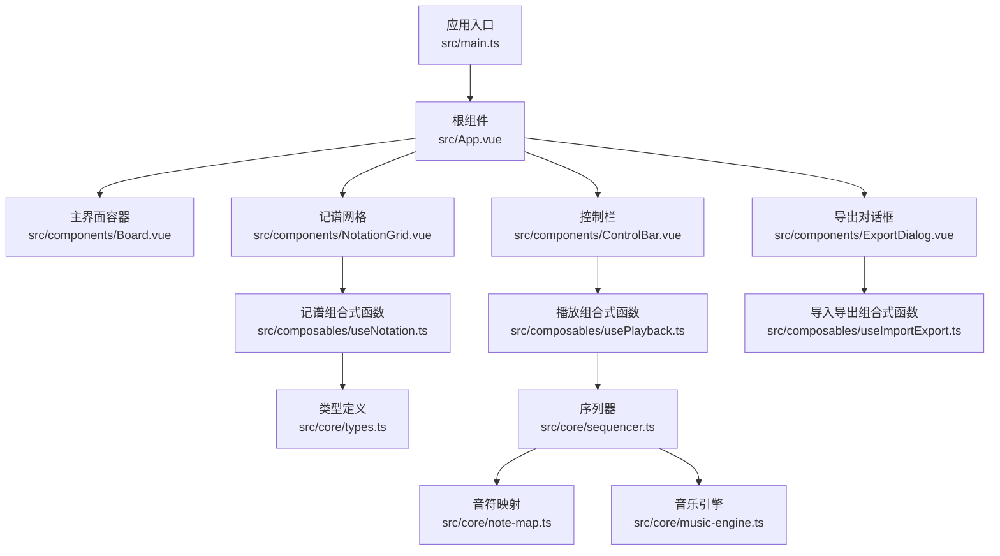
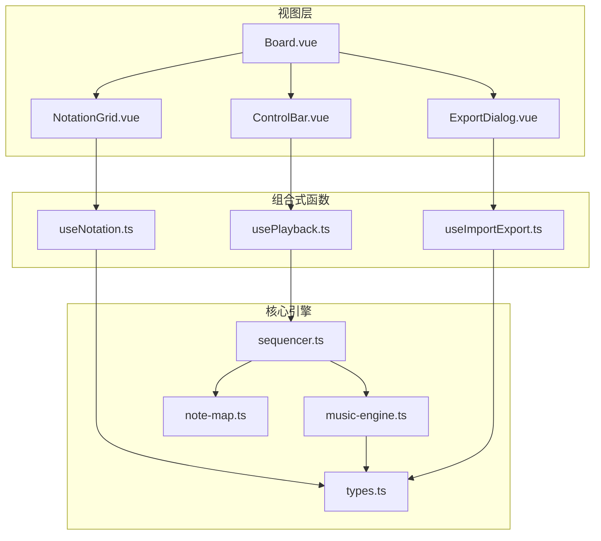
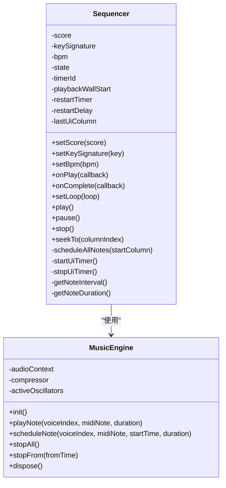
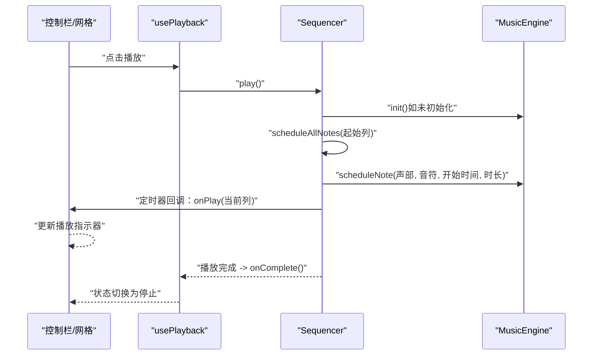
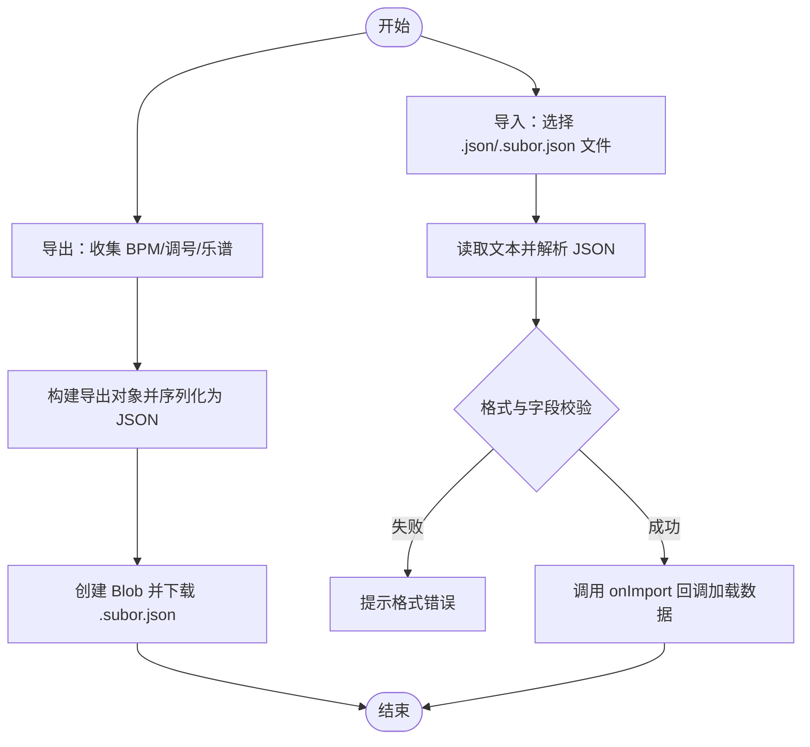
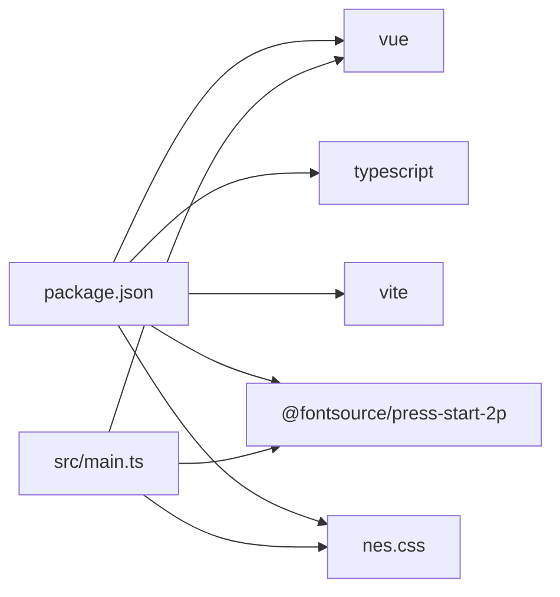

# 项目概述

<cite>
**本文引用的文件**
- [README.md](file://README.md)
- [package.json](file://package.json)
- [vite.config.ts](file://vite.config.ts)
- [tsconfig.json](file://tsconfig.json)
- [src/main.ts](file://src/main.ts)
- [src/App.vue](file://src/App.vue)
- [src/components/Board.vue](file://src/components/Board.vue)
- [src/composables/useNotation.ts](file://src/composables/useNotation.ts)
- [src/composables/usePlayback.ts](file://src/composables/usePlayback.ts)
- [src/composables/useImportExport.ts](file://src/composables/useImportExport.ts)
- [src/core/types.ts](file://src/core/types.ts)
- [src/core/note-map.ts](file://src/core/note-map.ts)
- [src/core/music-engine.ts](file://src/core/music-engine.ts)
- [src/core/sequencer.ts](file://src/core/sequencer.ts)
</cite>

## 目录
1. [简介](#简介)
2. [项目结构](#项目结构)
3. [核心组件](#核心组件)
4. [架构总览](#架构总览)
5. [详细组件分析](#详细组件分析)
6. [依赖关系分析](#依赖关系分析)
7. [性能考量](#性能考量)
8. [故障排查指南](#故障排查指南)
9. [结论](#结论)
10. [附录](#附录)

## 简介
SUBOR Music Board 是一款基于 Vue 3 + TypeScript + Vite 的三声部简谱音乐创作工具，专注于 FC/8-bit 风格的音乐生成。它提供主旋律、和弦律、低频三个声部的独立编辑能力，结合 Web Audio API 实现实时音频合成，并支持完整的导入导出流程，便于在网页端进行音乐创作、分享与复用。

该工具适用于音乐教育、游戏音乐创作、电子音乐入门教学、复古风格音乐制作等多种场景。通过直观的网格式记谱界面与可调节的速度/调号控制，用户可以快速构建具有层次感的三声部乐曲。

## 项目结构
项目采用前端工程化的模块化组织方式，核心分为以下层次：
- 应用入口与样式：应用挂载、字体与主题样式引入
- 视图层组件：主界面容器、记谱网格、控制条、导出对话框等
- 业务组合式函数：记谱编辑、播放控制、导入导出
- 核心引擎与类型：音符映射、音乐引擎、序列器、类型定义

图表来源
- [src/main.ts:1-8](file://src/main.ts#L1-L8)
- [src/App.vue:1-138](file://src/App.vue#L1-L138)
- [src/components/Board.vue:1-47](file://src/components/Board.vue#L1-L47)
- [src/composables/useNotation.ts:1-116](file://src/composables/useNotation.ts#L1-L116)
- [src/composables/usePlayback.ts:1-95](file://src/composables/usePlayback.ts#L1-L95)
- [src/composables/useImportExport.ts:1-138](file://src/composables/useImportExport.ts#L1-L138)
- [src/core/types.ts:1-164](file://src/core/types.ts#L1-L164)
- [src/core/sequencer.ts:1-354](file://src/core/sequencer.ts#L1-L354)
- [src/core/note-map.ts:1-119](file://src/core/note-map.ts#L1-L119)
- [src/core/music-engine.ts:1-221](file://src/core/music-engine.ts#L1-L221)

章节来源
- [src/main.ts:1-8](file://src/main.ts#L1-L8)
- [src/App.vue:1-138](file://src/App.vue#L1-L138)
- [vite.config.ts:1-8](file://vite.config.ts#L1-L8)
- [tsconfig.json:1-8](file://tsconfig.json#L1-L8)

## 核心组件
- 记谱编辑（useNotation）
  - 提供乐谱数据结构、光标管理、插入/覆盖/删除/清空等编辑操作
  - 支持默认列数与边界保护，保障 UI 与播放的一致性
- 播放控制（usePlayback）
  - 将播放状态、当前列、循环标志与序列器对接
  - 监听 BPM 与调号变化，实现运行时调整
- 导入导出（useImportExport）
  - 导出为 .subor.json，包含版本、标题、描述、BPM、调号与乐谱
  - 导入时进行格式校验与容错处理
- 音乐引擎（MusicEngine）
  - 基于 Web Audio API 的单例引擎，每个音符独立创建振荡器与增益节点
  - 三声部共享压缩器，主旋律/和弦律用方波，低频用三角波
- 序列器（Sequencer）
  - 预调度模式：一次性计算所有音符的绝对播放时间并创建振荡器
  - 支持循环播放、暂停/恢复、跳转、BPM/调号实时切换
- 音符映射（note-map）
  - 将简谱字符（含升降号、八度修饰）映射为 MIDI 音符编号
- 类型系统（types）
  - 定义记谱字符、列/乐谱结构、光标、播放状态、BPM/调号、导出格式等

章节来源
- [src/composables/useNotation.ts:1-116](file://src/composables/useNotation.ts#L1-L116)
- [src/composables/usePlayback.ts:1-95](file://src/composables/usePlayback.ts#L1-L95)
- [src/composables/useImportExport.ts:1-138](file://src/composables/useImportExport.ts#L1-L138)
- [src/core/music-engine.ts:1-221](file://src/core/music-engine.ts#L1-L221)
- [src/core/sequencer.ts:1-354](file://src/core/sequencer.ts#L1-L354)
- [src/core/note-map.ts:1-119](file://src/core/note-map.ts#L1-L119)
- [src/core/types.ts:1-164](file://src/core/types.ts#L1-L164)

## 架构总览
整体采用“视图层 + 组合式函数 + 核心引擎”的分层设计：
- 视图层负责交互与展示（Board、NotationGrid、ControlBar、ExportDialog）
- 组合式函数封装业务逻辑（useNotation、usePlayback、useImportExport）
- 核心引擎负责音频合成与播放调度（MusicEngine、Sequencer、note-map）

图表来源
- [src/components/Board.vue:1-47](file://src/components/Board.vue#L1-L47)
- [src/App.vue:1-138](file://src/App.vue#L1-L138)
- [src/composables/useNotation.ts:1-116](file://src/composables/useNotation.ts#L1-L116)
- [src/composables/usePlayback.ts:1-95](file://src/composables/usePlayback.ts#L1-L95)
- [src/composables/useImportExport.ts:1-138](file://src/composables/useImportExport.ts#L1-L138)
- [src/core/sequencer.ts:1-354](file://src/core/sequencer.ts#L1-L354)
- [src/core/music-engine.ts:1-221](file://src/core/music-engine.ts#L1-L221)
- [src/core/note-map.ts:1-119](file://src/core/note-map.ts#L1-L119)
- [src/core/types.ts:1-164](file://src/core/types.ts#L1-L164)

## 详细组件分析

### 音乐引擎（MusicEngine）与序列器（Sequencer）
- 音乐引擎
  - 单例模式，初始化时创建 AudioContext 与压缩器
  - 每个音符独立创建振荡器与增益节点，支持立即播放与预调度
  - 三声部音色差异化：主旋律/和弦律为方波，低频为三角波；八度按声部分配
  - 提供停止全部（stopAll）与按时间选择性停止（stopFrom，保留工具）能力；播放中变速/调号变更走「stopAll 丢弃 + 120ms 防抖 + 从当前指示器列整体重排」（2026-08-30 改）
- 序列器
  - 预调度策略：一次性计算所有音符的绝对播放时间并创建振荡器
  - UI 定时器（约 50ms）轮询当前列，列变化时触发回调
  - 支持循环播放、暂停/恢复、跳转、BPM/调号实时切换
  - 有效长度计算：忽略末尾空白列，提升播放效率

图表来源
- [src/core/music-engine.ts:1-221](file://src/core/music-engine.ts#L1-L221)
- [src/core/sequencer.ts:1-354](file://src/core/sequencer.ts#L1-L354)

章节来源
- [src/core/music-engine.ts:1-221](file://src/core/music-engine.ts#L1-L221)
- [src/core/sequencer.ts:1-354](file://src/core/sequencer.ts#L1-L354)

### 记谱与播放流程（序列器调度）

图表来源
- [src/composables/usePlayback.ts:1-95](file://src/composables/usePlayback.ts#L1-L95)
- [src/core/sequencer.ts:1-354](file://src/core/sequencer.ts#L1-L354)
- [src/core/music-engine.ts:1-221](file://src/core/music-engine.ts#L1-L221)

章节来源
- [src/composables/usePlayback.ts:1-95](file://src/composables/usePlayback.ts#L1-L95)
- [src/core/sequencer.ts:1-354](file://src/core/sequencer.ts#L1-L354)

### 导入导出流程

图表来源
- [src/composables/useImportExport.ts:1-138](file://src/composables/useImportExport.ts#L1-L138)
- [src/core/types.ts:140-164](file://src/core/types.ts#L140-L164)

章节来源
- [src/composables/useImportExport.ts:1-138](file://src/composables/useImportExport.ts#L1-L138)
- [src/core/types.ts:140-164](file://src/core/types.ts#L140-L164)

### 记谱输入与验证
- 输入字符集：数字 1-7、升降号 #/b、八度修饰符 .（高音）/,（低音）、空格
- 单字符验证与完整值验证分别用于按键拦截与最终合法性检查
- 八度修饰符仅支持一级（. 或 ,），解析后用于生成 CSS 类名与音高偏移

章节来源
- [src/core/types.ts:1-96](file://src/core/types.ts#L1-L96)

## 依赖关系分析
- 技术栈
  - Vue 3：响应式组件与组合式 API
  - TypeScript：类型安全与开发体验
  - Vite：快速构建与热更新
  - Web Audio API：原生音频合成，避免外部依赖
- 第三方依赖
  - 字体与 UI：Press Start 2P 字体、NES.css 主题
- 内部耦合
  - 视图层通过组合式函数与核心引擎解耦
  - Sequencer 与 MusicEngine 弱耦合，便于替换或扩展
  - note-map 与 types 提供稳定的音符映射契约

图表来源
- [package.json:1-25](file://package.json#L1-L25)
- [src/main.ts:1-8](file://src/main.ts#L1-L8)

章节来源
- [package.json:1-25](file://package.json#L1-L25)
- [vite.config.ts:1-8](file://vite.config.ts#L1-L8)
- [tsconfig.json:1-8](file://tsconfig.json#L1-L8)

## 性能考量
- 预调度策略：一次性创建所有振荡器，降低播放时的调度开销，适合浏览器端实时合成
- 有效长度优化：仅播放包含有效音符的列，避免在空白列上浪费时间
- 实时变速/变调的丢弃重排：变速/调号切换时 stopAll 立即丢弃所有声，120ms 防抖后从当前指示器列整体重排，杜绝叠加混响并保持音画同步
- UI 定时器：约 50ms 轮询，平衡流畅度与 CPU 占用
- 音色与八度：三声部音色与八度差异带来层次感，同时避免过多振荡器叠加

## 故障排查指南
- 首次播放无声音
  - 确认浏览器允许自动播放音频（需用户交互后初始化）
  - 检查音频上下文状态，必要时重新初始化
- 变速/调号切换卡顿
  - 确保未频繁触发切换；序列器内部已避免对当前列音符的影响
- 导入失败
  - 检查文件扩展名与 JSON 结构是否符合导出格式
  - 确认 BPM 与调号在允许范围内
- 记谱输入异常
  - 仅允许 1-7 数字、#、b、.、,、空格；注意八度修饰符仅支持一级

章节来源
- [src/core/music-engine.ts:41-60](file://src/core/music-engine.ts#L41-L60)
- [src/core/sequencer.ts:84-115](file://src/core/sequencer.ts#L84-L115)
- [src/composables/useImportExport.ts:84-131](file://src/composables/useImportExport.ts#L84-L131)
- [src/core/types.ts:77-96](file://src/core/types.ts#L77-L96)

## 结论
SUBOR Music Board 以简洁而强大的架构实现了 FC/8-bit 风格的三声部简谱创作。通过 Web Audio API 的原生合成与预调度策略，项目在浏览器端实现了低延迟、高稳定性的实时播放；配合直观的网格记谱与完善的导入导出机制，既适合初学者入门，也能满足有一定需求的创作者与教育场景使用。

## 附录
- 应用目标
  - 三声部简谱创作：主旋律、和弦律、低频
  - 实时音频合成：基于 Web Audio API
  - 导入导出：.subor.json 格式，便于分享与复用
- 技术选型优势
  - Vue 3 + TypeScript：类型安全与现代开发体验
  - Vite：快速构建与热更新
  - Web Audio API：原生能力，无第三方依赖
- 应用场景
  - 音乐教育：简谱入门、三声部编排
  - 游戏音乐：FC/8-bit 风格主题创作
  - 创意音乐：复古风格、电子音乐片段制作